# 线程

## 线程的创建方式

Java 中创建线程的方法有四种：继承 Thread 类、实现 Runnable 接口、实现 Callable 接口并使用FutureTask类以及通过线程池创建线程。

1. 继承 Thread 类：

继承 Thread 类是创建线程最简单的方式，在该类中重写 run() 方法即可实现线程的执行逻辑。可以通过 start() 方法启动线程，如下所示：

```java
class MyThread extends Thread {
    @Override
    public void run() {
        // 实现线程执行逻辑
    }
}
MyThread thread = new MyThread();
thread.start();
```

2. 实现 Runnable 接口：


实现 Runnable 接口也是一种常见的创建线程的方式，可以将 Runnable 对象传递给 Thread 类，通过 start() 方法启动线程，如下所示：

```java
class MyRunnable implements Runnable {
    @Override
    public void run() {
        // 实现线程执行逻辑
    }
}
MyRunnable runnable = new MyRunnable();
Thread thread = new Thread(runnable);
thread.start();
```

3. 实现 Callable 接口并使用FutureTask类：

与 Runnable 接口相比，Callable 接口可以返回执行结果，并且可以抛出异常。

但是Callable接口实例不能作为Thread类的target，所以还需要一个搭桥接口，RunnableFuture接口就是Thread和Callable之间的“搭桥接口”。而FutureTask类实现了RunnableFuture接口。RunnableFuture继承了Runnable接口和Future接口。其中Future接口提供的功能有取消执行中的任务、获取任务的执行结果等。

使用方法如下所示：

```java
class MyCallable implements Callable<String> {
    @Override
    public String call() throws Exception {
        System.out.println("calling");
        return "this is the result of the execute";
    }
}
public static void main(String[] args) {
    MyCallable myCallable = new MyCallable();
    FutureTask<String> futureTask = new FutureTask<>(myCallable);
    Thread thread = new Thread(futureTask);
    thread.start();
    try {
        System.out.println(futureTask.get()); // 获取任务的执行结果
    } catch (InterruptedException | ExecutionException e) {
        throw new RuntimeException(e);
    }
}
/*
输出结果：
    calling
    this is the result of the execute
*/
```

4. 通过线程池创建线程

## 线程局部变量

线程局部变量有两种，ThreadLocal和InheritableThreadLocal，其中ThreadLocal在主线程和子线程之间不具备可继承性，而InheritableThreadLocal具备可继承。

### ThreadLocal

`ThreadLocal`由一个线程的类型为`ThreadLocal.ThreadLocalMap`的对象`threadlocals`来保存，`ThreadLocalMap`是`ThreadLocal`类的内部类。具体来说，在`ThreadLocalMap`中，set到`ThreadLocal`对象的值作为值（value），`ThreadLocal`对象作为键（key），并且key是一个弱引用。

因为ThreadLocal对象（key）是一个弱引用，所以当线程销毁后，由于ThreadLocal对象不再被强引用，所以ThreadLocal对象可以被垃圾回收。但是threadlocals中依然存在键值对，所以为了避免内存溢出，还是需要手动移除（remove）ThreadLocal对象。

ThreadLocal的使用方法示例：

```java
ThreadLocal<String> threadLocal = new ThreadLocal<>(); //创建一个用于存储String类型的ThreadLocal变量
threadLocal.set("Hello, ThreadLocal!"); //设置当前线程的ThreadLocal变量值
String value = threadLocal.get(); //返回当前线程的ThreadLocal变量值
threadLocal.remove(); //清除当前线程的ThreadLocal变量值
```

可以创建多个ThreadLocal实例，每个ThreadLocal实例可以用来存储一个特定的值，例如，可以创建两个ThreadLocal实例来存储不同类型的值：

```java
ThreadLocal<String> threadLocal1 = new ThreadLocal<>(); //创建一个用于存储String类型的ThreadLocal变量
ThreadLocal<Integer> threadLocal2 = new ThreadLocal<>(); //创建一个用于存储Integer类型的ThreadLocal变量
```

### InheritableThreadLocal

使用InheritableThreadLocal创建对象保存的变量具有继承性，子线程调用该对象的get方法可以获取到父线程set到该对象中的值。父线程是创建和启动子线程的线程。

InheritableThreadLocal的使用方法示例：

```java
static final InheritableThreadLocal<String> INHERITABLE_THREAD_LOCAL = new InheritableThreadLocal<>();
public static void main(String[] args) {
    INHERITABLE_THREAD_LOCAL.set("主线程保存的值");
    new Thread(() -> {
    String value = INHERITABLE_THREAD_LOCAL.get();
    System.out.println("子线程中访问主线程中保存的局部变量值：" + value);
    }).start();
}
/*
输出结果：
	子线程中访问主线程中保存的局部变量值：主线程保存的值
*/
```

通过InheritableThreadLocal对象之所以能够访问到父（parent）线程的inheritableThreadLocals，是因为在创建线程的时候，会将parent线程的inheritableThreadLocals复制一份到子线程的inheritableThreadLocals中。

## Fork/Join框架


## 操作系统线程生命周期

- 初始状态：处于初始状态的线程只是在编程语言层面被创建，在操作系统层面并没有被真正创建。
- 可运行状态：线程在操作系统层面真正被创建，可以被分配CPU资源。
- 运行状态：处于运行状态的线程已经获取到CPU资源，正在运行。
- 休眠状态：线程正在等待，或者正处于阻塞状态（如调用了一个阻塞的API），就可能（只有处在运行状态的线程才可以直接转换成休眠状态或终止状态）进入休眠状态。
- 终止状态：线程正常运行结束或出现异常，就可能进入终止状态。

## Java线程的生命周期

- 初始化状态：线程在Java中被创建（调用new方法），但还没有启动（调用start方法）。
- 运行状态
  - 就绪状态：对应操作系统线程生命周期中的可运行状态。
  - 运行状态：对应操作系统线程生命周期中的运行状态。
- 等待状态：等待其它线程通知或中断等待。
- 超时等待状态：等待其它线程通知或中断等待，如果超过指定时间，当前线程也会进入下一个状态。
- 阻塞状态：等待进入临界区。
- 终止状态：表示当前线程执行完毕，包括正常执行结束和异常退出。

## 线程调度模型

目前主流操作系统中主要基于时间片进行线程调度，调度模型可以分为分时调度模型和抢占式调度模型：

- 分时调度模型：会平均分配CPU时间片，每个线程占用的CPU时间片都是一样的，所有线程会轮流占有CPU时间片。
- 抢占式调度模型：按照线程的优先级分配时间片，线程的优先级越高，分配到CPU时间片的概览越大。

## 上下文切换

当程序中可运行的线程数量大于CPU核心数时，CPU资源会在不同线程之间来回切换，就会发生线程的上下文切换，也叫做线程切换。

在线程上下文切换时，操作系统会保存运行线程的上下文。

**减少上下文切换的措施：**

1. 使用无锁编程
2. 创建合适的线程数
3. 使用协程

## 线程方法

1. start：启动线程。
2. sleep：让当前线程休眠（暂停执行）一段时间，**不会释放锁**。
3. wait：让当前线程暂停执行**并释放锁资源**。
4. notify：随机唤醒一个因wait调用而处于等待中的线程。
5. notifyAll：唤醒所有因wait调用而处于等待中的线程。
6. park：阻塞当前线程，等待被其它线程唤醒，**不会释放锁**。
7. unpark：唤醒指定的线程，使其从等待状态中返回。
8. join：等待一个线程执行完毕后再继续执行当前线程。
9. interrupt：如果是作用于对被sleep、wait、join阻塞的线程，会清除线程的中断标记并抛出异常；如果是作用于一个正在运行的线程，会强制终止该线程。
10. yield：**不会释放锁**，只是让出当前线程的CPU执行时间片，回到就绪状态，等待CPU的调度。

## 线程结束的方式

1. 等待线程自然执行完毕
   - run()方法执行完毕
2. 强制结束线程
   - 调用Interrupt()方法：推荐使用，原因是interrupt方法并不直接停止线程，而是由线程决定如何响应中断，线程有机会执行释放资源、保持数据一致性等操作。。
   - 调用stop()方法：不推荐使用，原因是使用stop方法存在一些潜在的问题，如不能释放资源、数据不一致等、

## 线程同步

线程同步是一种用于协调多个线程并发执行的机制，以确保它们按照特定的顺序或规则访问共享资源，避免数据出现不符合预期的操作结果。

## 用户线程和守护线程 

1. 用户线程

   默认情况下主线程和创建的新线程、新线程池都为用户线程

   以线程为例，想要查看线程是否为守护线程只需通过调用 `isDaemon()` 方法查询即可，如果查询的值为 `false` 则表示不为守护线程。

2. 守护线程

   守护线程（Daemon Thread）也被称之为后台线程或服务线程，当程序中的用户线程全部执行结束之后，守护线程也会跟随结束。

   JVM中的垃圾回收线程、JIT编译线程都是守护线程

   守护线程可以按来源分两种：

   - JVM中带有的守护线程

   - 将默认的用户线程修改为守护线程
     - 如果是线程，则可以通过设置 `setDaemon(true)` 方法将用户线程直接修改为守护线程
     - 如果是线程池则需要通过 `ThreadFactory` 将线程池中的每个线程都为守护线程才行，接下来我们分别来实现一下

# 线程池

## 线程池的状态

线程池在运行过程中涉及的状态包括RUNNING、SHUTDOWN、STOP、TIDYING、TERMINATED

RUNNING：表示线程池处在运行状态，能处理正在执行的任务，能处理阻塞队列中的任务，能够接收新提交的任务。

SHUTDOWN：表示线程池处在关闭状态，能处理正在执行的任务，能处理阻塞队列中的任务，但是不能接收新提交的任务。如果线程池处于RUNNING状态，此时调用shutdown()方法会使线程进入SHUTDOWN状态。

STOP：表示线程池处于停止状态，线程会中断正在执行的任务，不能处理阻塞队列中的任务，也不能接收新提交的任务。如果线程池处于RUNNING或者SHUTDOWN状态，那么调用线程池的shutdownNow()方法会使线程池进入STOP状态。

TIDYING：如果线程池中已经没有正在执行的任务，并且线程池的阻塞队列为空，线程池就会进入TIDYING状态。当线程池处于SHUTDOWN或者STOP状态时，如果满足TIDYING状态的条件，线程池就会进入TIDYING状态。

TERMINATED：如果线程池处于TIDYING状态，此时调用线程池的terminated方法，线程池就会进入TERMINATED状态。

## 线程池的创建方式

Java中线程池的创建有四个类可以实现，分别是Executors、ThreadPoolExecutor、ForkJoinPool、ScheduledThreadPoolExecutor。

1. 使用Executors类创建线程池

   Executors 提供了一些静态工厂方法来创建不同类型的线程池，包括newFixedThreadPool、newWorkStealingPool、newCachedThreadPool、newScheduledThreadPool、newSingleThreadExecutor、newSingleThreadScheduledExecutor等。这种方式适用于简单的场景，但缺少可定制性，无法精细调整线程池的参数。其中newWorkStealingPool是JDK1.8新增的方法，表示创建一个具有并行级别的线程池，比Executors类中断其它方法创建的线程池有更高的并发性能。

   

   在Executors类中，newFixedThreadPool、newCachedThreadPool和newSingleThreadExecutor都是调用ThreadPoolExecutor类的构造方法实现的。所以《阿里巴巴Java开发手册》推荐直接调用ThreadPoolExecutor类的构造方法创建线程。

   newWorkStealingPool是调用ForkJoinPool类的构造方法实现的。

   newScheduledThreadPool和newSingleThreadScheduledExecutor是调用ScheduledThreadPoolExecutor类的构造方法实现的。

   

   Executors类的使用示例：

   ```java
   // 创建一个固定大小的线程池
   ExecutorService executor = Executors.newFixedThreadPool(10);
   ```

2. 使用ThreadPoolExecutor类创建线程池

   使用 ThreadPoolExecutor 构造函数手动创建线程池，可以自定义线程池的参数，参数如下：

   ```java
   public ThreadPoolExecutor(int corePoolSize, //线程池的核心线程数
                                 int maximumPoolSize, //最大线程数
                                 long keepAliveTime, //空闲线程存活时间
                                 TimeUnit unit, //空闲线程存活时间单位
                                 BlockingQueue<Runnable> workQueue, //阻塞队列
                                 ThreadFactory threadFactory, // 用来创建线程的线程工厂
                                 RejectedExecutionHandler handler) //拒绝处理任务时的策略
   ```

   1. 当线程池中的线程数小于corePoolSize，即使存在空闲线程，也会创建新的线程。
   2. 当线程池中的线程数大于corePoolSize，小于maximunPoolSize，那么只有当workQueue队列已满时才会创建新线程来执行任务。
   3. 如果线程池中运行的线程数等于maximunPoolSize，并且workQueue队列已满，就会触发拒绝处理任务时的策略（handler）来拒绝任务的执行。

   ThreadPoolExecutor类的使用示例：

   ```java
   // 手动创建 ThreadPoolExecutor 对象
   // 除ArrayBlockingQueue外还有LinkedBlockingQueue
   BlockingQueue<Runnable> workQueue = new ArrayBlockingQueue<>(100); 
   ThreadPoolExecutor executor = new ThreadPoolExecutor(10, 20, 60L, TimeUnit.SECONDS, workQueue);
   new ThreadPoolExecutor(nThreads, nThreads,
                                         0L, TimeUnit.MILLISECONDS,
                                         new LinkedBlockingQueue<Runnable>());
   ```

3. 使用ForkJoinPool类创建线程池

   > 维基百科为工作窃取的介绍：
   >
   > 在并行计算中，工作窃取是多线程计算机程序的一种调度策略。它解决了在具有固定数量处理器（或内核）的静态多线程计算机上执行动态多线程计算的问题，这种计算可以“生成”新的执行线程。它在执行时间、内存使用和处理器间通信方面都很有效。

   从JDK1.8开始，Java增加了创建work-stealing（工作窃取）线程池的方法，ForkJoinPool类就是提供了创建work-stealing线程池的实现。

   使用 ThreadPoolExecutor 构造函数手动创建线程池，可以自定义的线程池参数如下

   ```Java
   private ForkJoinPool(int parallelism, //线程池的并发级别
                            ForkJoinWorkerThreadFactory factory, //用来创建线程的线程工厂
                            UncaughtExceptionHandler handler, // 执行任务时遇到不可恢复的错误而终止的内部工作线程的处理程序
                            int mode, //处理任务队列的模式，取值可为FIFO_QUEUE或LIFO_QUEUE
                            String workerNamePrefix) //表示线程池中执行任务的线程的名称前缀
   ```

   ForkJoinPool类的使用示例：

   ```java
   new ForkJoinPool();
   new ForkJoinPool(Runtime.getRuntime().availableProcessors());
   new ForkJoinPool(Runtime.getRuntime().availableProcessors(), 
                    ForkJoinPool.defaultForkJoinWorkerThreadFactory, 
                    new Thread.UncaughtExceptionHandler(){
   	@Override
   	public void uncaughtException(Thread t, Throwable e) {
   		//处理异常
   	}
   }, true);  
   ```

4. 使用ScheduledThreadPoolExecutor类创建线程池

   ScheduledThreadPoolExecutor类用于创建定时任务线程池。ScheduledThreadPoolExecutor继承了ThreadPoolExecutor类，本质上ScheduledThreadPoolExecutor类的构造方法还是调用了ThreadPoolExecutor类的构造方法，只不过在调用时，传递的阻塞队列的类型是DelayedWorkQueue。

## 线程池执行任务的流程

以ThreadPoolExecutor为例，线程池的任务执行流程是：

1. 对于提交到线程池的任务，首先会判断线程池中的线程数是否达到corePoolSize
   1. 如果没有达到，就创建新的线程执行任务
   2. 如果达到了，就判断workQueue是否已满
      1. 如果没满，就添加到workQueue
      2. 如果满了，就判断线程池中的线程数是否达到maximunPoolSize
         1. 如果没有达到，就创建新线程来执行任务
         2. 如果达到了，就执行拒绝执行策略

## 线程池的拒绝策略

以ThreadPoolExecutor为例，如果线程池中的线程数达到了maximunPoolSize，并且workQueue已满，没有空闲的线程，此时如果有任务提交到线程池，就会执行线程池的拒绝策略处理函数handler.rejectedExecution(command, this)。

ThreadPoolExecutor中的handler的类型是RejectedExecutionHandler。

```java
private volatile RejectedExecutionHandler handler;
```

RejectedExecutionHandler接口有四个实现类，这四个类就是JDK提供的线程池拒绝策略的实现类，如果没有传递该handler参数指定使用的拒绝策略，则默认执行AbortPolicy类的拒绝策略，否则执行传递的类的执行策略。继承RejectedExecutionHandler可以实现自定义的拒绝策略。
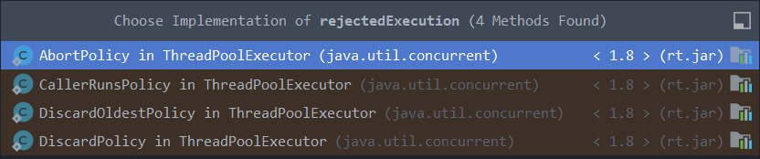

## 线程池的关闭方式

Java 线程池的关闭方式有两种：调用 shutdown() 和 shutdownNow() 方法。

1. 调用 shutdown() 方法

shutdown() 方法会平缓地关闭线程池，即不会中断正在执行的任务，能够处理完阻塞队列中已提交的任务，但不会接收新的任务。

```java
ExecutorService executor = Executors.newFixedThreadPool(10);
// 提交任务给线程池执行
...
// 关闭线程池
executor.shutdown();
```

2. 调用 shutdownNow() 方法

shutdownNow() 方法会强制立即关闭线程池，即中断所有正在执行的任务，不会处理阻塞队列中已提交的任务，更不会接收新的任务。

```java
ExecutorService executor = Executors.newFixedThreadPool(10);
// 提交任务给线程池执行
...
// 关闭线程池
executor.shutdownNow();
```

## 最佳线程数

要确定线程池的最佳线程数是根据应用场景确定的，一般可以将程序分为CPU密集型程序和I/O密集型程序，对于这两种程序，计算最佳线程数的方法是不同的。

1. CPU密集型程序

   CPU密集型程序对CPU的资源利用率高，理论最佳线程数=CPU核心数，一般会将线程数设为CPU核心数+1，以避免有的线程阻塞浪费CPU资源

   

2. I/O密集型程序

   I/O密集型程序对CPU的资源利用率低，线程数的计算需要考虑I/O操作的CPU占用率，理论上最佳线程数=CPU核心数 * (1 + I/O操作的耗时/CPU计算的耗时)

通过上述方式计算出的线程数只是理论上的最佳线程数，在实际中，需要对系统进行压测，并根据压测结果确定最佳线程数。

# XXX程

## 进程和线程

- 进程：操作系统分配资源的基本单位

- 线程：操作系统执行的基本单位，可以通俗的理解为程序不同的执行路径


## [协程](https://cloud.tencent.com/developer/article/1839604)（纤程）

协程（Coroutine）是Linux中的概念，对应的纤程（Fiber）是Windows中的概念，实现思路大致相同。

协程，是一种用户态的轻量级线程，协程的调度完全由用户控制（也就是在用户态执行）。协程拥有自己的寄存器上下文和栈。协程调度切换时，将寄存器上下文和栈保存到线程的堆区，在切回来的时候，恢复先前保存的寄存器上下文和栈，直接操作栈则基本没有内核切换的开销，所以上下文的切换非常快。

## 超线程

超线程（Hyper-Threading）是Intel公司引入的一种处理器（CPU）技术。这项技术的主要目标是提高处理器核心的效率和性能。超线程通过使单个处理器核心模拟出两个“逻辑”核心，以便同时处理两个线程，从而提高了处理器的并行处理能力。

传统的单核心处理器在任何时刻只能处理一个线程。但是，由于各种原因（例如，等待数据从内存中加载），处理器可能无法始终保持忙碌状态。在这些情况下，处理器的一部分（例如，算术逻辑单元或浮点单元）可能会闲置，从而造成资源浪费。

超线程技术试图解决这个问题，通过在单个核心上同时运行两个线程，使得当一个线程在等待时，另一个线程可以使用处理器的资源进行计算。因此，超线程可以使处理器在相同的时间内完成更多的工作，从而提高处理器的整体效率和性能。

然而，超线程并不总是能提供显著的性能提升。在某些情况下，如果两个线程需要使用相同的处理器资源，那么它们可能会相互竞争，从而导致性能下降。此外，超线程对于多线程程序或多任务环境最有效，对于单线程程序或单任务环境的效果可能不明显。

请注意，虽然超线程可以提高处理器的并行处理能力，但它并不能取代多核处理器。多核处理器具有多个独立的物理核心，每个核心都可以处理自己的线程，因此它们通常可以提供比超线程更好的并行性和性能。

# 并发编程相关的概念

## 临界区

- 临界区表示可以被多线程共享的资源，但是每次只能提供给一个线程使用
- 在并发编程中，临界区指的是受保护的对象或程序代码段

## 操作系统的互斥量


## 用户态、内核态

## 同步和异步

- 以同步方式调用方法时，必须在方法返回结果之后才能执行后面的操作
- 以异步方式调用方法时，不需要等方法返回信息就可以执行后面的操作，当方法完成后，会以通知或回调的方式告诉调用方

## 死锁、饥饿、活锁

1. 死锁指两个或多个线程在执行过程中互相等待对方释放资源的情况，导致彼此无法继续执行；
2. 饥饿指某个线程由于无法获得所需资源而一直无法执行；
3. 活锁指两个或多个线程由于某些条件发生变化，导致彼此不断地改变自己的状态和行为，但始终无法向前推进。


## 死锁

### 形成死锁的必要条件

1. 互斥条件：资源只能被一个线程占有
2. 不可剥夺条件：线程占有的资源不能被其他线程强行撤销
3. 请求与保持条件：如果线程已经占有了一个资源，有需要抢占新资源，而该新资源已经被其它线程占有时，那么抢占新资源的线程会阻塞等待，不会释放自己已经占有的资源
4. 循环等待条件：发生死锁时，必然存在一个线程与资源的循环等待链，链中的线程请求的资源被下一个线程占有

### 死锁的预防

1. 死锁的预防是破坏死锁形成的条件，而互斥条件不能被破坏，因为使用锁的目的就是要保证这一点。
2. 破坏不可剥夺条件：让当前线程主动释放锁，JVM内置的synchronized锁不能实现这一点，JDK的Lock锁可以实现。使用方法是，通过tryLock()方法加锁，并在finally代码块中调用unlock()方法释放锁。
3. 破坏请求与保持条件：一次性申请线程所需的全部资源，再运行过程中不再请求新的资源。
4. 破坏循环等待条件：按照一定的顺序申请资源，实现方法是为每一个资源分配一个唯一编号，每次申请资源时都按照一定的顺序加锁，比如每次都先对编号较小的资源加锁。


## 自旋锁

自旋锁是指线程在获取锁失败后，不会立即进入阻塞状态，而是继续不断尝试获取锁

# 原子性、可见性、有序性

1. 原子性

   原子性操作和数据库中的事务类似

   造成原子性问题的根本原因是在线程执行过程中发生了线程切换

2. 可见性

   可见性是指一个线程修改共享变量，其他线程能够立即读取到共享变量的最新值

   造成可见性问题的根本原因是CPU的缓存机制

3. 有序性

   有序性指程序能够按照代码的顺序执行，不会发送乱序执行

   一个典型的有序性问题是使用双重监测机制创建单例对象（DCL单例），如果在多线程情况下创建单例对象发送乱序执行就可能产生bug

解决方法：

1. 原子性：Java中解决原子性问题的方案是使用synchronized锁、Lock锁、ReentrantLock、ReentrantReadWriteLock锁、CAS操作或原子类等。
2. 可见性：使用缓存一致性协议
3. 有序性：禁止指令重排

## 原子性核心原理

### 总线锁保证原子性

多核CPU对内存中的一个共享变量值进行加1操作不是原子操作，这是因为在CPU中对值加1的操作有三步（设被加1的数叫count）：

1. 将内存中的count值读取到寄存器。
2. 对寄存器中的count值进行加1操作。
3. 将寄存器中的count值写回内存。

如果要保证这三步的原子性，就要保证在CPU1执行这三步的时候，其他CPU不能读写这个共享变量的内存。CPU可以通过对总线加锁来解决这个问题。

在Linux系统中，锁定总线的指令是lock前缀指令。该指令可以与其他指令组合使用，例如lock add、lock cmpxchg、lock xchg等，用于实现原子性操作。

lock前缀指令会将总线置为锁定状态，以确保对内存的访问具有原子性和互斥性。当一个CPU执行带有lock前缀的指令时，它将先发送请求到总线，获取总线的独占控制权，然后执行相关的操作并释放总线控制权。由于总线只能被一个CPU独占，因此其他CPU在访问内存时会被阻塞，直到当前CPU执行完成。

总线锁定会导致其他CPU核心跟所有内存之间的通信全部阻塞，开销极大，而输出LOCK#信号的CPU核心可能只需要使用内存中的很小一部分空间，会造成资源的浪费。

### 互斥锁保证原子性

互斥锁是一种显式地获取和释放锁的方式，当一个线程尝试获取互斥锁时，如果该锁已经被其他线程占用，那么当前线程就会被阻塞。

互斥锁模型：

1. 对保护临界区资源的锁对象加锁
2. 进入临界区代码执行
3. 对锁对象进行解锁

### CAS保证原子性

CAS底层使用的操作系统原语是lock cmpxchg

## 可见性和有序性核心原理

### 缓存一致性

由于CPU的多级缓存架构，引入了数据的不一致问题

CPU的缓存一致性要求CPU内部缓存中的数据和主内存中的数据一致

缓存一致性的特点：每个读操作所返回的值必须是最后一次对该存储位置的写操作的值。

### MESI协议

CPU通过缓存一致性协议（如MESI协议、MSI协议等）来保证缓存一致性

MESI协议的每一个字母都是一种一种状态的简称

- M：Modify

  处于M状态的缓存行的特点是：

  1. 缓存行数据被本地写（当前CPU核心修改缓存行数据），缓存行中的数据和主内存中的数据不一致
  2. 数据只在当前CPU核心的缓存中存在
  3. 处于M状态的缓存行中的数据必须在其他CPU核心读取主内存的数据之前写回主内存
  4. M状态的缓存行数据被写回主内存后，当前缓存行的状态会被标记为E

- E：Exclusive

  处于E状态的缓存行的特点：

  1. 缓存行数据未被修改过，缓存行中的数据和主内存中的数据一致，缓存行有效
  2. 数据只在当前CPU核心的缓存中存在
  3. 处于E状态的缓存行的数据如果被其他的CPU核心读取，会变成S状态
  4. E状态的缓存行数据被修改后，当前缓存行的状态会被标记为M

- S：Shared

  处于S状态的缓存行的特点是：

  1. 缓存行数据未被修改过，缓存行中的数据和主内存中的数据一致，缓存行有效
  2. 数据存在于多个CPU核心的缓存
  3. 处于S状态的缓存行的数据如果发生本地写，会变成M状态
  4. 处于S状态的缓存行的数据如果发生远程写（其他CPU核心修改缓存行数据），会变成I状态

- I：Invalid

  处于I状态的缓存行的特点是：

  1. 处于I状态的缓存行无效
  2. 处于M、E或S状态的缓存行数据，如果发生远程写，则这些缓存行状态都会改为I状态


MESI存在的问题：

1. MESI协议在高并发场景下可能会存在问题，原因是在MESI协议下，如果当前CPU需要其他的CPU缓存行改变状态，会发送RFO（Request For Owner）请求进行通知，请求到达其他的CPU是需要时间的，在高并发场景下状态的修改可能会不及时。

2. M状态的缓存行数据不会立即更新到主内存，可能会导致其他CPU缓存行中读取的数据和修改后的数据出现短暂的不一致，

   这一问题可以通过加锁或volatile解决。

3. 存在伪共享问题。伪共享问题产生的原因是，CPU进行缓存和主内存交换数据的单位是缓存行（目前主流CPU缓存行的大小是64bytes），MESI协议也是针对缓存行变更状态，不是单个数据的状态。一个缓存行可能会存储了多个不同数据，所以缓存行中不同数据的状态存在共享的可能（伪共享），会导致不同数据的缓存状态彼此干扰。

   JDK8之前可以通过字节填充的方式解决伪共享问题，思路大致是在创建变量时，用其他字段填充当前变量所在的缓存行，避免同一个缓存行内存放多个数据变量。

   JDK8中引入了@Contended注解来自动填充缓存行，@Contended注解可以用在类和成员变量上，加上@Contended注解后JVM会自动填充，避免出现伪共享问题。使用@Contended注解需要注意的问题是，@Contended只能用在Java自身的核心类中，如果要用在自己写的类里面，需要添加JVM参数`-XX:RestrictContended`，此外，@Contended默认的填充宽度是128bytes，如果需要自定义宽度需要配置JVM的`-XX:ContendedPaddingWidth`参数。

   

### volatile核心原理

volatile在内存语义上有两个作用：

1. 保证被volatile修饰的共享变量对每个线程都是可见的（可见性）
2. 禁止指令重排（有序性）

volatile不支持原子性，非线程安全

#### 保证可见性的核心原理

volatile能够保证共享变量的可见性，如果一个共享变量使用volatile修饰，则共享变量所在的缓存行会被要求进行一致性校验，当一个线程修改了volatile修饰的共享变量后，修改后的共享变量值会立即刷新到主内存（MESI协议不会立即刷新，而是等远程读或远程写才会将修改后的数据值刷新到主内存）。

#### 保证有序性的核心原理

volatile禁止指令重排是通过内存屏障（Memory Barrier）实现的。

内存屏障的底层是CPU指令。这个指令有两个作用：

- 强制刷新缓存，保证共享变量的可见性

  强制刷新缓存是指将处理器的缓存中的数据立即写回到主内存。当处理器修改了某个内存地址的值时，为了确保其他处理器能够看到最新的值，处理器会将修改后的值先写入自己的缓存中，然后再定期将缓存中的数据刷新回主内存。但是有时候我们需要立即刷新缓存，以确保其他处理器能够尽快看到最新的值。这可以通过执行一个写屏障或者其他特定的指令来实现。

- 禁止指令重排，保证指令的执行顺序

  处理器为了提高程序执行效率，在编译（编译器重排序）或运行（CPU重排序）时会针对代码中的语句进行优化和重排。然而，在多线程并发环境下，这种重排可能会导致一些共享变量的状态无法正确传递，从而出现数据不一致的情况。内存屏障可以禁止指令重排，确保程序执行顺序的正确性。

  注：

  1. 编译器重排序：在代码编译阶段为了提高程序的执行效率，但不改变程序执行结果的重排序。
  2. CPU重排序：CPU按照as-if-serial原则进行指令级重排序和内存系统重排序。as-if-serial原则能够保证在单线程环境下程序执行的正确性，不能保证在多线程环境下程序执行结果的正确性。

volatile禁止指令重排序的规则：

| 是否能重排序 | 第二个操作 |            |            |
| ------------ | ---------- | ---------- | ---------- |
| 第一个操作   | 普通读或写 | volatile读 | volatile写 |
| 普通读或写   | 是         | 是         | **否**     |
| volatile写   | 是         | **否**     | **否**     |
| volatile读   | **否**     | **否**     | **否**     |

可以总结出规则是：

1. 当第一个操作是volatile读，无论第二个操作是什么，都不能重排序（读操作禁止重排序之后的操作）
2. 当第一个操作是volatile写，第二个操作是volatile读，不能重排序
3. 当第二个操作是volatile写，无论第一个操作是什么，都不能重排序（写操作禁止重排序之前的操作）

内存屏障的类型：

- LoadLoad屏障：禁止前面的读（Load）和后面的Load重排
- LoadStore屏障：禁止前面的Load和后面的写（Store）重排
- StoreStore屏障：禁止前面的Store重排和后面的Store重排
- StoreLoad屏障：禁止前面的Store重排和后面的Load重排

JVM编译器会按照上述规则在程序编译生成的指令中插入内存屏障，规则是：

1. 对于volatile读
   1. 后面插入一个LoadLoad屏障
   2. 后面插入一个LoadStore屏障
2. 对于volatile写
   1. 前面插入一个StoreStore屏障
   2. 后面插入一个StoreLoad屏障

#### DCL单例

DCL（Double Check Lock）单例为什么需要加volatile：

如果不加volatile，不能避免指令重排序，初始化指令和堆栈建立连接的指令可能会倒换，即可能出现堆栈建立连接发生在初始化指令之前，即

- 加volatile，没有被重排序的指令执行过程如下
  1. 初始化指令
  2. 堆栈建立连接的指令
- 不加volatile，可能出现的重排序的指令执行过程如下
  - 堆栈建立连接的指令
  - 初始化指令

这就导致在多线程环境下，如果没有使用volatile，假如一个线程正在使用创建对象，并且发生了指令重排序，使得堆栈建立连接的指令发生在初始化指令之前，那么当这条线程恰好执行完堆栈建立连接的指令，还没有执行初始化指令时，有一个新的线程线程执行DCL单例的函数，判断得到栈中已经指向堆中已有的对象，就会执行返回此对象，而此时对象还没有被初始化，此时获取的对象的值仅仅是默认值而不是初始化的值。

### Java内存模型

Java内存模型简称JMM，是Java为了解决可见性和有序性问题而指定的一种编程规范。

主内存：主要对应于Java堆中存储对象实例数据的部分

工作内存：主要对应于虚拟机栈中的部分区域

#### JMM的概念

对于线程的工作内存和主内存之间的数据交互，JMM规定了变量从主内存复制到工作内存，以及从工作内存同步到主内存的实现细节。

JMM规定

1. 所有变量都存储在主内存中，也就是存储在计算机的物理内存中
2. 每个线程都有自己的工作内存，用于存储线程私有数据
3. 线程不能直接访问其他线程的工作内存中的数据，只能通过主内存进行数据交互
4. 当线程需要操作变量时，需要先将主内存中的变量复制到对应的工作内存中

JMM同步数据的八种操作：

| 操作   | 名称 | 目标             | 作用                                                         |
| ------ | ---- | ---------------- | ------------------------------------------------------------ |
| lock   | 加锁 | 主内存中的变量   | 把主内存中的变量标记为线程独占的状态                         |
| unlock | 解锁 | 主内存中的变量   | 释放主内存中锁定的变量，释放后可以被其他线程锁定             |
| store  | 存储 | 工作内存中的变量 | 把工作内存中的变量的值刷新到主内存中，以便随后的write操作使用 |
| write  | 写入 | 工作内存中的变量 | 把store操作从工作内存中得到的变量写入到主内存的变量中        |
| read   | 读取 | 主内存中的变量   | 把主内存中的变量写入到工作内存中                             |
| load   | 载入 | 主内存中的变量   | 将read操作从主内存中得到的变量值载入工作内存的变量中         |
| use    | 使用 | 工作内存中的变量 | 将工作内存中的变量值传递给执行引擎                           |
| assign | 赋值 | 工作内存中的变量 | 执行引擎将值赋值给工作内存中的变量                           |

#### Happens-Before原则

在JMM中定义了一套Happens-Before原则，用于保证程序在执行过程中的可见性和有序性。

Happens-Before原则主要包括以下内容：

1. 程序次序原则

   写在前面的操作先行发生于写在后面的操作

2. volatile变量原则

   对一个volatile变量的写操作必然发生在后续对这个变量的读操作之前

3. 传递原则

   ABC三个操作，A先于B，B先于C，则A先于C

4. 监视锁规则

   对监视器的加锁发生在解锁之前

5. 锁定原则

   先解锁才能加锁

6. 线程启动原则

   线程start()后才能执行线程中的代码

7. 线程中断原则

   对线程的interrupt()方法的调用发生在中断事件产生之前

8. 线程终结原则

   线程结束后，其他线程能够访问到该线程修改后的共享变量的值

9. 对象终结原则

   一个对象的初始化必然在其finalize()方法之前执行

# synchronized

## synchronized用法

synchronized用法分三种：

1. 同步实例方法

   当类的普通方法被synchronized修饰时，相当于对this加锁，这个方法被声明为同步方法。

2. 同步静态方法

   当类的静态方法被synchronized修饰时，相当于对这个类的Class对象（.class）加锁，而一个类只对应一个Class对象。

3. 同步代码块

   通过对互不影响的临界区资源分别加锁（可能需要创建锁对象），可以减小对临界区资源的等待，提高程序的执行效率。

可以由此将synchronized的锁分成两类锁：

**对象锁**：对实例方法和同步代码块加的锁称为对象锁

**类锁**：对静态方法加的锁称为类锁

## Java对象结构

Java对象结构按照顺序由以下几部分组成：

1. 对象头
   1. Mark Word
   2. 类型指针
   3. 数组长度（仅在当前对象是数组时才会存在）
2. 实例数据
3. 对齐填充

以下是对Java对象组成部分的详细说明（64位JVM下）：

1. 对象头（8 + 4 + 4 = 12 + 4 = 16字节）

   1. Mark Word（8字节）

      Mark Word用于存储对象的运行时数据，按照锁状态可以分为以下几类：

      - 无锁：对象的Hash码（31位）、GC的分代年龄（4位）、偏向锁标记（1位）、锁的状态标志（2位）
      - 偏向锁：偏向锁线程id（54位）、获得偏向锁的时间戳（2位）、GC的分代年龄、偏向锁标记、锁的状态标志
      - 轻量级锁：轻量级锁指针（指向栈中锁的指针，62位）、锁的状态标志
      - 重量级锁：重量级锁指针（指向对象监视器的指针，62位）、锁的状态标志
      - GC标记（GC标记用于标记可以回收的垃圾对象）：锁的状态标志

   2. 类型指针（4字节，默认开启压缩，由8字节压缩为4字节）

      类的类元信息存储在JVM的方法区中，对象头的类型指针会指向存储在方法区中的类元信息

      不同位数的JVM中长度不同，在32位JVM中，类型指针占用32位的存储空间，64位JVM中，占用64位。

   3. 数组长度（仅在当前对象是数组时才会存在，4字节）

2. 实例数据

   存储对象的成员变量信息，既包含了类的成员变量值（具体值），也包含了父类的成员变量值

3. 对齐填充

   以满足JVM中对象的起始地址是8的整数倍的要求，所以对象的实例变量占用的存储空间需要是8字节的整数倍

## 使用JOL查看对象结构

为了方便查看JVM中对象结构并计算某个对象的大小，OpenJDK提供了一个JOL工具包

定义了一个int[]数组，并使用JOL提供的方法输出对象信息：

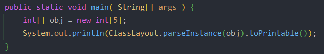

输出的Java对象信息：

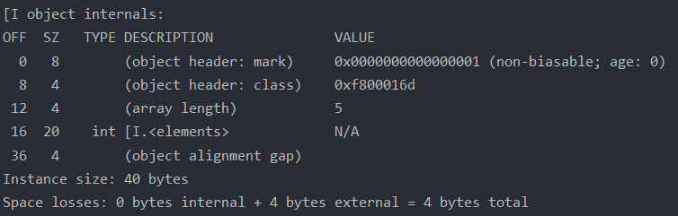

## synchronized底层实现

JVM是基于JVM中的monitor锁实现的，Java1.5版本之前的synchronized锁性能较低，但是从Java1.6开始，对synchronized锁进行了优化，引入了锁升级、锁粗化、锁消除等技术来提高synchronized的性能。

1. 字节码层面

   - synchronized修饰的方法的字节码会比普通方法多一个ACC_SYNCHRONIZED标识符

   - synchronized修饰的代码块的字节码会在同步代码块的前后分别添加monitorenter和monitorexit指令

2. JVM层面

   synchronized修饰方法和代码块，在底层实现上没有本质区别

   重量级锁的底层是基于Monitor锁实现的

3. 操作系统层面

   轻量级锁的底层是基于CAS实现的

   Monitor锁是基于操作系统的Mutex锁实现的，Mutex锁是操作系统级别的重量级锁。

## Monitor锁原理

重量级锁的底层是基于Monitor锁实现的，而Monitor锁又是基于操作系统的Mutex锁实现的

在Java中创建出来的任何一个对象都会关联一个Monitor对象，当Monitor对象被一个Java对象持有后（Monitor对象的owner参数不为空），这个Monitor对象就会处于锁定状态。

在HotSpot JVM中，Monitor对象是由ObjectMonitor实现的，ObjectMonitor 是JVM中用于实现对象的同步、监视和锁定的重要数据结构。ObjectMonitor的数据结构：

```c
ObjectMonitor() {
    _header       = NULL;
    _count        = 0; // 记录线程获取锁的次数
    _waiters      = 0,
    _recursions   = 0;  // 锁的重入次数
    _object       = NULL;
    _owner        = NULL;  // 指向持有ObjectMonitor对象的线程
    _WaitSet      = NULL;  // 处于wait状态的线程，会被加入到_WaitSet
    _WaitSetLock  = 0 ;
    _Responsible  = NULL ;
    _succ         = NULL ;
    _cxq          = NULL ;
    FreeNext      = NULL ;
    _EntryList    = NULL ;  // 处于等待锁block状态的线程，会被加入到该列表
    _SpinFreq     = 0 ;
    _SpinClock    = 0 ;
    OwnerIsThread = 0 ;
  }
```

ObjectMonitor的几个关键属性 `count、recursions、owner、WaitSet、 EntryList` 体现了monitor的工作原理

synchronized加锁与解锁在JVM底层的实现流程大致分为以下几步：

1. 被阻塞的线程被封装成ObjectWaiter对象进入`_EntryList`，获取到锁（获取到Monitor对象）的线程就会被`_owner`指向，并把ObjectMonitor对象的`_count`变量值加1。

2. 当线程调用wait()方法时，当前线程会释放持有的ObjectMonitor对象，并把`_owner`变量值设为NULL，`_count`变量值减1。

   由于wait()、notify()、notifyAll()等方法在执行过程中会使用ObjectMonitor对象，所以，必须在同步代码块或方法中调用这些方法。

3. 如果获取到ObjectMonitor对象的线程执行完毕，则会释放ObjectMonitor对象，将ObjectMonitor对象中的`_count`变量值减1（当`_count`变量值再次为0，当前线程就成功的释放了锁），`_owner`变量值设为NULL。

## 锁升级的过程

锁升级的过程经历以下几个阶段

1. 无锁
2. 偏向锁

3. 轻量级锁（自旋锁）

4. 重量级锁

Java锁对象由无锁升级为重量级锁的详细步骤：

1. 线程的抢占锁时首先会检查偏向锁标记位和锁标记位，如果发现是偏向锁，进行锁竞争的一般流程：

   1. 线程获取锁：线程会检查Mark Word中的偏向锁线程id是否是自己的线程id
      1. 如果是，则当前线程已经持有了锁，直接执行同步代码
      2. 如果不是，则当前线程会通过CAS自旋的方式尝试将Mark Word中的偏向锁线程id设为自己的线程id
         1. CAS操作成功，将Mark Word中的偏向锁线程id设为自己的线程id的操作成功
         2. CAS操作失败，说明此时有其他线程也在争抢锁资源，此时会撤销偏向锁，升级为轻量级锁

2. 如果发现是轻量级锁，进行锁竞争的一般流程：

   1. 将锁对象的 Mark Word 备份到 Displaced Mark Word （当线程被创建后，JVM会在线程的栈帧中创建一个用于存储锁记录（Lock Record）的空间，里面存储了owner和Displaced Mark Word）中，并将栈帧的owner指针指向锁对象

   2. 尝试通过 CAS 将锁对象的 Mark Word 更新为指向 Displaced Mark Word 的指针

      1. 如果CAS操作成功，表示当前线程成功获取了轻量级锁，并进入临界区执行。

      2. 如果已经指向其他线程，竞争锁失败，会进行CAS操作

         1. 自旋等待：如果CAS操作失败，表示锁对象已经被其他线程占用。此时，请求锁的线程会进入自旋等待状态。在自旋等待状态下，线程会反复尝试使用CAS操作获取锁，而不会被阻塞。

         1. 自旋限制：CAS自旋操作超过一定的次数仍未抢占到锁，轻量级锁会膨胀为重量级锁，进入阻塞状态。

            对于自旋次数上限值，JDK中提供了自适应自旋的方案，如果当前线程的CAS自旋成功，就会增大下一次的自旋次数上限值，如果失败，就会减小。

   3. 当线程释放锁

      1. 如果锁对象还是轻量级锁的状态，当前线程就会使用CAS操作将Displaced Mark Word中存储的信息复制到锁对象的Mark Word中
      2. 如果锁对象已经升级为了重量级锁，当前线程就会释放锁并唤醒其他被阻塞的线程争抢锁

3. 如果发现是重量级锁，进行锁竞争的一般流程：

   1. 线程请求锁：当一个线程需要获取重量级锁时，它会向操作系统发送请求。
      1. 如果当前没有其他线程持有锁，请求的线程会成功获取锁，并进入临界区执行。

      2. 如果锁已经被其他线程占用，请求的线程将进入阻塞等待状态，线程会被操作系统挂起，不会占用CPU资源。


Java锁对象由无锁升级为重量级锁的其他途径：

1. 计算一致性哈希

   只要锁对象计算过一致性哈希，偏向模式就置为0了，也就意味着该对象锁不能再偏向了，最低也会膨胀会轻量级锁。
   如果对象锁处于偏向模式时遇到计算一致性哈希请求，那么会跳过轻量级锁模式，直接膨胀为重量级锁。

## 锁降级

重量级锁的降级只会发生在GC期间的STW阶段，只能降级为可以被JVM线程访问，而不被其他Java线程访问的对象。

# AQS核心原理

，

AQS（AbstractQueuedSynchronizer）是volatile和CAS和队列的组合应用

java中哪些同步锁是基于AQS实现的：

Java 并发包 `java.util.concurrent` 中的许多同步工具类都是基于 `AbstractQueuedSynchronizer` (简称 AQS) 来实现的。AQS 是一个用于构建锁和同步器的框架，它使用一个 int 成员变量来表示同步状态，并提供了一种使用 CAS（Compare-and-Swap）设置同步状态的方式。以下是一些基于 AQS 实现的同步类：

1. **ReentrantLock**：重入锁，是一种互斥锁，它的特点是支持重入功能，也就是说，一个线程能够对已经获取到的锁再次获取，而不会发生死锁。

2. **ReentrantReadWriteLock**：读写锁，它分为两个锁，一个是读锁，一个是写锁。多个读锁之间不会互斥，读锁与写锁互斥，写锁与写锁互斥。这是由jvm自己控制的，你只要上好相应的锁即可。

3. **Semaphore**：信号量，内部维护了一组"许可"，线程可以申请许可（如果无可用许可则阻塞），也可以释放许可。信号量可用于实现资源池，或者对某个操作的并发线程数进行限制。

4. **CountDownLatch**：倒计时门栓，它可以让一个或多个线程等待其他线程完成各自的工作后再执行。

5. **CyclicBarrier**：循环栅栏，它允许一组线程互相等待，直到所有的线程都准备就绪后，所有的线程才能继续执行。

6. **FutureTask**：一个实现了 `Future` 和 `Runnable` 接口的类，可以用来执行 `Callable` 任务，并且可以获取任务执行后的结果。

这些类都通过自定义 AQS 来实现它们自己的同步语义。

## AQS数据结构原理

AQS（AbstractQueuedSynchronizer，抽象队列同步器）是Java中提供的一个抽象类，位于java.util.concurrent.locks包下

AQS的数据结构主要包括以下几个部分：

1. 两类FIFO（先进先出）的双向链表（同步队列和同步条件队列）

   链表中的每个节点都是对线程的封装，如果线程竞争锁失败，就会被封装成一个Node节点加入AQS队列的尾部。当获取锁的线程释放锁之后，会从AQS中唤醒一个被阻塞的线程。

   1. 同步队列通过addWaiter()方法添加到队列的尾部，通过acquire()方法退出同步队列
   2. 同步条件队列addConditionWaiter()方法添加到队列的尾部，通过doSignal()方法退出同步队列。AQS中的同步条件队列就是为Lock锁实现的一个基础同步器，只有在使用了Condition时会存在条件队列，并且一个线程可能存在多个条件队列

2. 头节点指针、尾节点指针

   头节点指针指向的节点封装的线程会占用资源，同时会通过CAS的方式更新state变量、头/尾节点指针的指针的指向。

3. 用来标识状态的volatile修饰的变量state

   AQS中使用getState()方法读取state变量的值，使用setState()（无法保证原子性）和compareAndSetState()方法（能够保证原子性）设置state变量的值

4. Node类，AQS实现的独占锁和共享锁是在其静态内部类Node中定义的

   静态内部类Node是一个双向链表，节点中保存了当前的状态waitState和当前线程thread。通过SHARED和EXCLUSIVE定义共享或独占状态。

   Node中有四个常量，是waitState变量的取值，waitState变量也是用volatile修饰：

   ```java
   /** waitStatus value to indicate thread has cancelled */
   // 表示当前节点中的线程已被取消
   static final int CANCELLED =  1;
   /** waitStatus value to indicate successor's thread needs unparking */
   // 表示后继节点中的线程处于等待状态，需要被唤醒
   static final int SIGNAL    = -1;
   /** waitStatus value to indicate thread is waiting on condition */
   // 表示当前节点中的线程在等待某个条件，也就是当前节点处于condition队列中
   static final int CONDITION = -2;
   /**
    * waitStatus value to indicate the next acquireShared should
    * unconditionally propagate
    */
   // 表示在当前场景下能够执行后续的acquireShared操作
   static final int PROPAGATE = -3;
   ```

## AQS底层对锁的支持

Java中java.util.concurrent包下的大部分工具类的实现都基于AQS（都extends Sync，而Sync extends AbstractQueuedSynchronizer）。基于AQS的工具类：

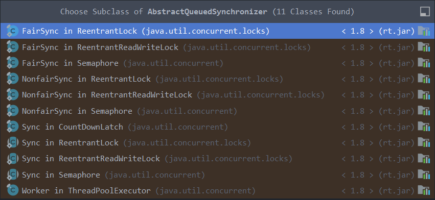

AQS底层支持独占锁和共享锁两种模式：

1. 独占锁同一时刻只能被一个线程占用，如ReentrantLock
2. 共享锁同一时刻可以被多个线程占用，如CountDownLatch、Semaphore等
3. 有的锁实现类同时实现了独占锁和共享锁两种模式：如ReentrantReadWriteLock

## 独占锁和共享锁的实现流程

**独占锁模式下的加锁流程：**

独占锁加锁的入口是acquire()方法，当线程调用acquire()方法获取独占锁时，首先会调用tryAcquire()方法尝试获取锁资源，如果获取失败返回false，就会调用addWaiter()方法将当前线程封装为Node节点，添加到AQS队列的尾部。然后调用acquireQueued()方法在等待队列中排队，在acquireQueued()方法中进入一个循环逻辑：如果监测到前驱节点是head节点，就尝试获取锁，如果获取成功就将head指向当前Node节点；如果前驱节点不是head节点，就调用shouldParkAfterFailedAcquire()方法判断是否可以进入waiting状态，如果可以，就进入阻塞状态直到调用LockSupport的unpark()方法唤醒当前线程。

**独占锁模式下的解锁流程：**

独占锁模式中，释放锁的入口方法是release()，在release()方法中首先会调用tryRelease()方法尝试释放锁，如果返回true，并且head节点不为空且head节点的waitState状态不为0，会调用unparkSuccessor()方法唤醒队列最前面可以被唤醒的节点。

**共享锁模式下的加锁流程：**

共享锁加锁的入口是acquireShared()方法，当线程调用acquireShared()方法获取共享锁时，首先会调用tryAcquireShared()方法尝试获取锁资源，如果获取失败返回负数，就会调用doAcquireShared()方法将当前线程封装为Node节点，添加到AQS队列的尾部并阻塞。然后监测前驱节点是否是head节点，就尝试获取锁，如果获取成功就将head指向当前Node节点，如果同时还有剩余资源则继续唤醒队列中后面的线程；如果前驱节点不是head节点，就调用shouldParkAfterFailedAcquire()方法判断是否可以进入waiting状态，如果可以，就进入阻塞状态直到调用LockSupport的unpark()方法唤醒当前线程。

**共享锁模式下的解锁流程：**

共享锁模式中，释放锁的入口方法是releaseShared()，在release()方法中首先会调用tryReleaseShared()方法尝试释放锁，如果返回true，就执行doReleaseShared()方法唤醒队列后面的线程。

# Lock锁核心原理

## 显示锁

Lock显示锁和synchronized隐式锁

1. Lock锁都是手动写代码去获取锁和释放锁的，所以也叫显示锁
2. 而当调用synchronized修饰的代码时，并不需要显示的加锁和解锁的过程，所以称之为隐式锁

JUC显示锁中核心的接口是Lock接口，位于java.util.concurrent.locks包下：

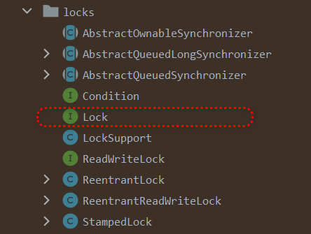

Lock接口提供的方法：

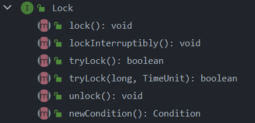

## 公平锁和非公平锁的原理

公平锁中的线程在抢占锁时首先会判断等待队列是否为空，如果队列为空或者当前线程是队列的队首元素，则当前线程获取到锁资源，否则会被放入队列尾部等待获取锁

非公平锁中的线程在抢占锁时会先直接尝试抢占锁，如果抢占成功就继续执行程序的业务逻辑，如果抢占失败，才会进入等待队列中等待

ReentrantLock支持公平锁和非公平锁，在使用时公平锁和非公平锁的用法一样：

```java
// 创建公平锁实例
Lock lock = new ReentrantLock(true); // 创建公平锁
// Lock lock = new ReentrantLock(false); // 创建非公平锁
// Lock lock = new ReentrantLock(); // 创建非公平锁
try {
	lock.lock();
} finally {
	lock.unlock();
}
```

## 悲观锁和乐观锁的原理

悲观锁的核心思想是对数据是否被修改持有悲观态度，认为其他线程会修改数据，所以在线程每次获取数据时都会加锁。

乐观锁的核心思想是对数据是否被修改持有乐观态度，认为其他线程不会修改数据，所以在线程每次获取数据时都不会加锁。乐观锁适合读多写少的场景。

synchronized锁就是悲观锁

java.util.concurrent.atomic包下的原子类就是乐观锁

AtomicInteger类的用法示例：

```java
AtomicInteger atomicInteger = new AtomicInteger(); //创建原子类
atomicInteger.incrementAndGet(); //加1
int num = atomicInteger.get(); // get值
```

## 可中断锁和不可中断锁的原理

可中断锁指在多个线程抢占的过程中可以被中断的锁。

不可中断锁指在多个线程抢占的过程中不可以被中断的锁。

ReentrantLock，就是可中断锁，ReentrantLock支持两种可中断锁的使用方式，lockInterruptibly()和tryLock(long timeout, TimeUnit unit)，如果当前线程在抢占锁的过程中被中断，就会抛出InterruptedException()用法示例：

```java
try {
	lock.lockInterruptibly();
} catch (InterruptedException) {
	// 抢占锁被中断
} finally {
	lock.unlock();
}
```

synchronized锁是不可中断锁，只能在抢占锁成功后被中断，不能在抢占锁的过程中被中断。

## 独占锁和共享锁的原理

按照加锁后的资源能否在被多个线程访问，可以将锁分为独占锁和共享锁

线程获取到独占锁后，其他线程如果想要获取该锁，只能等待。

线程获取到共享锁后，其他线程也可以获取到该锁，但是共享锁只允许对临界区的数据进行读取操作，不允许修改。也就是说，共享锁是针对读操作的锁。

synchronized锁、ReentrantLock锁、ReentrantReadWriteLock的写锁都是独占锁。

ReentrantReadWriteLock的读锁、Semaphore类、CountDownLatch类都是共享锁。

## 读/写锁

### ReentrantReadWriteLock

ReentrantReadWriteLock是ReadWriteLock接口的实现类：`ReentrantReadWriteLock implements ReadWriteLock`

ReadWriteLock支持由写锁将为读锁（锁降级）

ReentrantReadWriteLock的写锁（独占锁）用法示例：

```java
public class WriteUsage {
    ReadWriteLock readWriteLock = new ReentrantReadWriteLock();
    Lock writeLock = readWriteLock.writeLock(); //ReadWriteLock的写锁（独占锁）

    public void writeLockUsage(){
        try {
            writeLock.lock();
            System.out.println(Thread.currentThread().getName() + "抢占锁成功");
            Thread.sleep(1000); //使占有锁的线程运行一段时间后再释放
        } catch (InterruptedException e) {
            System.out.println("sleeping");
        } finally {
            writeLock.unlock();
            System.out.println(Thread.currentThread().getName() + "释放锁成功");
        }
    }

    public static void main(String[] args) {
        WriteUsage writeUsage = new WriteUsage();
        for (int i = 0; i < 5; i++) {
            new Thread(() -> {
                System.out.println(Thread.currentThread().getName() + "开始抢占锁");
                writeUsage.writeLockUsage();
            }).start();
        }
    }
    /*
    	输出的结果：
            Thread-1开始抢占锁
            Thread-4开始抢占锁
            Thread-3开始抢占锁
            Thread-0开始抢占锁
            Thread-2开始抢占锁
            Thread-1抢占锁成功
            Thread-1释放锁成功
            Thread-4抢占锁成功
            Thread-4释放锁成功
            Thread-3抢占锁成功
            Thread-3释放锁成功
            Thread-0抢占锁成功
            Thread-0释放锁成功
            Thread-2抢占锁成功
            Thread-2释放锁成功
        只有一个线程能够抢占到写锁
    */
}

```

ReentrantReadWriteLock的读锁（共享锁）用法示例：

```java
public class ReadUsage {
    ReadWriteLock readWriteLock = new ReentrantReadWriteLock();
    Lock readLock = readWriteLock.readLock(); //ReadWriteLock的读锁（共享锁）
    public void readLockUsage(){
        try {
            readLock.lock();
            System.out.println(Thread.currentThread().getName() + "抢占锁成功");
            Thread.sleep(1000); //使占有锁的线程运行一段时间后再释放
        } catch (InterruptedException e) {
            System.out.println("sleeping");
        } finally {
            readLock.unlock();
            System.out.println(Thread.currentThread().getName() + "释放锁成功");
        }
    }
    public static void main(String[] args) {
        ReadUsage readUsage = new ReadUsage();
        for (int i = 0; i < 5; i++) {
            new Thread(() -> {
                System.out.println(Thread.currentThread().getName() + "开始抢占锁");
                readUsage.readLockUsage();
            }).start();
        }
    }
    /*
    	输出的结果：
            Thread-0开始抢占锁
            Thread-4开始抢占锁
            Thread-2开始抢占锁
            Thread-3开始抢占锁
            Thread-1开始抢占锁
            Thread-0抢占锁成功
            Thread-4抢占锁成功
            Thread-2抢占锁成功
            Thread-3抢占锁成功
            Thread-1抢占锁成功
            Thread-0释放锁成功
            Thread-2释放锁成功
            Thread-4释放锁成功
            Thread-1释放锁成功
            Thread-3释放锁成功
        多个线程都能够抢占到读锁
    */
}

```


### StampedLock

StampedLock支持读锁、写锁、乐观锁三种模式。

## LockSupport原理

LockSupport位于`java.util.concurrent.locks`包，是Java提供的创建锁和其他多线程工具的基础类库，主要作用就是阻塞和唤醒线程，底层是基于UnSafe类实现的。AQS 底层就是使用了`LockSupport`来实现线程的阻塞和唤醒。

LockSupport类提供的核心方法：

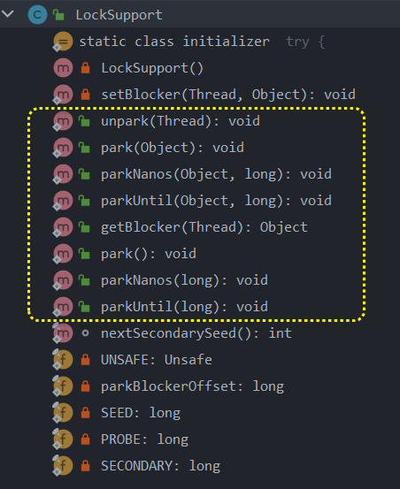

| 方法                                                        | 功能                                                         |
| ----------------------------------------------------------- | ------------------------------------------------------------ |
| public static void park()                                   | 阻塞当前线程                                                 |
| public static void park(Object blocker)                     | 使用指定的 blocker（锁对象）阻塞当前线程                     |
| public static void parkNanos(long nanos)                    | 阻塞当前线程，并指定了最长阻塞的时间，单位是纳秒             |
| public static void parkUntil(long deadline)                 | 阻塞当前线程，并指定了deadline时间点                         |
| public static void parkNanos(Object blocker, long nanos)    | 阻塞当前线程，并指定了使用的 blocker（锁对象）、最长阻塞的时间，单位是纳秒 |
| public static void parkUntil(Object blocker, long deadline) | 阻塞当前线程，并指定了使用的 blocker（锁对象）、deadline时间点 |
| public static void unpark(Thread thread)                    | 解除指定已被park的线程的阻塞状态；如果线程已经启动但还未park，就取消下一次的park。 |

在底层实现上，`LockSupport`使用了一种名为"许可（Permit）"的概念来控制阻塞和唤醒。Permit的数量最多为1。

如果线程已经拿到了Permit，则调用`LockSupport.park()`会立即返回；如果没有拿到Permit，`park()`方法会阻塞线程。调用`LockSupport.unpark(Thread)`方法会给指定的线程发放Permit。

unpark()可以先于park()调用：如果 `unpark(thread)` 在 `park()` 之前被调用，那么线程会获得一个Permit，当后续 `park()` 被调用时，线程可以立即消费掉这个Permit并继续执行，而不会阻塞。

如果调用者的线程被中断，park 将返回。

下面是一个简单的`LockSupport`使用例子：

```java
public class LockSupportExample {
    public static void main(String[] args) {
        Thread thread = new Thread(() -> {
            System.out.println("Child thread begin park!");

            // 调用park方法，挂起自己
            LockSupport.park();

            System.out.println("Child thread end park!");
        });

        thread.start();

        // 主线程延迟2s
        try {
            Thread.sleep(2000);
        } catch (InterruptedException e) {
            e.printStackTrace();
        }

        System.out.println("Main thread begin unpark!");

        // 调用unpark方法让thread线程持有许可证，然后park方法返回
        LockSupport.unpark(thread);
    }
}
```

在这个例子中，子线程通过调用`LockSupport.park()`方法阻塞自己，主线程在延迟2秒后调用`LockSupport.unpark(thread)`方法唤醒子线程。

# CAS核心原理

## CAS的基本概念

> 将内存位置的内容与给定值进行比较，只有当它们相同时，才将该内存位置的内容修改为新的给定值

CAS（Compare And Swap）是一种无锁编程算法，属于乐观锁。

CAS以原子性的方式更新共享变量的数据，能够保证线程安全。

CAS算法的使用包含以下步骤（假设新值是基于共享变量的旧值计算得到的，比如加1操作）：

1. 读取到的共享变量的值是prev
2. 确定要修改的值是next（如next=prev+1）
3. 再次读取共享变量的值是cur，并比较prev和cur是否一样，即计算得到next的操作前后共享变量的值是否发生了改变。如果没有发生改变就更新共享变量的值为next；如果发生了改变，则重新从第一步开始执行，或者根据需要结束执行。

AtomicInteger的getAndUpdate方法的实现就体现了这一点：

```java
public final int getAndUpdate(IntUnaryOperator updateFunction) {
    int prev, next;
    do {
        prev = get();
        next = updateFunction.applyAsInt(prev);
    } while (!compareAndSet(prev, next));
    return prev;
}
```

## CAS的核心类Unsafe

Unsafe类是Java中实现CAS操作的核心类，位于sun.misc包，在UnSafe类中提供了大量的native方法，通过JNI的方式调用JVM底层的C和C++实现的方法。java.util.concurrent.atomic包下提供的原子类底层操作都是基于Unsafe类实现的。

使用Unsafe的CAS方法实现count++：

```java
public class CasCountIncrement {
    public static Unsafe getUnsafe() {
        Unsafe unsafe = null;
        try {
            Field singleOneInstanceField = Unsafe.class.getDeclaredField("theUnsafe");
            singleOneInstanceField.setAccessible(true);
            unsafe = (Unsafe) singleOneInstanceField.get(null);
        } catch (NoSuchFieldException | IllegalAccessException e) {
            e.printStackTrace();
        }
        return unsafe;
    }
    private static final Unsafe unsafe = getUnsafe();
    private static final int THREAD_COUNT = 20;
    private static final int EXECUTE_COUNT_EACH_THREAD = 500;
    private volatile int count = 0;
    private static long countOffset = 0;

    static {
        try {
            countOffset = unsafe.objectFieldOffset(CasCountIncrement.class.getDeclaredField("count"));
        } catch (NoSuchFieldException e) {
            e.printStackTrace();
        }
    }

    public void incrementCountByCas() {
        int oldCount = 0;
        do {
            oldCount = count;
        } while (!unsafe.compareAndSwapInt(this, countOffset, oldCount, oldCount + 1));
    }

    public static void main(String[] args) throws InterruptedException {
        CasCountIncrement casCountIncrement = new CasCountIncrement();
        CountDownLatch countDownLatch = new CountDownLatch(THREAD_COUNT);
        for (int i = 0; i < THREAD_COUNT; i++) {
            new Thread(() -> {
                IntStream.range(0, EXECUTE_COUNT_EACH_THREAD).forEach((j) -> {
                    casCountIncrement.incrementCountByCas();
                });
                countDownLatch.countDown();
            }).start();
        };
        countDownLatch.await();
        System.out.println("count = " + casCountIncrement.count); //count = 10000
    }
}
```

## ABA问题的解决方案

java中的java.util.concurrent.atomic包下提供了AtomicStampedReference类和AtomicMarkableReference类来解决ABA问题。

区别是：

1. AtomicStampedReference使用的是int类型的stamp，可以区分每一次的修改
2. AtomicMarkableReference使用的是boolean类型的mark，只能判断有没有修改过

实现源码：

1. AtomicStampedReference：在CAS的基础上增加了stamp

   ```java
   /*
   Params:
       expectedReference – the expected value of the reference 
       newReference – the new value for the reference 
       expectedStamp – the expected value of the stamp 
       newStamp – the new value for the stamp
   */
   public boolean compareAndSet(V expectedReference,
                                V newReference,
                                int expectedStamp,
                                int newStamp) {
       Pair<V> current = pair;
       return
           expectedReference == current.reference &&
           expectedStamp == current.stamp &&
           ((newReference == current.reference &&
             newStamp == current.stamp) ||
            casPair(current, Pair.of(newReference, newStamp)));
   }
   ```

2. AtomicMarkableReference：在CAS的基础上增加了mark

   ```java
   /*
   Params:
       expectedReference – the expected value of the reference 
       newReference – the new value for the reference 
       expectedMark – the expected value of the mark 
       newMark – the new value for the mark
   */
   public boolean compareAndSet(V expectedReference,
                                V newReference,
                                boolean expectedMark,
                                boolean newMark) {
       Pair<V> current = pair;
       return
           expectedReference == current.reference &&
           expectedMark == current.mark &&
           ((newReference == current.reference &&
             newMark == current.mark) ||
            casPair(current, Pair.of(newReference, newMark)));
   }
   ```

   

# 同步集合

同步集合指的是在对集合进行修改时，需要对整个集合加锁，保证修改的原子性和线程安全。

## Vector

Vector实现了List接口，底层是数组，Vector类保证方法线程安全的方式是在方法上添加synchronized关键字。

## Stack

Stack 继承自 Vector 类，在此基础上还增加了一个栈数据结构（FILO），实现了线程安全的栈操作。

## Hashtable

Hashtable是一个散列表类，实现了线程安全的 key-value 操作。

## 同步包装器

如果要讲非线程安全的集合类，如ArrayList、HashMap转换成线程安全的类，则需要使用Java提供的同步包装器。

java.util包下的Collections类中的synchronizedXxx方法就是Java的同步包装器。

将ArrayList对象转为同步集合类的对象，使用示例：

```java
List<Object> synchronizedList = Collections.synchronizedList(new ArrayList<>());
```

## 同步集合的缺陷

1. 性能问题

   同步集合大量使用了synchroized关键字修饰整个方法，使用的是重量级锁，在部分场景下，如读多写少等，性能低。

2. 竞态条件问题

   同步集合可以保证每种方法单独操作的原子性，但是不能保证方法组合起来的复杂操作的原子性。当程序中出现复合操作时，有可能出现竞态条件问题。

   > 备注：
   >
   > 竞态条件（Race Condition）是指，当两个或多个线程对同一共享资源进行读写操作时，最终的结果取决于线程执行的相对速度和调度顺序，从而导致程序出现不确定性结果的问题。
   >
   > 一个经典的例子是，两个线程 T1 和 T2 同时对共享资源 X 进行读取和加 1 操作，如果 T1 先读取了 X 的值，然后进行加 1 操作，但在 T1 执行完加 1 操作前，T2 也读取了 X 的值并进行加 1 操作，然后 T1 再将自己的结果写入 X 中，这时候 X 的值就只加了 1 而不是 2，因此出现了不一致的情况。

   在使用同步集合进行复合操作时，对同步集合加锁，可以有效避免竞态条件问题。

3. 使用迭代器遍历问题

   使用迭代器遍历（本质上是复合操作）同步集合也会出现线程安全问题。比如两个启动线程，一个进行迭代读，另一个线程进行删除操作，就会抛出ConcurrentModificationException异常，说明在迭代读的过程中另一个线程执行了删除操作，所以，存在线程安全问题。

   解决办法也是对同步集合加锁。

# 并发集合

并发集合是指在对集合进行修改时，不需要对整个集合进行加锁的集合类的统称，可以支持高效的并发操作。

## 并发List集合类

### CopyOnWriteArrayList

CopyOnWriteArrayList采用了写时复制技术，即在写的时候复制一个副本。

CopyOnWriteArrayList的底层是一个数组，对数组的读操作会直接返回原数组中的值，对数组的写操作会首先获取ReentrantLock独占锁，然后复制一份原数组的副本，在数组的副本上进行写操作，在执行完毕后，再将s狐族的副本赋值给原数组的引用array。

可以看出，CopyOnWriteArrayList存在的缺陷有：

1. 写操作时时间、空间开销大，适合写少读多的场景。
2. 不能保证数据的实时一致性，因为在修改数组的过程中的如果其它线程读，读到的是原数组的值，不一定是修改后的最新值。

CopyOnWriteArrayList的优点有：

1. 读取数据的性能高

在使用Iterator遍历CopyOnWriteArrayList时，实际上遍历的是array引用指向的原数组。

## 并发Set集合类

### CopyOnWriteArraySet

CopyOnWriteArraySet的底层是基于CopyOnWriteArrayList实现的，所以特点和CopyOnWriteArrayList一样。

CopyOnWriteArraySet的add方法也是直接调用了CopyOnWriteArrayList的addIfAbsent方法。

### ConcurrentSkipListSet

与CopyOnWriteArraySet不同的是，ConcurrentSkipListSet是有序的，并且底层不是基于CopyOnWriteArrayList，而是基于ConcurrentSkipListMap。Java1.7版本时加入。

ConcurrentSkipListSet的底层使用了跳表。跳表的实现方法是在链表的基础上加索引，每一级索引也是一个链表，通过增加索引的层级来提高查找数据的效率，并且高层索引中的节点会存在一个指向低层级索引节点的指针。使用跳表查找数据的时间复杂度是O(logn)。

## 并发Map集合类

### ConcurrentHashMap

**Java1.7的 ConcurrentHashMap**：

Java1.7及之前的版本，ConcurrentHashMap使用的是Segment组、 HashEntry数组和链表实现的，结构见下图。在并发修改ConcurrentHashMap中的数据时，只会针对Segment数组中的对应元素加锁（Segment分段锁）。


**Java1.8的 ConcurrentHashMap**：

Java1.8及之后的版本，ConcurrentHashMap不再使用Segment分段锁 方案，而使用和HashMap相同的结构，也就是Node 数组、链表 / 红黑树的结构，见下图，并使用CAS+synchronized锁的方式保证线程安全。在并发修改ConcurrentHashMap中的数据时，只会针对Node（实际上是Node类的子类TreeBin）数组（对象名为table）中的对应元素加锁。


table数组扩容的规则：

1. 当数组长度小于64，且链表长度大于或等于8时，进行数组扩容。
2. 已使用数量/总容量的比值达到负载因子（默认是0.75，可以在构造对象的时候传入其它值作为负载因子）后，进行数组扩容。

链表转红黑树的规则：

1. 当数组长度大于或等于64，且链表长度大于或等于8时，链表会转换为红黑树。

红黑树转链表的规则：

1. 当链表的长度小于等于6时，红黑树会转换为链表。

ConcurrentHashMap的sizeCtl成员变量：

1. 在未初始化的阶段，sizeCtl记录了table数组的初始容量。
2. 在初始化的过程中，或在table扩容过程中，sizeCtl会被通过CAS操作赋值为-1。
3. 在初始化完成后，sizeCtl会记录当前table数组的扩容阈值。

### ConcurrentSkipListMap

ConcurrentSkipListMap底层使用了跳表数据结构，索引节点是Index类。key是有序的。关于链表的介绍见[ConcurrentSkipListSet](###ConcurrentSkipListSet)。

## 并发Queu集合类之阻塞队列

### 并发阻塞队列概述

**特性**

Java中的并发阻塞队列可以为队列的容量设置大小，当队列满时会阻塞执行队列添加操作的线程，直到队列数据被消费，执行添加操作的线程才会被唤醒；当队列为空时会阻塞执行队列消费操作的线程，直到队列中添加了新数据，执行消费操作的线程才会被唤醒。

并发阻塞队列可以分为单端阻塞队列和双端阻塞队列。单端阻塞队列只能向队列的一端添加数据，且只能从另一端消费数据。双端阻塞队列可以分别在队列两端添加数据或者消费数据。

**类的继承关系**

Java中的并发阻塞队列类都实现了BlockingQueue接口，该接口规定了对于数据的添加、删除和获取有4钟不同的处理方式，分别为抛出异常、返回值、限时阻塞和阻塞：

| 操作     | 抛出异常            | 返回值   | 限时阻塞                | 阻塞   |
| -------- | ------------------- | -------- | ----------------------- | ------ |
| 添加数据 | add(e)              | offer(e) | offer(e, timeout, unit) | put(e) |
| 删除数据 | remove(e)或remove() | poll()   | poll(timeout, unit)     | take() |
| 获取数据 | element()           | peek()   | 无                      | 无     |

**应用**

使用阻塞队列能够实现多个线程之间以线程安全的方式进行数据共享。

生产者-消费者模式可以使用并发阻塞队列实现。之所以是使用并发阻塞队列，而不是非并发阻塞队列，原因是，阻塞队列能够实现消费队列没有任务时消费者线程的阻塞，有任务之后消费者线程被唤醒；而非并发阻塞队列不存在阻塞和唤醒功能。

### ArrayBlockingQueue

ArrayBlockingQueue是基于数组实现的有界阻塞队列，遵循先进先出的原则，支持公平和非公平两种线程访问方式。


### LinkedBlockingQueue

### PriorityBlockingQueue

### DelayQueue

### SynchronousQueue

### LinkedTransferQueue


### LinkedBlockingDeque

## 并发Queu集合类之非阻塞队列

### ConcurrentLinkedQueue

### ConcurrentLinkedDuque

# 并发工具类

并发工具类是一组用于帮助管理多线程并发操作的类。它们提供了一些功能，例如线程同步、线程通信和控制线程执行的顺序等。

## CountDownLatch

概念：

`CountDownLatch`位于`java.util.concurrent`包中。`CountDownLatch`允许一个或多个线程等待其他线程完成一组操作。

`CountDownLatch`是不能重用的，一旦计数器的值变为0，就不能再次将它重置回一个非零的值。

使用场景：

假设一个并发程序的主线程需要等待其他几个工作线程完成一组操作后才能继续执行。在这种情况下，我们可以使用`CountDownLatch`。

用法：

创建一个`CountDownLatch`的实例，将计数器的初始值设为工作线程的数量。每个工作线程完成任务后调用`countDown()`方法。主线程在开始任务前调用`await()`方法，然后等待所有的工作线程都完成任务。这里有一个简单的例子来说明`CountDownLatch`的使用：

```java
import java.util.concurrent.CountDownLatch;

public class CountDownLatchDemo {
    public static void main(String[] args) throws InterruptedException {
        int workerNum = 5;
        final CountDownLatch latch = new CountDownLatch(workerNum);
        
        for (int i = 0; i < workerNum; i++) {
            new Thread(() -> {
                // do some work
                System.out.println(Thread.currentThread().getName() + " finished work.");
                latch.countDown();
            }).start();
        }

        latch.await();
        System.out.println("All workers have finished their jobs.");
    }
}
```

在这个例子中，创建一个了`CountDownLatch`的实例时，传递给它的构造函数的整数就是计数器的初始值。每个工作线程在完成任务后调用`countDown()`方法，每次调用这个方法都会将计数器的值减1。主线程在开始任务前调用`await()`方法，使主线程等待，然后等待计数器的值变为0，主线程继续执行，并输出一条消息。

## CyclicBarrier

`CyclicBarrier` 是 Java 并发编程中一种同步辅助工具，它允许一组线程互相等待，直到所有线程都到达某个公共的屏障点（Barrier Point）。

"Cyclic" 的含义是这个屏障点是可以重复利用的，也就是说，一旦所有等待线程都达到了屏障点，这个屏障就可以为下一轮的等待线程使用。

使用示例：

```java
import java.util.concurrent.CyclicBarrier;
public class CyclicBarrierDemo {
    public static void main(String[] args) {
        // 创建一个新的CyclicBarrier，当有3个线程达到时触发
        CyclicBarrier barrier = new CyclicBarrier(3, new Runnable() {
            @Override
            public void run() {
                // 所有线程到达屏障后执行此任务
                System.out.println("所有线程都到达了屏障点");
            }
        });

        // 启动三个将在屏障处等待的线程
        Thread t1 = new Thread(new Task(barrier), "线程 1");
        Thread t2 = new Thread(new Task(barrier), "线程 2");
        Thread t3 = new Thread(new Task(barrier), "线程 3");

        t1.start();
        t2.start();
        t3.start();
    }

    static class Task implements Runnable {
        private CyclicBarrier barrier;

        public Task(CyclicBarrier barrier) {
            this.barrier = barrier;
        }

        @Override
        public void run() {
            try {
                System.out.println(Thread.currentThread().getName() + " 在屏障处等待");
                barrier.await();
                System.out.println(Thread.currentThread().getName() + " 已经通过了屏障");
            } catch (InterruptedException ex) {
                ex.printStackTrace();
            } catch (BrokenBarrierException ex) {
                ex.printStackTrace();
            }
        }
    }
}
```

## Phaser

略

## Semaphore

信号量

用途：限流

## Exchanger

Exchanger 是 Java 并发包中提供的一个工具类，它用于在两个线程之间交换数据。Exchanger 提供了一个对外公开的 exchange() 方法，当一个线程调用该方法时，如果另一个线程已经调用了同一 Exchanger 对象的 exchange() 方法，则会导致两个线程相互阻塞，直到两个线程均完成数据的交换。

Exchanger 的主要特点如下：

1. 只支持两个线程之间的数据交换，不能用于多个线程之间的通信。

2. 数据交换的过程是原子性的，即在一个线程完成数据交换之前，另一个线程无法访问交换的数据，保证了线程安全性。

3. 如果一个线程先调用了 exchange() 方法，那么它会被阻塞等待另一个线程进行数据交换，避免了资源浪费和不必要的竞争。

Exchanger 的使用场景比较广泛，例如可以用于实现两个线程之间的数据异步传递、多线程流水线处理等。在使用 Exchanger 时需要注意线程安全问题和数据的一致性问题，确保数据交换的正确性和可靠性。

下面是一个简单的示例，演示了两个线程之间通过 Exchanger 进行数据交换的过程：

```java
import java.util.concurrent.Exchanger;

public class ExchangerExample {

    public static void main(String[] args) {
        Exchanger<String> exchanger = new Exchanger<>();
        Thread t1 = new Thread(() -> {
            try {
                String data = "Hello from thread 1";
                String result = exchanger.exchange(data);
                System.out.println("Thread 1 got result: " + result);
            } catch (InterruptedException e) {
                e.printStackTrace();
            }
        });
        Thread t2 = new Thread(() -> {
            try {
                String data = "Hello from thread 2";
                String result = exchanger.exchange(data);
                System.out.println("Thread 2 got result: " + result);
            } catch (InterruptedException e) {
                e.printStackTrace();
            }
        });
        t1.start();
        t2.start();
    }
}
```

输出结果如下：

```
Thread 1 got result: Hello from thread 2
Thread 2 got result: Hello from thread 1
```

可以看到，两个线程之间成功进行了数据交换，并且获取到了对方传递的数据。

# 锁工具类

锁工具类是用于实现线程同步和互斥访问的工具。它们提供了一种机制，允许线程对共享资源进行独占访问，以确保数据的一致性和正确性。

## ReentrantLock

ReentrantLock是Java并发包`java.util.concurrent.locks`中的一个类，ReentrantLock是可重入锁，每获取一次，重入的计数就会增加1。当线程释放锁时，重入的计数就会减少1。只有当重入的计数变为0时，锁才会真正被释放。

`ReentrantLock`是基于Java的`AbstractQueuedSynchronizer`(AQS)框架实现的。AQS使用一个整数值来表示锁的状态，并使用一个FIFO队列来管理等待的线程。ReentrantLock底层使用的是锁的park()和unpark()

要使用`ReentrantLock`，需要创建一个`ReentrantLock`的实例，然后在需要互斥访问的代码前调用`lock()`方法，代码后调用`unlock()`方法。为了确保锁可以被正确释放，通常需要将`unlock()`方法放在`finally`块中。下面是一个例子：

```java
import java.util.concurrent.locks.ReentrantLock;

public class ReentrantLockExample {
    private final ReentrantLock lock = new ReentrantLock();

    public void doSomething() {
        lock.lock();
        try {
            // critical section
        } finally {
            lock.unlock();
        }
    }
}
```

在这个例子中，`doSomething`方法中的代码是互斥的，也就是说，在任何时刻，最多只有一个线程可以执行这段代码。

ReentrantLock提供了比内置`synchronized`关键字更强大更灵活的锁机制。

ReentrantLock比synchronized增加的功能：

1. ReentrantLock可以设置等待时间，如果超时未得到锁，可以进入finally里面解除获取锁的操作
2. ReentrantLock可以使用可打断的等待lock.lockInterruptibly()，其他线程打断可打断的等待线程之后，等待线程就可以进入被打断的catch
3. ReentrantLock还支持公平锁，synchronized只支持非公平锁。公平锁模式可以防止线程饥饿，但是在性能上通常不如非公平锁模式。ReentrantLock使用公平锁的方式是往够早函数里面传一个true参数，即new ReentrantLock(true)。

**lock.lock();是写在try里面还是外面**

在使用 `Lock` 的时候，通常建议将 `lock.lock();` 写在 `try` 块的外面，然后在 `finally` 块中释放锁。例如：

```java
Lock lock = new ReentrantLock();

lock.lock();
try {
    // access shared resources
} finally {
    lock.unlock();
}
```

这样做的原因是，如果获取锁（`lock.lock()`）失败抛出了异常，那么在 `finally` 块中就无需（也不能）去释放这个锁。如果将 `lock.lock();` 写在 `try` 块内部，当获取锁抛出异常时，`finally` 块仍然会执行，这可能会导致尝试释放一个实际上并未被当前线程持有的锁，从而引发 `IllegalMonitorStateException`。

然而，需要注意的是，这种模式主要适用于 `lock.lock()` 不会抛出受检异常的情况。在 `java.util.concurrent.locks.Lock` 接口中，`lock()` 方法是不会抛出受检异常的。但如果你使用的锁实现可能会在 `lock()` 方法中抛出受检异常，那么你可能需要将 `lock()` 调用放入 `try` 块中，并在 `catch` 块中适当地处理异常。


## ReadWriteLock

ReadWriteLock，读写锁，

读写锁：

- 共享锁（读锁）：读共享
- 排他锁（写锁）：写互斥

由ReadWriteLock对象可以得到读锁和写锁

ReentrantReadWriteLock在实际项目中使用的并不多，简单了解即可。JDK 1.8 引入了性能更好的读写锁StampedLock。

## StampedLock

`StampedLock` 是 Java 在 JDK 8 中引入的一个新的同步工具类，用来解决某些场景下的并发问题。它设计的初衷是为了优化读多写少的场景，因此在读线程非常多，写线程非常少的情况下，`StampedLock` 提供了一种乐观读锁，可以使得多个线程同时读，大大提高了并发性能。

`StampedLock` 提供的锁包括写锁、悲观读锁以及乐观读，这三种锁的释放和获取都是通过一个 `stamp`（邮票）变量来控制的，这个 `stamp` 变量类似于版本号，每次写锁的获取和释放都会导致 `stamp` 变化。

下面是一个使用 `StampedLock` 的例子：

```java
public class Point {
    private double x, y;
    private final StampedLock sl = new StampedLock();

    void move(double deltaX, double deltaY) { // 移动点的位置
        long stamp = sl.writeLock(); // 获取写锁
        try {
            x += deltaX;
            y += deltaY;
        } finally {
            sl.unlockWrite(stamp); // 释放写锁
        }
    }

    double distanceFromOrigin() { // 计算从原点到现在位置的距离
        long stamp = sl.tryOptimisticRead(); // 尝试获取乐观读锁
        double currentX = x, currentY = y;
        if (!sl.validate(stamp)) { // 如果乐观读锁验证失败，改用悲观读锁
            stamp = sl.readLock();
            try {
                currentX = x;
                currentY = y;
            } finally {
                sl.unlockRead(stamp); // 释放悲观读锁
            }
        }
        return Math.sqrt(currentX * currentX + currentY * currentY);
    }
}
```

在这个例子中，`move` 方法使用写锁，保证了数据的完整性，而 `distanceFromOrigin` 方法首先尝试获取乐观读锁，如果验证成功，则直接计算结果，否则改用悲观读锁。

需要注意的是，`StampedLock` 不支持重入和条件变量，使用时也要注意避免锁升级导致的死锁问题。此外，`StampedLock` 的锁方法不响应中断，如果需要支持中断，可以使用相应的 `xxxLockInterruptibly` 方法。


# 无锁原子类

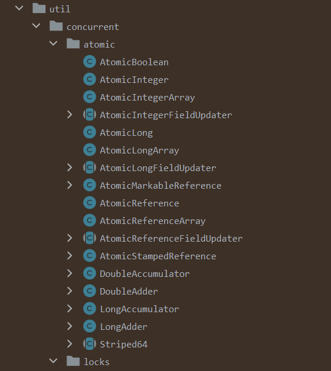

## AtomicInteger

## AtomicReference

## AtomicReferenceFieldUpdater

## AtomicLongArray

## LongAdder

## 性能比较

- synchronized


- AtomicInteger

  实现原理：基于CAS，使用了`Unsafe`类的一些函数来进行底层的原子性操作。

  虽然`Unsafe`类可以进行一些不安全的操作，但在`AtomicInteger`中，它被用来实现线程安全的原子性操作。这是一个很好的例子，说明了工具本身并不决定结果，关键在于如何使用工具。

- LongAdder

  实现原理：分段锁，每个线程对应数组中的一个值，最后将值加和

# 锁优化方案

## 减小锁的范围

缩小锁的范围就是缩短持有锁的时间，减轻阻塞。

最简单的做法是将一些不会产生线程安全问题的代码移到同步代码块之外，比如把不会产生线程安全问题的I/O类耗时的操作，放在同步代码块之外。

## 减小锁的粒度

减小锁的粒度就是缩小锁定对象的范围，就能够减少锁的竞争。

做法是把对大对象的加锁转换为对小对象的加锁，比如一个类中的多个方法都是对this加锁，按照减小锁粒度的思路就可以转换为只对每个方法中用到的临界区对象加锁。

## 锁分离

锁分离就是把锁拆分为读锁和写锁，规则是读读不互斥、读写和写写互斥

锁分离最典型的应用是ReadWriteLock（读/写锁）

## 锁分段

锁分段就是对一组对象上的锁进行分解，以减小锁的粒度。

锁分段的典型应用是ConcurrentHashMap，ConcurrentHashMap将数据按照不同的数据段进行存储（使用了一个包含16个锁的数组），并为每一个数据段分配一把锁（第N个数据交给第N%16把锁保护）。

## 避免热点区域

避免热点区域是对热点区域（经常被访问的临界区）进行优化。

避免热点区域典型的应用是ConcurrentHashMap的size，ConcurrentHashMap会给每个数据段分别维护size，而不是共用一个size，这些size由所在数据段的锁来维护，减小了size改变的竞争频率，要统计size长度时，会累加数据段的size。

## 使用独占锁的替换方案

要保证线程安全，还可以根据需要使用下面的方案替换独占锁：

1. 并发容器
2. 读/写锁
3. 乐观锁（如使用了CAS操作的原子类）
4. final关键字修饰的不可变对象（final修饰的的变量是不可变的，不存在线程安全问题）

## JVM自带的锁优化

### 锁消除

锁消除的前提的JVM开启了逃逸分析，如果JVM通过逃逸分析发现对象只能被一个线程访问到，就可以不对这个对象加锁。即便程序中使用了同步锁，JVM也会将锁消除。

JVM参数：

1. 开启逃逸分析：-XX:+DoEscapeAnalysis
2. 开启同步锁消除：-XX:+EliminateLocks

如下代码，尽管StringBuffer的append()是被synchronized修饰的，但是不存在线程竞争，JVM会进行锁消除。

```java
public String method(){
    StringBuffer sb = new StringBuffer();
    sb.append("1");//append()是被synchronized修饰的
    sb.append("2");
    return sb.toString();
}
```

### 锁粗化

由于锁的竞争和释放开销比较大，如果代码中对锁进行了频繁的竞争和释放，那么JVM会进行优化，将锁的范围适当扩大。

如下代码，在循环内使用synchronized，JVM锁粗化后，会将锁范围扩大到循环外。

```java
public void method(){
    for (int i= 0; i < 100; i++) {
        synchronized (this){
            ...
        }
    }
}
```

粗化后：

```java
public void method(){
    synchronized (this){
        for (int i= 0; i < 100; i++) {
      		...      
    	}
    }
}
```

虽然JVM内部会进行优化，但是最好还是在代码里就优化了。

# 分布式锁架构

## 超卖问题

超卖问题的意思是系统售出的商品数量超出库存量，产生原因是多个线程同时拿到了同一商品的相同库存量，对同一商品的相同库存量进行了多次扣减。

下面给出模拟超卖问题的示例。

1. 使用SpringBoot和Redis搭建的会产生超卖问题的程序：

```java
@RestController
@RequestMapping("/order/v1")
public class OverSoldV1 {
    private static final String PRODUCT_ID = "1001";
    String STOCK_COUNT = "100";

    private final Logger logger = Logger.getLogger(String.valueOf(OverSold.class));
    private final StringRedisTemplate stringRedisTemplate;

    public OverSold(StringRedisTemplate stringRedisTemplate) {
        this.stringRedisTemplate = stringRedisTemplate;
        stringRedisTemplate.opsForValue().set(PRODUCT_ID, STOCK_COUNT);
    }

    @RequestMapping("/submitOrder")
    public String submitOrder() {
        
        String stockString = stringRedisTemplate.opsForValue().get(PRODUCT_ID);
        if (stockString == null || "".equals(stockString.trim())) {
            logger.info("库存不足，扣减失败");
            throw new RuntimeException("库存不足，扣减失败");
        }
        int stock = Integer.parseInt(stockString);
        if (stock > 0) {
            stock -= 1;
            stringRedisTemplate.opsForValue().set(PRODUCT_ID, String.valueOf(stock));
            String info = "库存扣减成功，当前库存为：" + stock;
            logger.info(info);
        } else {
            logger.info("库存不足，扣减失败");
            throw new RuntimeException("库存不足，扣减失败");
        }
        return "success";
    }
}
```

2. 使用JMeter对接口进行并发测试，设置线程数为5，Ramp-up period是0，即5个线程会同时访问

3. 运行JMeter测试任务，得到输出结果，可以看到存在对同一商品的相同库存进行了多次扣减的问题，即超卖问题。

   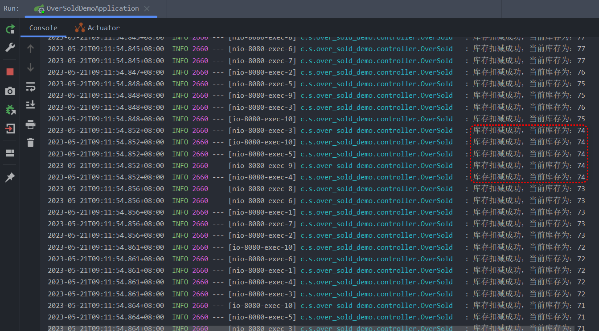

## 分布式锁

### 分布式锁的实现方式

Java提供的锁机制都是JVM级别的，只在JVM进程内部有效。但是不能解决分布式场景下的高并发问题，要解决分布式环境下的高并发问题，需要使用分布式锁。

实现分布式锁可以参照JVM锁的实现方式，JVM中多个线程在访问临界区资源时，会到统一的地方检查程序的临界区是否已经加锁，JVM在统一的地方使用加锁状态来标记是否进行了加锁操作，这个统一的地方可以是保存加锁状态的服务。

分布式锁的实现方法和JVM锁的实现方法类似，只是在实现JVM锁时，是将锁的状态保存在Java对象头中，而实现分布式锁时，是将锁的状态保存在一个外部服务中，这个外部服务可以使用数据库（如MySQL）、Redis、Zookeeper等数据存储服务实现。

具体实现方式：

1. 基于数据库的锁：这种方式通常是在数据库中创建一张锁表，需要获取锁的时候在这张表中插入一条记录，释放锁的时候则删除这条记录。这种方式实现简单，但是性能可能会受到影响。

2. 基于Redis的锁：Redis提供了一些原子性的操作，比如`SETNX`，set if not exist， 可以利用这些特性来实现分布式锁。`SETNX`命令可以在键不存在的情况下设置键值对，如果键已经存在，则不做任何操作。这种方式性能较好，但是需要处理好锁的超时和续期问题。

3. 基于Zookeeper的锁：Zookeeper提供了一种叫做顺序临时节点的机制，可以利用这个机制来实现分布式锁。要获取锁的线程创建一个临时节点，如果这个节点是所有节点中序号最小的，那么就认为这个线程获取了锁。这种方式性能较差，但是更加可靠，适合对一致性要求更高的场景。

### 分布式锁的基本要求

要实现一个分布式锁，需要满足以下要求：

1. 支持互斥性：支持多个线程操作同一共享变量的互斥性。
2. 支持阻塞与非阻塞：当线程获取分布式锁失败，分布式锁能够支持当前线程是阻塞或者非阻塞的特性。
3. 支持可重入性：分布式锁能够支持同一线程同时多次获取同一个分布式锁的特性。
4. 支持锁超时：为避免获取到分布式锁的线程意外退出，进而无法正常释放锁，导致其它线程无法正常获取到锁的情况，分布式锁需要支持超时机制，若加锁时长超过一定时间，锁就会自动释放。

### CAP理论与分布式锁模型

CAP理论是分布式领域非常著名的理论，CAP理论由C、A、P三部分组成，每个字母的含义如下：

1. C（Consistency）：一致性，表示在分布式环境下，所有节点在任意时刻都具有相同的数据。
2. A（Availability）：可用性，表示在分布式环境下，每个请求都能得到响应，但是不能保证能够获取到最新的数据。
3. P（Partition Tolerance）：分区容错性，表示在分布式环境下，当系统中的某个分区发生故障或通信中断时，其他分区可以继续运行，保持整个系统的正常工作。

同时，CAP理论指出，在分布式环境下，不可能同时保证一致性、可用性和分区容错性，最多只能保证其中的两个特性。

在分布式系统中，必须保证分区容错性。

基于CAP理论可以进行分布式锁模型的设计，例如：

1. 基于Redis的AP架构模型

   Redis先返回请求结果，再以异步的方式同步数据

2. 基于Zookeeper的CP架构模型

   当数据在大多数Zookeeper节点间同步完成后，才返回请求结果

### 基于Redis实现分布式锁

在超卖问题的示例代码的基础上，进行优化得到可以确保如下条件的分布式锁：

1. 不会出现超卖

   使用Redis的SETNX命令，该命令的返回结果是：

   - 1：Redis中不存在当前key，设置键值对成功
   - 0：Redis中存在当前key，设置键值对失败

   使用该命令对应的函数存储当前获取锁的线程id，以是否返回1作为是否获取到锁的判断条件，可以确保每次只有一个线程获取到锁

   同时为了保证可重入性，在每次获取锁之前先判断是否是自己持有的锁

2. 不会因为线程异常退出导致锁无法释放

   解决方法是

   1. 引入try finally块
   2. 引入超时机制，为避免获取到锁之后没有执行设置超时机制，需要和SETNX命令共同以原子化的方式使用

修改后的代码：

```java
@RestController
@RequestMapping("/order/v2")
public class OverSoldV2 {
    private static final String PRODUCT_ID = "1001";
    private static final String THREAD_ID = "THREAD_ID";
    String STOCK_COUNT = "100";

    private final Logger logger = Logger.getLogger(String.valueOf(OverSoldV2.class));
    private final StringRedisTemplate stringRedisTemplate;

    public OverSoldV2(StringRedisTemplate stringRedisTemplate) {
        this.stringRedisTemplate = stringRedisTemplate;
        stringRedisTemplate.opsForValue().set(PRODUCT_ID, STOCK_COUNT);
    }

    @RequestMapping("/submitOrder")
    public String submitOrder() {
        String threadId = String.valueOf(Thread.currentThread().getId());
        Boolean isLocked = stringRedisTemplate.opsForValue().setIfAbsent(THREAD_ID, threadId, 30, TimeUnit.SECONDS);
        if (Boolean.FALSE.equals(isLocked)) {
            return "failure";
        }
        try {
            String stockString = stringRedisTemplate.opsForValue().get(PRODUCT_ID);
            if (stockString == null || "".equals(stockString.trim())) {
                logger.info("库存不足，扣减失败");
                throw new RuntimeException("库存不足，扣减失败");
            }
            int stock = Integer.parseInt(stockString);
            if (stock > 0) {
                stock -= 1;
                stringRedisTemplate.opsForValue().set(PRODUCT_ID, String.valueOf(stock));
                String info = "库存扣减成功，当前库存为：" + stock;
                logger.info(info);
            } else {
                logger.info("库存不足，扣减失败");
                throw new RuntimeException("库存不足，扣减失败");
            }
        } finally {
            stringRedisTemplate.delete(THREAD_ID);
        }
        return "success";
    }
}
```

运行JMeter测试任务，得到输出结果，可以看到不再发生对库存重复扣减，超卖问题被解决。

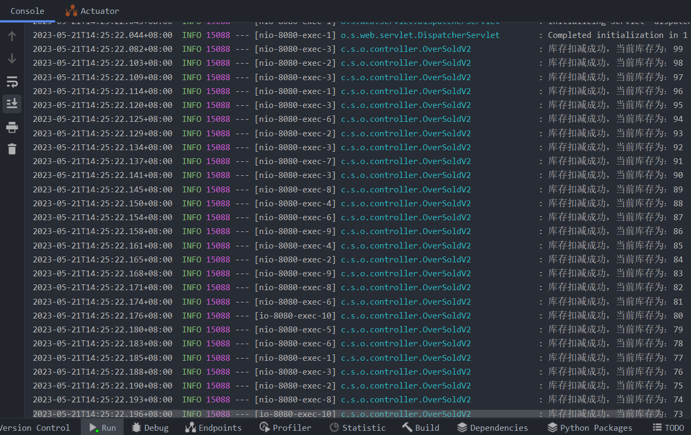

虽然超卖问题已经解决，但是每次获取锁失败就直接返回，没有实现锁的阻塞性，要实现锁的阻塞性，一种简单的实现方式是使用自旋：

```java
@RestController
@RequestMapping("/order/v3")
public class OverSoldV3 {
    private static final String PRODUCT_ID = "1001";
    private static final String THREAD_ID = "THREAD_ID";
    String STOCK_COUNT = "100";

    private final Logger logger = Logger.getLogger(String.valueOf(OverSoldV3.class));
    private final StringRedisTemplate stringRedisTemplate;

    public OverSoldV3(StringRedisTemplate stringRedisTemplate) {
        this.stringRedisTemplate = stringRedisTemplate;
        stringRedisTemplate.opsForValue().set(PRODUCT_ID, STOCK_COUNT);
    }

    @RequestMapping("/submitOrder")
    public String submitOrder() {
        String threadId = String.valueOf(Thread.currentThread().getId());
        Boolean isLocked = stringRedisTemplate.opsForValue().setIfAbsent(THREAD_ID, threadId, 30, TimeUnit.SECONDS);
        if (Boolean.FALSE.equals(isLocked)) {
            do {
                isLocked = stringRedisTemplate.opsForValue().setIfAbsent(THREAD_ID, threadId, 30, TimeUnit.SECONDS);
            } while (Boolean.FALSE.equals(isLocked));
        }
        try {
            String stockString = stringRedisTemplate.opsForValue().get(PRODUCT_ID);
            if (stockString == null || "".equals(stockString.trim())) {
                logger.info("库存不足，扣减失败");
                throw new RuntimeException("库存不足，扣减失败");
            }
            int stock = Integer.parseInt(stockString);
            if (stock > 0) {
                stock -= 1;
                stringRedisTemplate.opsForValue().set(PRODUCT_ID, String.valueOf(stock));
                String info = "库存扣减成功，当前库存为：" + stock;
                logger.info(info);
            } else {
                logger.info("库存不足，扣减失败");
                throw new RuntimeException("库存不足，扣减失败");
            }
        } finally {
            stringRedisTemplate.delete(THREAD_ID);
        }
        return "success";
    }
}
```

使用阻塞等待后，调整JMeter的请求数等于商品数（100），如果恰好消费完，说明锁的阻塞等待是有效的。

JMeter的线程参数配置如下图，开启了5个线程，每个线程循环20次，请求次数总共100次：

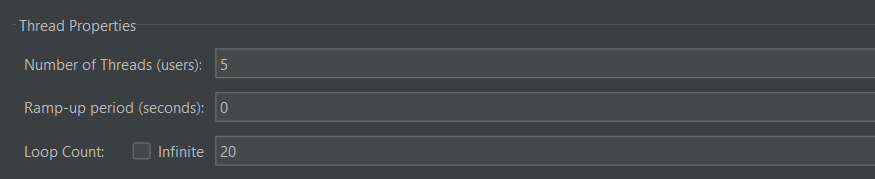

运行JMeter测试任务，输出结果显示如下图：

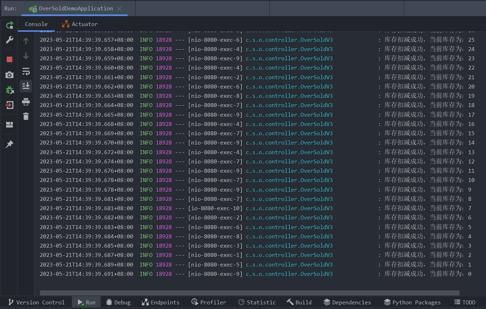

输出结果显示，确实是恰好消费完，说明锁的阻塞等待是有效的。

# 秒杀系统架构

## 电商系统架构

一个简化的电商系统架构由上到下分为客户端、网关层、负载均衡层、应用层和存储层。各层包含的应用和服务举例如下：

1. 客户端：PC网页端、APP、H5网页端、小程序。
2. 网关层：系统网关，包括硬件网关和软件网关。
3. 负载均衡层：Nginx等负载均衡服务器
4. 应用层：涵盖接入服务和基础服务等
   1. 接入服务：商品接入服务、会员接入服务、订单接入服务、收银接入服务、物流接入服务等
   2. 基础服务：商品服务、用户服务、订单服务、库存服务、价格服务、物流服务等
5. 存储层：数据库集群、缓存集群、ElastichSearch集群等

各层的并发度估计：

1. 假设负载均衡层使用的是Nginx，Nginx的最大并发度大于10万，数量级是万
2. 假设应用层使用的是Tomcat，Tomcat的最大并发度8百左右，数量级是百
3. 假设存储层的缓存使用的是Redis，Redis的最大并发度5万左右，数量级是万
4. 假设存储层的数据库使用的是MySQL，MySQL的最大并发度1千左右，数量级是千

在设计系统架构时需要综合考虑系统各层的最大并发度和数量级。

其中，

在 Redis 缓存层面可以采用主从复制、集群模式等技术来提高数据读写的并发度和可靠性，同时合理选择缓存策略，避免缓存雪崩和缓存穿透等问题。

在 MySQL 数据库层面可以采用水平分库分表、索引优化、SQL 语句优化等方式来提高并发度和性能。

需要注意的是，在实际应用中，系统性能还受到其它多种因素的影响，例如硬件配置、网络带宽、业务规模和复杂度等。

### 系统扩容

系统扩容包括垂直扩容和水平扩容。

从应用层的角度来看，垂直扩容是提升服务器的配置，水平扩容是增加服务器的数据。

### 缓存

缓存包括本地缓存和集中式缓存。

本地缓存可以使用Guava Cache实现，集中式缓存可以使用Redis实现。

在实现中，读取数据的步骤是，先读取本地缓存，如果本地缓存中没有要读取的数据，就从集中式缓存中读取，如果集中式缓存中依然没有，则从数据库中读取，然后将数据依次存入集中式缓存和本地缓存。

### 分库分表

分库分表，顾名思义，就是将原本存储于单个数据库上的数据拆分到多个数据库，把原来存储在单张数据表的数据拆分到多张数据表中，实现数据切分。

分库分表的实现可以分为两种方式：垂直切分和水平切分。垂直切分是将数据库中的表按照业务划分，将功能相近的业务表独立出来，分开部署；水平切分是将单张数据表中的数据进行划分，分散成多张表存储到多台服务器。

### 读写分离

通常情况下，数据库的读操作远远多于写操作。通过读写分离，可以利用这一特点，将读操作分发给多个只负责读取数据的从服务器（读库），而将写操作发送给主服务器（写库）。这样一来，主服务器专注于处理写操作，而从服务器处理读操作，从而提高系统的整体性能和并发处理能力。

## 秒杀系统的特点

秒杀系统的并发量存在瞬时凸峰，也叫做流量突刺现象。

秒杀系统的技术特点是：瞬时高并发、读多写少、流程简单。

秒杀系统的三个阶段是：

1. 预热阶段

   用户会刷新秒杀页面，查看秒杀活动，用户的刷新操作可以使部分数据存储到Redis缓存中，所以称为预热。

2. 秒杀阶段

   秒杀阶段会产生瞬时的高并发流量，在这一阶段，要确保已经做好了服务的限流、熔断和降级等。

3. 结算阶段

秒杀系统的性能优化方案：

1. 异步解耦

   将秒杀系统的整体流程进行拆分，通过队列的方式控制核心部分，实现异步解耦。

2. 限流防刷

   对秒杀系统的部分业务进行限流、熔断和降级处理。

3. 资源控制

   由于应用层能够承受的并发量比缓存的并发量少很多，所以在高并发系统中，可以使用OpenResty，由负载均衡层访问缓存。

# 分工问题的实现方式

Guarded Suspension模式

Thread-Pre-Message模式

生产者-消费者模式

两阶段终止模式

Worker-Thread模式

Balking模式

# ParallelStream 

ParallelStream 是 JDK 8 中新增的流式 API，它继承自 Java.util.stream.Stream 接口，并提供了并行流（Parallel Stream）处理能力。

与普通流不同的是，ParallelStream 可以利用多个线程（默认情况下是 ForkJoinPool 中的线程）来并行执行部分或全部流处理操作，以加速大容量数据的处理和分析。在并行流执行流处理操作时，它会将数据划分成多个小块，并分别交给不同的线程进行处理，在处理完成后再将结果合并返回。

ParallelStream 支持大部分 Stream 的 API 操作，例如 filter、map、reduce、sorted 等，只需要调用 parallel() 方法即可将一个普通流转换为并行流。需要注意的是，由于并行流涉及到多线程的协作，因此在使用 ParallelStream 时需要考虑线程安全和共享变量等问题，避免出现并发问题和数据异常。

以下是一个 ParallelStream 的示例代码：

```java
List<String> list = Arrays.asList("java", "python", "scala", "ruby", "go");
long count = list.parallelStream().filter(str -> str.length() > 4).count();
System.out.println(count);
```

以上代码演示了如何使用 ParallelStream 统计字符串列表中长度大于 4 的字符串数量。由于 ParallelStream 默认使用 ForkJoinPool 的线程池来执行并行计算，因此可以实现更高效的数据统计和分析。


# JMH

## 概述

JMH是一款由JVM团队开发的、专门对代码进行基准测试的工具类。

> 备注：
>
> 基准测试（Benchmark）是一种评估程序性能的方法。通过设计和实现一组具有代表性的测试用例，来测量程序在给定硬件、操作系统和运行环境下的性能指标，如执行时间、内存占用、CPU 占用率等。
>
> 基准测试可以帮助开发人员发现和改正代码中的性能问题，以及比较不同程序或算法之间的性能差异。它也可以为程序优化提供指导，并且对于不同平台或环境下的性能比较也具有参考价值。

## 使用方法

1. 导入依赖：使用JMH需要在项目中添加jmh-core和jmh-generator-annprocess依赖。
2. 创建测试类，在测试类上添加注解@BenchmarkMode、@Warmup、@Measurement、@Threads 等。
3. 在上一步创建的测试类中编写测试方法，在测试方法上添加注解@Benchmark。
4. 运行测试方法，测试结果会以表格形式展示出来。

## 使用示例

```java
import org.openjdk.jmh.annotations.*;

@BenchmarkMode(Mode.AverageTime)
@Warmup(iterations = 3, time = 1)
@Measurement(iterations = 5, time = 1)
@Threads(8)
public class MyBenchmark {
    @Benchmark
    public void testMethod() {
        // 测试代码
    }
}

```

在这个示例中，我们定义了一个名为 `MyBenchmark` 的基准测试类，其中：

- `@BenchmarkMode` 注解指定了测试模式为平均执行时间。
- `@Warmup` 注解指定了预热次数为 3 次，每次预热时间为 1 秒钟。
- `@Measurement` 注解指定了测试次数为 5 次，每次测试时间也为 1 秒钟。
- `@Threads` 注解指定了线程数量为 8。

在方法上，我们使用 `@Benchmark` 注解来标注需要测试的方法，然后在测试代码中编写需要测试的逻辑。

## 使用JMH进行吞吐量测试示例

吞吐量（Throughput）指的是在一定时间内能够处理的事务或请求数量，通常用单位时间内完成的请求数量来衡量系统/程序的性能。

JMH 的 Throughput 测试模式用于测试程序的吞吐量，即在给定时间段内程序能够处理的请求总数。

下面是一个简单的 JMH 吞吐量测试示例：

```java
import org.openjdk.jmh.annotations.*;

@BenchmarkMode(Mode.Throughput)
@Warmup(iterations = 3, time = 1)
@Measurement(iterations = 5, time = 1)
@Threads(8)
public class MyBenchmark {
    @Benchmark
    public void testMethod() {
        // 测试代码
    }
}
```

在这个示例中，我们使用了 `@BenchmarkMode` 注解来指定测试模式为 `Mode.Throughput`，表示通过统计每单位时间内执行的操作次数来评估程序性能。同时，我们仍然需要设置预热次数、测试次数和线程数量等参数，以确保测试结果的准确性。

## 使用JMH进行QPS/TPS测试示例

QPS（Queries Per Second）和 TPS（Transactions Per Second）都是指每秒钟能够处理的请求数或事务数量，是评估系统性能的重要指标。

JMH 中没有直接提供 QPS/TPS 模式的测试，但通过计算每秒钟能够完成的迭代次数，我们也可以得出相应的指标。

下面是一个简单的 JMH QPS/TPS 测试示例：

```java
import org.openjdk.jmh.annotations.*;

@BenchmarkMode(Mode.Throughput)
@Warmup(iterations = 3, time = 1)
@Measurement(iterations = 5, time = 1)
@Threads(8)
@OutputTimeUnit(TimeUnit.SECONDS)
public class MyBenchmark {
    @Benchmark
    public void testMethod() {
        // 测试代码
    }
}
```

在这个示例中，我们同样使用了 `@BenchmarkMode` 注解来指定测试模式为 `Mode.Throughput`，并且设置了预热次数、测试次数和线程数量等参数。除此之外，我们还添加了 `@OutputTimeUnit` 注解来指定输出结果的时间单位为秒。

通过运行测试，并根据测试代码实际执行的操作计算得出每秒钟能够完成的操作次数，即可得到测试的 QPS/TPS 值。最终的测试结果会以表格形式展示出来，包括平均值、方差、标准误差和置信区间等统计数据。

# Reference

- 冰河. 深入理解高并发编程: JDK核心技术. 北京: 电子工业出版社, 2022.6.
- 冰河. 深入理解高并发编程: 核心原理与案例实战. 北京: 电子工业出版社, 2023.2.
- 尼恩等. Java高并发核心编程:加强版. 卷2, 多线陈、锁、JMM、JUC、高并发设计模式. 北京: 清华大学出版社, 2022.10.
- https://www.bilibili.com/video/BV1xK4y1C7aT?p=2&vd_source=e229b568d11ab1ec4d7f50fb619a17b6

