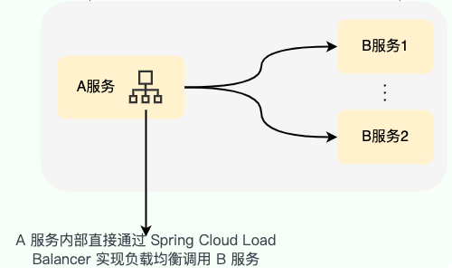
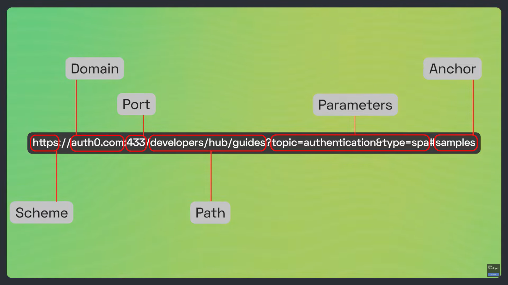
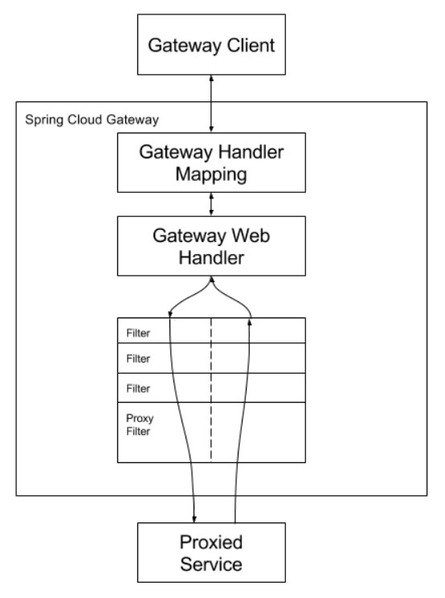

# 服务架构

微服务架构是一种一个单一应用程序开发为一组小型服务的代码结构，每个服务运行在自己的进程中，服务间采用轻量级通信机制（如HTTP）进行通信。这些服务可以独立部署，不同服务可以使用不同语言开发，使用不同的数据存储技术。

## 微服务与Spring Cloud

为了降低构建和维护分布式系统的难度，加快微服务的落地，Spring Cloud提供了快速构建分布式微服务系统的一些常用功能，如配置管理、服务发现、断路器、路由、服务代理、控制总线等工具。使用这些工具可以快速构建分布式微服务架构的系统。

## Spring Cloud与Dubbo

### Dubbo

Apache Dubbo 是一款 RPC 服务开发框架，用于解决微服务架构下的服务治理与通信问题。利用 Dubbo 提供的丰富服务治理特性，可以实现诸如服务发现、负载均衡、流量调度等服务治理诉求。

[官网对Dubbo的含义的介绍](https://cn.dubbo.apache.org/zh-cn/overview/what/overview/)：

- Dubbo的产生原因：微服务的分布式特性，使得应用间的依赖、网络交互、数据传输变得更频繁，因此不同的应用需要定义、暴露或调用 RPC 服务，那么这些 RPC 服务如何定义、如何与应用开发框架结合、服务调用行为如何控制？
- Dubbo的含义：**Dubbo 在微服务应用开发框架之上抽象了一套 RPC 服务定义、暴露、调用与治理的编程范式**。

[Dubbo支持的注册中心](https://cn.dubbo.apache.org/zh-cn/overview/mannual/java-sdk/reference-manual/registry/)的官网介绍。

### Spring Cloud与Dubbo的区别

Dubbo主要用来实现服务治理，而Spring Cloud的各个组件实现了微服务架构下的所需的各种功能，服务治理只是其中的一个方面。

Dubbo的在Spring Cloud Netfix技术架构中的替代方案可以是，通过Consul或Eureka Server等实现服务注册中心（对应Dubbo中的注册中心），通过Ribbon实现软负载均衡。 

## Spring Cloud Netfix和Spring Cloud Alibaba

Spring Cloud Netfix和Spring Cloud Alibaba是Spring Cloud的两套技术架构。

### Spring Cloud Netfix

[Spring Cloud Netfix在官方文档](https://www.springcloud.cc/spring-cloud-netflix.html)中介绍：该项目通过自动配置和绑定到Spring环境和其他Spring编程模型的习惯方式来为Spring Boot应用程序提供Netflix OSS集成。通过几个简单的注释，您可以快速启用和配置应用程序中的常见模式，并通过经过测试的Netflix组件构建大型分布式系统。提供的组件包括服务发现（Eureka），断路器（Hystrix），智能路由（Zuul）和客户端负载平衡（Ribbon）。可以从[Netfix的GitHub](https://github.com/Netflix)中找到这些组件。

### Spring Cloud Alibaba

Spring Cloud Alibaba的相关文档：[Spring Cloud Alibaba参考文档](https://spring-cloud-alibaba-group.github.io/github-pages/hoxton/zh-cn/index.html)、[Spring Cloud Alibaba中文版README.md](https://github.com/alibaba/spring-cloud-alibaba/blob/2022.x/README-zh.md)。其提供的组件有：Sentinel(分布式流控：流量控制、熔断降级、系统负载保护等多个维度保护服务的稳定性)、Nacos（注册中心）、RocketMQ（分布式消息组件）、Seata（分布式事务组件）等。

# 服务注册中心和配置中心

服务注册中心提供了服务注册和服务发现功能

1. 服务注册：所有服务的提供方启动时向注册中心发送自己的信息，包括地址、端口、提供的服务等。
2. 服务发现：当服务调用方需要调用服务时，只需要向注册中心查询谁提供了自己需要的服务。

## Zookeeper（注册中心和配置中心）

### 功能

Zookeeper可以解决分布式应用中的服务的注册和发现、统一命名服务、状态同步服务、集群管理、分布式应用配置管理等问题。可以替代Eureka、Spring Cloud Config。不能替代路由网关（Zuul）、负载均衡（Ribbon）、断路器（Hystricx）等。

### 使用方法

1. 启动Zookeeper的服务，可以使用Docker等方法启动Zookeeper。
2. 在Zookeeper服务提供方：
   1. 添加依赖spring-cloud0zookeeper-discovery和org.apache.curator。注：Zookeeper通过Curator（Curator 是一个 Apache ZooKeeper 客户端框架）实现了服务注册和发现功能，实现了和Eureka相同的功能。
   2. 在配置文件中添加对Zookeeper的配置，指定Zookeeper服务暴露的的连接ip和端口。
   3. 在启动类添加@EnableDiscoveryClient注解。
3. 在服务消费方：
   1. 添加依赖
   2. 添加配置信息

## Nacos（注册中心和配置中心）

### 功能和特性

[Nacos](https://nacos.io/zh-cn/docs/what-is-nacos.html) /nɑ:kəʊs/ 是 Dynamic Naming and Configuration Service的首字母简称，一个更易于构建云原生应用的动态服务发现、配置管理和服务管理平台。

Nacos官网给出的关键特性包括:

- **服务发现和服务健康监测**

  Nacos 支持基于 DNS 和基于 RPC 的服务发现。服务提供者使用 [原生SDK](https://nacos.io/zh-cn/docs/sdk.html)、[OpenAPI](https://nacos.io/zh-cn/docs/open-api.html)、或一个[独立的Agent TODO](https://nacos.io/zh-cn/docs/other-language.html)注册 Service 后，服务消费者可以使用[DNS TODO](https://nacos.io/zh-cn/docs/xx) 或[HTTP&API](https://nacos.io/zh-cn/docs/open-api.html)查找和发现服务。

  Nacos 提供对服务的实时的健康检查，阻止向不健康的主机或服务实例发送请求。Nacos 支持传输层 (PING 或 TCP)和应用层 (如 HTTP、MySQL、用户自定义）的健康检查。 对于复杂的云环境和网络拓扑环境中（如 VPC、边缘网络等）服务的健康检查，Nacos 提供了 agent 上报模式和服务端主动检测2种健康检查模式。Nacos 还提供了统一的健康检查仪表盘，帮助您根据健康状态管理服务的可用性及流量。

- **动态配置服务**

  动态配置服务可以让您以中心化、外部化和动态化的方式管理所有环境的应用配置和服务配置。

  动态配置消除了配置变更时重新部署应用和服务的需要，让配置管理变得更加高效和敏捷。

  配置中心化管理让实现无状态服务变得更简单，让服务按需弹性扩展变得更容易。

  Nacos 提供了一个简洁易用的UI ([控制台样例 Demo](http://console.nacos.io/nacos/index.html)) 帮助您管理所有的服务和应用的配置。Nacos 还提供包括配置版本跟踪、金丝雀发布、一键回滚配置以及客户端配置更新状态跟踪在内的一系列开箱即用的配置管理特性，帮助您更安全地在生产环境中管理配置变更和降低配置变更带来的风险。

- **动态 DNS 服务**

  动态 DNS 服务支持权重路由，让您更容易地实现中间层负载均衡、更灵活的路由策略、流量控制以及数据中心内网的简单DNS解析服务。动态DNS服务还能让您更容易地实现以 DNS 协议为基础的服务发现，以帮助您消除耦合到厂商私有服务发现 API 上的风险。

  Nacos 提供了一些简单的 [DNS APIs TODO](https://nacos.io/zh-cn/docs/xx) 帮助您管理服务的关联域名和可用的 IP:PORT 列表.

- **服务及其元数据管理**

  Nacos 能让您从微服务平台建设的视角管理数据中心的所有服务及元数据，包括管理服务的描述、生命周期、服务的静态依赖分析、服务的健康状态、服务的流量管理、路由及安全策略、服务的 SLA 以及最首要的 metrics 统计数据。

### 使用方法

1. 在创建的SpringBoot项目中添加依赖nacos-discovery-spring-boot- starter
2. 创建Controller类，通过@NacosInjected注入Nacos的NamingService，并提供discovery方法用于根据服务名称获取注册到Nacos上的服务地址
3. 添加对Nacos服务地址的配置

### 高可用

在分布式架构中，任何中间件或者应用都不允许单点存在，所以开源组件一般都会支持高可用的集群。Nacos的集群架构类似于Zookeeper，包含一个Leader节点和多个Follower节点，和Zookeeper不同的是，它的数据一致性算法使用的是Raft。

Nacos支持Derby和MySQL两种持久化机制，默认使用的是Derby数据库，Derby的吞吐量没有MySQL大，生产环境中可以使用MySQL替换，如果使用M有SQL，需要运行nacos-mysql-sql脚本创建数据库和表。

### Dubbo使用Nacos作为注册中心

> 官方文档：[Dubbo x Spring Boot 开发](https://cn.dubbo.apache.org/zh-cn/overview/quickstart/java/spring-boot/)

1. 在一个Maven项目（spring-boot-dubbo-sample）中添加三个模块，分别用来声明接口、实现接口和使用接口的实现类。

2. 在声明接口的模块（nacos-sample-interface）中声明接口，打包安装模块。

3. 在实现接口的模块（nacos-sample-provider）中添加三个依赖nacos-discovery-spring-boot-starter（Nacos的Starter组件）、dubbo-spring-boot-starter（Dubbo的Starter组件）以及nacos-sample-api（声明接口的模块名）；

   创建接口的实现类，并在实现类中添加`@DubboService` 注解（`@Service` 注解从 3.0 版本开始就已经废弃，改用 `@DubboService`，以区别于 Spring 的 `@Service` 注解）；配置Dubbo 的应用名（dubbo.application.name）、Dubbo 协议信息（dubbo.protocol）、Dubbo 使用的注册中心地址（dubbo.register.adderss）等信息。配置示例：

   ```yml
   dubbo:
     application:
       name: nacos-sample-provider
     protocol:
       name: dubbo
       port: -1
     registry:
       address: nacos://127.0.0.1:8848
       #如果使用Zookeeper作为注册中心，只需要修改此address如下
       #address: zookeeper:127.0.0.1:2181
   ```

   在启动类中添加注解@EnableDubbo。

4. 在使用接口的实现类的模块（nacos-sample-consumer）使用@DubboReference注解（`@Reference` 注解从 3.0 版本开始就已经废弃，改用 `@DubboReference`，以区别于 Spring 的 `@Reference` 注解）即可获取nacos-sample-provider中的实现类对象；在配置文件中配置Dubbo 的应用名、Dubbo 协议信息、Dubbo 使用的注册中心地址；在启动类中添加注解@EnableDubbo。

### Nacos源码（待完善）

根据注册中心的主要功能确定Nacos源码关键的部分有：服务注册、服务地址的获取、服务变化的感知。

1. 服务注册
2. 服务地址的获取
3. 服务变化的感知

### Nacos作为配置中心

[使用方法](https://github.com/alibaba/spring-cloud-alibaba/wiki/Nacos-config)：

1. 引入依赖spring-cloud-starter-alibaba-nacos-config。
2.  添加配置，使用 bootstrap.properties 配置文件来配置Nacos Server 地址、文件扩展名。

特性：

1. spring-cloud-starter-alibaba-nacos-config 支持配置的动态更新

   可以通过配置 `spring.cloud.nacos.config.refresh.enabled=false` 来关闭动态刷新

2. 可支持profile粒度的配置

   spring-cloud-starter-alibaba-nacos-config 在加载配置的时候，不仅仅加载了以 dataId 为 `${spring.application.name}.${file-extension:properties}` 为前缀的基础配置，还加载了dataId为 `${spring.application.name}-${profile}.${file-extension:properties}` 的基础配置。在日常开发中如果遇到多套环境下的不同配置，可以通过Spring 提供的 `${spring.profiles.active}` 这个配置项来配置。

   ```properties
   spring.profiles.active=develop
   ```

3. 支持自定义 namespace 的配置

   首先看一下 Nacos 的 Namespace 的概念， [Nacos 概念](https://nacos.io/zh-cn/docs/concepts.html)

   > 用于进行租户粒度的配置隔离。不同的命名空间下，可以存在相同的 Group 或 Data ID 的配置。Namespace 的常用场景之一是不同环境的配置的区分隔离，例如开发测试环境和生产环境的资源（如配置、服务）隔离等。

   在没有明确指定 `${spring.cloud.nacos.config.namespace}` 配置的情况下， 默认使用的是 Nacos 上 Public 这个namespace。如果需要使用自定义的命名空间，可以通过以下配置来实现：

   ```properties
   spring.cloud.nacos.config.namespace=b3404bc0-d7dc-4855-b519-570ed34b62d7
   ```

   该配置必须放在 bootstrap.properties 文件中。此外 `spring.cloud.nacos.config.namespace` 的值是 namespace 对应的 id，id 值可以在 Nacos 的控制台获取。并且在添加配置时注意不要选择其他的 namespace，否则将会导致读取不到正确的配置。

4. 支持自定义 Group 的配置

   在没有明确指定 `${spring.cloud.nacos.config.group}` 配置的情况下， 默认使用的是 DEFAULT_GROUP 。如果需要自定义自己的 Group，可以通过以下配置来实现：

   ```properties
   spring.cloud.nacos.config.group=DEVELOP_GROUP
   ```

   该配置必须放在 bootstrap.properties 文件中。并且在添加配置时 Group 的值一定要和 `spring.cloud.nacos.config.group` 的配置值一致。

5. 支持自定义扩展的 Data Id 配置

   Spring Cloud Alibaba Nacos Config 从 0.2.1 版本后，可支持自定义 Data Id 的配置。关于这部分详细的设计可参考 [这里](https://github.com/spring-cloud-incubator/spring-cloud-alibaba/issues/141)。 一个完整的配置案例如下所示：

   ```properties
   spring.application.name=opensource-service-provider
   spring.cloud.nacos.config.server-addr=127.0.0.1:8848
   
   # config external configuration
   # 1、Data Id 在默认的组 DEFAULT_GROUP,不支持配置的动态刷新
   spring.cloud.nacos.config.extension-configs[0].data-id=ext-config-common01.properties
   
   # 2、Data Id 不在默认的组，不支持动态刷新
   spring.cloud.nacos.config.extension-configs[1].data-id=ext-config-common02.properties
   spring.cloud.nacos.config.extension-configs[1].group=GLOBALE_GROUP
   
   # 3、Data Id 既不在默认的组，也支持动态刷新
   spring.cloud.nacos.config.extension-configs[2].data-id=ext-config-common03.properties
   spring.cloud.nacos.config.extension-configs[2].group=REFRESH_GROUP
   spring.cloud.nacos.config.extension-configs[2].refresh=true
   ```

   可以看到:

   - 通过 `spring.cloud.nacos.config.extension-configs[n].data-id` 的配置方式来支持多个 Data Id 的配置。
   - 通过 `spring.cloud.nacos.config.extension-configs[n].group` 的配置方式自定义 Data Id 所在的组，不明确配置的话，默认是 DEFAULT_GROUP。
   - 通过 `spring.cloud.nacos.config.extension-configs[n].refresh` 的配置方式来控制该 Data Id 在配置变更时，是否支持应用中可动态刷新， 感知到最新的配置值。默认是不支持的。

   多个 Data Id 同时配置时，他的优先级关系是 `spring.cloud.nacos.config.extension-configs[n].data-id` 其中 n 的值越大，优先级越高。

   `spring.cloud.nacos.config.extension-configs[n].data-id` 的值必须带文件扩展名，文件扩展名既可支持 properties，又可以支持 yaml/yml。 此时 `spring.cloud.nacos.config.file-extension` 的配置对自定义扩展配置的 Data Id 文件扩展名没有影响。

   通过自定义扩展的 Data Id 配置，既可以解决多个应用间配置共享的问题，又可以支持一个应用有多个配置文件。

   为了更加清晰的在多个应用间配置共享的 Data Id ，你可以通过以下的方式来配置：

   ```properties
   # 配置支持共享的 Data Id
   spring.cloud.nacos.config.shared-configs[0].data-id=common.yaml
   
   # 配置 Data Id 所在分组，缺省默认 DEFAULT_GROUP
   spring.cloud.nacos.config.shared-configs[0].group=GROUP_APP1
   
   # 配置Data Id 在配置变更时，是否动态刷新，缺省默认 false
   spring.cloud.nacos.config.shared-configs[0].refresh=true
   ```

   可以看到：

   - 通过 `spring.cloud.nacos.config.shared-configs[n].data-id` 来支持多个共享 Data Id 的配置。
   - 通过 `spring.cloud.nacos.config.shared-configs[n].group` 来配置自定义 Data Id 所在的组，不明确配置的话，默认是 DEFAULT_GROUP。
   - 通过 `spring.cloud.nacos.config.shared-configs[n].refresh` 来控制该Data Id在配置变更时，是否支持应用中动态刷新，默认false。

6. 配置的优先级

   Spring Cloud Alibaba Nacos Config 目前提供了三种配置能力从 Nacos 拉取相关的配置。

   - A: 通过 `spring.cloud.nacos.config.shared-configs[n].data-id` 支持多个共享 Data Id 的配置
   - B: 通过 `spring.cloud.nacos.config.extension-configs[n].data-id` 的方式支持多个扩展 Data Id 的配置
   - C: 通过内部相关规则(应用名、应用名+ Profile )自动生成相关的 Data Id 配置

   当三种方式共同使用时，他们的一个优先级关系是:A < B < C

7. 完全关闭配置

   通过设置 spring.cloud.nacos.config.enabled = false 来完全关闭 Spring Cloud Nacos Config

## Consul（注册中心和配置中心）

### 功能

Consul是HashiCrop公司推出的开源工具，提供了服务注册和发现、分布式一致性协议实现、健康检查、Key/Value存储、多数据中心方案等。

### 使用方法

1. 启动Consul服务，可以使用Docker等方法启动Consul。
2. 其它步骤参加Zookeeper的使用方法，不同的是依赖是spring-cloud-consul-discovery

## Eureka（注册中心）

### 功能和组成

Eureka提供了完整的服务注册和服务发现功能，以及负载均衡、故障转移的功能。

主要包含两个部分：Eureka Client、Eureka Server：

- Eureka Server: 服务注册中心，用于管理各种微服务实例的注册与发现。Eureka Server提供了一种能力，让各个微服务之间彼此连接并互相感知。每当有新的微服务被启动时，它会向Eureka Server节点发送一个REST请求，并且在该服务器上进行注册。同时，对于已经注册的微服务，Eureka Server会接收并存储它们发送的心跳信息，以便为客户端提供最新可用的服务列表。

- Eureka Client: （微）服务实例，用于与Eureka Server注册中心进行交互。Eureka Client会向Eureka Server注册自己，并定期发送心跳消息来更新它的状态。同时，它还可以查询Eureka Server上已注册的其他微服务实例的信息，并通过负载均衡算法从可用的微服务列表中选择合适的服务来处理请求。服务提供方和服务消费方都是Eureka Client。

Eureka Server和Eureka Client之间的协作使得微服务可以快速地、灵活地进行部署和扩展，并且可以轻松地进行服务监控和故障排除。

### 使用方法

1. 在Eureka Server中，添加pom依赖（spring-cloud-strater-eureka-server），在启动类上添加@EnableEurekaServer注解表示该服务是一个EurekaServer。
2. 在Eureka Client中，添加pom依赖（spring-cloud-strater-eureka），在application.yml中添加配置（配置注册中心的地址defaultZone和自身的名字name），在启动类上添加@EnableEurekaClient注解表示该服务是一个EurekaClient。

### 健康检查

Eureka通过客户端（Eureka Client）的心跳包来检测客户端状态，但是这种方式只能检测客户端是否在线，不能保证客户端可以对外提供服务，这是因为客户端可能依赖了其它的资源，如数据库、缓存等，如果其依赖的服务无法正常使用，那么即使客户端在线，也不能对外提供服务，这时就需要客户端自己向Eureka Server提供自身的状态。

开启Eureka的健康检查，客户端就能将自身状态就可以传送给Eureka Server了。在application.yml中添加配置即可开启Eureka的健康检查。

Eureka Client有如下状态：UP、DOWN、STARTING、OUT_OF_SERVICE、UNKNOWN

### 自我保护模式

自我保护模式是一种应对网络异常的安全保护机制，它的理念是宁可同时保留所有实例（健康的实例和不健康的实例），也不盲目注销任何健康的实例。

### 就近原则

Eureka有Region和Zone的概念，Region可以理解为区、Zone可以理解为机房。Eureka Serve启动时需要指定自己所在的Zone。Eureka Client启动时也需要指定Zone，Eureka Client会优先请求自己的Zone下的Eureka Serve列表中的Eureka Serve；如果没有指定，会默认使用defaultZone作为自己的Zone。

## Config（配置中心）

### 功能、特点和组成

在研发流程中有测试环境、UAT（User Acceptance Testing，用户验收测试）环境、生产环境等，每个微服务对应多个不同环境的配置文件，修改配置文件十分繁琐。这就需要引入配置中心组件。

Spring Cloud Config提供了分布式配置管理功能。特点如下：

1. 服务器存储后端的默认实现使用git。
2. 支持丰富的文件格式，包括yml、json、properities等，还可以自定义文件格式。
3. 配合Spring Cloud Bus可实现配置推送。
4. Spring Boot项目中不需要改动代码，加入一个启动配置文件指明使用Config Server中哪个配置文件即可。

主要包含两个部分：Config Client、Config Server。

### 使用方法

1. Config的配置必须放在bootstrap.properities中，才能被正确加载，因为放在bootstrap.properities中才能确保config相关的配置先于application.properities加载（bootstrap.properities的加载先于application.properities）。
2. 在Config Server中，添加pom依赖，在启动类上添加@EnableConfigServer注解表示允许该服务以HTTP形式对外提供配置管理服务。
3. 在Config Client中，添加pom依赖，在启动类上添加@EnableAutoConfiguration注解表示自动向Config Server获取项目的配置。

### 热生效

热生效是指，让修改后的配置动态生效。

用法是在Config Client的启动类上添加@RefreshScope注解。此外，还需要搭配Spring Cloud Bus，通知Config Client进行本地配置更新。

### 高可用

通过将所有Config Server实例以服务提供方的形式注册到Eureka上，Config Client以服务消费方的形式区Eureka获取Config Server的实例。由Eureka提供故障转移、服务注册和发现等功能。

使用方法：

1. 在Config Server（作为Eureka Client）添加pom依赖，在配置文件application.yml中添加对Eureka注册中心的配置，在启动类上添加注解（具体方法见Eureka的使用方法之Eureka Client的配置方法）。

2. 在Config Client（也是作为Eureka Client）添加pom依赖，在启动类上添加注解（具体方法见Eureka的使用方法之Eureka Client的配置方法）。

   不同的是添加配置的位置是bootstrap.yml，在bootstrap.yml中添加对Eureka注册中心的配置，并在原Config Client配置的基础上删除spring.cloud.config.uri的静态的指定，改为将spring.cloud.config.discovery.enabled设为true， 并通过spring.cloud.config.discovery.serviceId指定在注册中心配置的serviceId。

# [负载均衡](https://javaguide.cn/high-performance/load-balancing.html#%E8%B4%9F%E8%BD%BD%E5%9D%87%E8%A1%A1%E5%88%86%E4%B8%BA%E5%93%AA%E5%87%A0%E7%A7%8D)

## 分类

负载均衡可以简单分为 **服务端负载均衡** 和 **客户端负载均衡** 这两种。

- **服务端负载均衡** 主要应用在 **系统外部请求** 和 **网关层** 之间，可以使用 **软件** 或者 **硬件** 实现。软件负载均衡通过软件（比如 **LVS、Nginx、HAproxy** ）实现负载均衡功能

  

- **客户端负载均衡** 主要应用于系统内部的不同的服务之间，可以使用现成的负载均衡组件来实现。在客户端负载均衡中，客户端会自己维护一份服务器的地址列表，发送请求之前，客户端会根据对应的负载均衡算法来选择具体某一台服务器处理请求。

  

## 负载均衡常见的算法

1. 随机法

   策略：每次从可用的服务实例列表中随机选择一个实例来处理请求，可以设置权重。

   权重：如果没有配置权重的话（适合于服务器性能相近的集群），所有的服务器被访问到的概率都是相同的。如果配置权重（适合于服务器性能不等的集群）的话，权重越高的服务器被访问的概率就越大。

   缺陷：部分机器在一段时间之内无法被随机到。轮询法可以避免这个问题

2. 轮询法

   策略：挨个轮询服务器处理，也可以设置权重。

3. 一致性 Hash 法

   策略：相同参数的请求总是发到同一台服务器处理，比如同个 IP 的请求。

4. 最小连接法

   策略：当有新的请求出现时，遍历服务器节点列表并选取其中活动连接数最小的一台服务器来响应当前请求。活动连接数可以理解为当前正在处理的请求数。

   最小连接法可以尽可能最大地使请求分配更加合理化，提高服务器的利用率。

   缺陷：这种方法实现起来最复杂，需要监控每一台服务器处理的请求连接数。

## Ribbon

### 功能

Ribbon最主要的功能是提供了客户端的负载均衡算法，还提供了一系列完整的服务调用配置项，如连接超时、失败重试、访问权重、调用优先级等。

### 使用方法

1. 在Eureka的客户端代码的基础上进行改造

   将DiscoveryClient改为LoadBalancerClient，并调用其choose方法，会使原先得到的ServiceInstance集合变为得到单个ServiceInstance实例。

2. 使用@LoadBalanced注解

   在启动类上（通常，有时也用在配置类上、组件类上等）使用@RibbonClient注解设置需要调用的服务名，在RestTemplate的bean对象上使用@LoadBalanced注解。

   如果想要自定义参数和策略，就需要使用自定义配置：

   1. 使用@RibbonClient注解时，可以设置configuration的值来自定义配置类。
   2. 也可以使用配置文件，在配置文件中指定使用的配置类

### 负载均衡策略

Ribbon 支持的 7 种负载均衡策略：

- `RandomRule`：随机策略。
- `RoundRobinRule`（默认）：轮询策略
- `WeightedResponseTimeRule`：权重（根据响应时间决定权重）策略
- `BestAvailableRule`：最小连接数策略
- `RetryRule`：重试策略（按照轮询策略来获取服务，如果获取的服务实例为 null 或已经失效，则在指定的时间之内不断地进行重试来获取服务，如果超过指定时间依然没获取到服务实例则返回 null）
- `AvailabilityFilteringRule`：可用敏感性策略（先过滤掉非健康的服务实例，然后再选择连接数较小的服务实例）
- `ZoneAvoidanceRule`：区域敏感性策略（根据服务所在区域的性能和服务的可用性来选择服务实例）

## LoadBalancer

### 负载均衡策略

Spring Cloud LoadBalancer 支持的 2 种负载均衡策略：

- `RandomLoadBalancer`：随机策略
- `RoundRobinLoadBalancer`（默认）：轮询策略

# 熔断器（断路器）

## 补充

### 限流算法

1. 漏桶算法：漏捅按固定流量流出
2. 令牌桶算法：生成令牌的速度是恒定的，而拿令牌的数量是没有限制的
3. 固定时间窗口法：在一个时间间隔内进行限制，存在临界点缺陷，在时间临界点前后的极短时间内容易遭受攻击
4. 滑动时间窗口算法：可以有效规避固定时间窗口算法中时间临界点的问题

### 隔离方法

1. 线程池隔离：给服务调用设置固定数量的线程，如果被调用服务的正在被使用的线程数达到了限制的数量，就不会再调用，使用存在代价，代价包括线程的上下文切换。
2. 信号量隔离：信号量隔离是使用Semaphore实现的，通过设置的最大信号量控制对资源调用的数量，拿不到信号时直接拒绝。
3. 通过响应时间隔离：当依赖的资源出现响应时间过长的情况，就拒绝对该资源的请求。
4. QPS（每秒请求次数）隔离：当调用服务的QPS达到阈值时，就拒绝。

### 熔断概念

当下游服务不可用时，上游服务为了保证自身服务的可用性，不再继续调用目标服务，而是直接返回。

### 降级概念

降级是系统将某些不重要的业务或接口的功能停止，以应对高负载的场景。

## Hystrix

微服务架构中一般存在较多的服务单元，这样就出现某个单元因为网络原因等问题出现延迟，如果此时请求方的请求不断增多，时间一长就会形成调用方的任务积压，阻塞请求占用大量的系统的线程、IO等资源，导致调用方的服务瘫痪。进一步的会影响调用方的上游，从而产生“雪崩效应”。

> 雪崩效应（Avalanche Effect）是指在分布式系统中，由于某个服务的故障或不可用，从而导致整个系统的连锁反应，最终导致整个系统无法正常工作的现象。
>
> 具体来说，当一个服务出现故障时，其它依赖该服务的服务都会请求该服务，并等待响应。如果这些请求全部被堵塞住或响应时间过长，则会消耗掉资源，进而阻塞或延迟其它请求，造成一系列连锁反应。这可能会导致更多的请求堆积，使整个系统变得异常缓慢或直接崩溃。
>
> 为了避免雪崩效应，需要考虑以下几种解决方案：
>
> 1. 限流：限制对服务的访问量和频率，避免过多的请求排队等待。
> 2. 降级：在一定条件下降低服务的质量和功能，如缩短超时时间、返回默认值等，以保证系统的稳定性。
> 3. 熔断：在服务发生故障时快速断开与该服务的连接，并通过降级方式替代该服务响应请求，以避免因故障而导致其它服务出现雪崩效应。
>
> 综上所述，为了保证分布式系统的健壮性和可用性，在设计和实现中需要充分考虑服务之间的依赖和关系，并采取一些必要的措施来避免或应对雪崩问题。

为解决这一问题，可以使用熔断器（Circuit Breaker）。

熔断器的原理是：当某个服务单元发生故障，通过熔断器的故障监控，向调用方返回一个错误请求，而不是长时间的等待响应，避免故障在分布式系统中蔓延。

### 熔断原理

Hystrix提供了熔断模式和隔离模式来缓解雪崩效应。这两种方案都属于阻塞发生之后的应对策略，而非预防性策略（如限流）。

1. 熔断模式（服务熔断）

   如果某个服务响应调用太慢，则熔断对该服务的调用，即后续请求不再调用该服务，直接返回并快速释放资源。

   熔断恢复：被熔断的请求不是永久被切断，而是暂停一段时间（默认是5秒）之后允许部分请求通过，若请求都是健康的（ResponseTime<250ms），则取消熔断。

2. 隔离模式（服务降级）

   为每个依赖调用分配一个线程池，如果线程池已满，调用将立即被拒绝，加速失败时间。

服务调用的各种结果（成功、异常、超时、拒绝）都会上报给熔断器，加入bucket计算发生的总数。

### 使用方法

1. 引入Hystrix的maven依赖，spring-cloud-starter-hystrix

2. 在启动类中添加@EnableCircutBreaker注解或@EnableHystrix注解

3. 在controller方法上添加@HystrixCommand，表示开启对该方法的熔断检测功能。

4. 配置方法：

   1. 直接对@HystrixCommand注解的commandProperities设置@HystirxProperities注解的参数进行配置。
   2. 使用配置文件进行配置，Hystrix的大部分配置都以hystrix.command开头

   可以配置的参数包括：

   - 隔离策略的超时时间
   - 最大请求数
   - 进行短路的失败请求的次数阈值
   - 短路后多长时间之后进行重试
   - 出错百分比阈值
   - ......

### 监测工具

熔断的监测工具有两个：

1. Hystrix Dashboard：针对Hystrix进行实时监控的工具，通过Hystrix Dashboard可以直观的看到各个Hystrix命令的请求响应时间、请求成功率等数据。
2. Turbine：只使用Hystrix Dashboard只能看到单个应用内的服务信息，而Turbine能够汇总系统内多个服务的数据并显示到Hystrix Dashboard上。

Hystrix Dashboard和Turbine监测工具使用方法：

1. 在需要被监测的项目中，引入依赖spring-boot-starter-actuator
2. 在仪表盘应用中，引入依赖spring-cloud-starter-hystrix-dashboard，主类中添加@EnableHystrixDashboard注解开启仪表板
3. 在上面创建的仪表盘应用中，继续添加Turbine的依赖spring-cloud-starter-turbine，在配置文件application.yml中添加配置信息，除了要配置Turbine，还需要指定Eureka的地址，使Turbine能够到注册中心查找需要监测的服务实例。
4. 在被监测的服务项目中，也需要进行配置，保证配置中的eureka.instance.metadata-map.cluster和Turbine中的clusterConfig的配置名称一致。
5. 请求Turbine的聚合监测面板地址就能看到聚合后的图形化监测信息。


## Sentinel

### 功能

 [Sentinel](https://github.com/alibaba/Sentinel) 以流量为切入点，从流量控制、熔断降级、系统负载保护等多个维度保护服务的稳定性。

Sentinel在服务隔离的实现方式和Hystrix完全不一样，Hystrix使用的是通过线程池隔离，而Sentinel采用了两种不同的手段，信号量隔离、响应时间隔离、QPS隔离。

Sentinel的系统负载保护意思是，Sentinel从系统的维度提供了保护，确保系统的入口流量和系统的负载达到一个平衡，保证系统在能力范围内处理最多的请求。

### [使用方法](https://github.com/alibaba/spring-cloud-alibaba/wiki/Sentinel)

1. 引入依赖spring-cloud-starter-alibaba-sentinel
2. 添加配置，如Sentinal DashBoard的地址、端口
3. 在Service类要使用Sentinel的方法上使用@SentinelResource注解

### [Sentinel持久化](https://github.com/all4you/sentinel-tutorial/blob/master/sentinel-practice/sentinel-persistence-rules/sentinel-persistence-rules.md)

无论是通过硬编码的方式来更新规则，还是通过接入 Sentinel Dashboard 后，在页面上操作来更新规则，都无法避免一个问题，那就是服务重新后，规则就丢失了，因为默认情况下规则是保存在内存中的。

目前 Sentinel 中默认实现了5种规则持久化的方式，分别是：file、redis、nacos、zk和apollo。

使用方法：

1. 引入sentinel持久化依赖
2. 增加配置
3. 实现init()函数

### Sentinal DashBoard配置项

#### 流控模式

1. 直接：api达到限流条件时，直接限流
2. 关联：当关联的资源达到阈值时，就限流自己
3. 链路：只记录指定链路上的流量（指资源从入口资源进来的流量，如果达到阈值，就进行限流）

#### 流控效果

1. 快速失败：直接失败并抛出异常
2. [Warm UP](https://sentinelguard.io/zh-cn/blog/sentinel-golang-0-6-0-release.html)：当系统长期处于低水位的情况下，流量突然增加时，直接把系统拉升到高水位可能瞬间把系统压垮。比如刚启动的服务，数据库连接池可能还未初始化，缓存也处于空的状态，这时候激增的流量非常容易导致服务崩溃。这时我们就可以利用 Sentinel 的 Warm-Up 流控模式，控制通过的流量缓慢增加，在一定时间内逐渐增加到阈值上限，而不是在一瞬间全部放行。这样可以给冷系统一个预热的时间，避免冷系统被压垮。
3. 排队等待（[匀速排队模式](https://github.com/alibaba/Sentinel/wiki/%E6%B5%81%E9%87%8F%E6%8E%A7%E5%88%B6-%E5%8C%80%E9%80%9F%E6%8E%92%E9%98%9F%E6%A8%A1%E5%BC%8F)）：这种方式适合用于请求以突刺状来到，这个时候我们不希望一下子把所有的请求都通过，这样可能会把系统压垮；同时我们也期待系统以稳定的速度，逐步处理这些请求，以起到“削峰填谷”的效果，而不是拒绝所有请求。

#### 熔断降级

[Sentinel 提供以下几种熔断策略](https://sentinelguard.io/zh-cn/docs/circuit-breaking.html)：

- 慢调用比例 (`SLOW_REQUEST_RATIO`)：选择以慢调用比例作为阈值，需要设置允许的慢调用 RT（即最大的响应时间），请求的响应时间大于该值则统计为慢调用。当单位统计时长（`statIntervalMs`）内请求数目大于设置的最小请求数目，并且慢调用的比例大于阈值，则接下来的熔断时长内请求会自动被熔断。经过熔断时长后熔断器会进入探测恢复状态（HALF-OPEN 状态），若接下来的一个请求响应时间小于设置的慢调用 RT 则结束熔断，若大于设置的慢调用 RT 则会再次被熔断。
- 异常比例 (`ERROR_RATIO`)：当单位统计时长（`statIntervalMs`）内请求数目大于设置的最小请求数目，并且异常的比例大于阈值，则接下来的熔断时长内请求会自动被熔断。经过熔断时长后熔断器会进入探测恢复状态（HALF-OPEN 状态），若接下来的一个请求成功完成（没有错误）则结束熔断，否则会再次被熔断。异常比率的阈值范围是 `[0.0, 1.0]`，代表 0% - 100%。
- 异常数 (`ERROR_COUNT`)：当单位统计时长内的异常数目超过阈值之后会自动进行熔断。经过熔断时长后熔断器会进入探测恢复状态（HALF-OPEN 状态），若接下来的一个请求成功完成（没有错误）则结束熔断，否则会再次被熔断。

#### 热点参数限流

[热点参数限流](https://sentinelguard.io/zh-cn/docs/parameter-flow-control.html)会根据配置的限流阈值与模式，对包含热点参数的资源调用进行限流。

Sentinel 利用 LRU 策略统计最近最常访问的热点参数，结合令牌桶算法来进行参数级别的流控。

要使用热点参数限流功能，需要引入sentinel-parameter-flow-control，并使用`@SentinelResource` 注解（与Hysyrix的@HysyrixCommand类似）定义资源

# 声明式RESTful客户端

## Feign

使用Ribbon的缺点是需要对请求拼接参数，而[Feign](https://cloud.spring.io/spring-cloud-openfeign/reference/html/#spring-cloud-feign)解决了这个问题。使用Feign，可以通过定义接口并添加注解的方式来描述服务间的交互，而无需手动编写HTTP请求代码。

### [使用方法](https://cloud.spring.io/spring-cloud-netflix/multi/multi_spring-cloud-feign.html)

1. 添加依赖：spring-cloud-starter-feign

2. 在启动类上添加注解：@EnableFeignClients，该注解的defaultConfiguration属性可以指定所有Feign接口的配置类。

3. 定义Feign接口：使用@FeignClient(name="xxx")注解定义Feign接口。

   该注解除了name属性还有，可以指定用户自定义的配置类的configuration属性，可以在使用了Hystrix的服务中指定熔断的FallBack类的fallback属性。

# 路由网关

API 网关是一个搭建在客户端和微服务之间的服务，我们可以在 API 网关中处理一些非业务功能的逻辑，例如权限验证、监控、缓存、请求路由等。

API 网关就像整个微服务系统的门面一样，是系统对外的唯一入口。有了它，客户端会先将请求发送到 API 网关，然后由 API 网关根据请求的标识信息将请求转发到微服务实例。

## Zuul

### 功能

Zuul的具体作用就是服务转发，Zuul可以作为为资源的统一访问入口。

此外Zuul还提供了过滤器的功能，可以用来进行接口权限校验、限流、统计等。

### 使用方法

Zuul用做服务转发的使用方法：

1. 添加pom依赖，spring-cloud-starter-zuul

2. 在启动类上添加@EnableZuulProxy注解

3. 在application.yml文件中添加配置，zuul.routes的配置格式如下：

   ```yml
   #第一种
   [serviceId]:					#对应Eureka中的serviceId，规则名与serviceId相同
   	path: /providerURL/**		#转发哪些path（URL的path部分，见下文的补充）
   #第二种
   customName1:					#自定义的转发规则名称
   	path: /fromURL1/**			#转发哪些path
   	url: http://localhost:8081	#转发到哪个scheme://domain:port
   customName2:					
   	path: /fromURL2/**			
   	url: http://localhost:8082	
   ```

   示例：

   ```yml
   zuul:
     host:
       socket-timeout-millis: 60000
       connect-timeout-millis: 60000
     routes:
       frameFronted:
         path: /fronted/frame/**
         url: http://localhost:8111
       loginFronted:
         path: /fronted/login/**
         url: http://localhost:8222
   ```

其它配置参数：

1. 忽略匹配：ingoredPatterns参数可以配置忽略URL
2. 敏感Header过滤：在请求的转发中默认会转发HTTP的Header信息，然而可能有些敏感信息不能被转发给下游系统，如Cookie。可以通过sensitiveHeaders参数进行配置，各项之间使用逗号分隔。

匹配顺序：如果想按配置的顺序进行路由规则控制，则需要使用YMAL，如果使用的是properities文件，则会丢失顺序。

补充：

URL结构：



##  Gateway

### 功能和特点

Spring Cloud Gateway 是 Spring Cloud 团队基于 Spring 5.0、Spring Boot 2.0 和 Project Reactor 等技术开发的高性能 API 网关组件。

Spring Cloud Gateway 旨在提供一种简单而有效的途径来发送 API，并为它们提供横切关注点，例如：安全性，监控/指标和弹性。 

> Spring Cloud Gateway 是基于 WebFlux 框架实现的，而 WebFlux 框架底层则使用了高性能的 Reactor 模式通信框架 Netty。

Spring Cloud Gateway 具有以下特性：

- 基于 Spring Framework 5、Project Reactor 和 Spring Boot 2.0 构建。
- 能够在任意请求属性上匹配路由。
- predicates（断言） 和 filters（过滤器）是特定于路由的。
- 集成了 Hystrix 熔断器。
- 集成了 Spring Cloud DiscoveryClient（服务发现客户端）。
- 易于编写断言和过滤器。
- 能够限制请求频率。
- 能够重写请求路径。

可以通过配置使Gateway兼容HTTPS请求，

核心概念（[Glossary](https://cloud.spring.io/spring-cloud-gateway/reference/html/#glossary)）

Spring Cloud GateWay 最主要的功能就是路由转发，而在定义转发规则时主要涉及了以下三个核心概念，如下表。

| 核心概念          | 描述                                                         |
| ----------------- | ------------------------------------------------------------ |
| Route（路由）     | 网关最基本的模块。它由一个 ID、一个目标 URI、一组断言（Predicate）和一组过滤器（Filter）组成。 |
| Predicate（断言） | 路由转发的判断条件，我们可以通过 Predicate 对 HTTP 请求进行匹配，例如请求方式、请求路径、请求头、参数等，如果请求与断言匹配成功，则将请求转发到相应的服务。 |
| Filter（过滤器）  | 过滤器，我们可以使用它对请求进行拦截和修改，还可以使用它对上文的响应进行再处理。 |

> 注意：其中 Route 和 Predicate 必须同时声明（路由断言）。

### 断言的类型

1. After
2. Before
3. Between
4. Cookie
5. Headers
6. Host
7. Method
8. Path
9. Query
10. RemoteAddr

多个路由断言可以通过与或非等逻辑连接。

### 过滤器的类型

1. AddRequestHeader
2. AddRequestParameter
3. AddResponseHeader
4. Hystrix
5. PrefixPath
6. RedictTo
7. RemoteNonProxyHeaders
8. RemoveRequestHeader
9. RemoveResponseHeader
10. RewritePath
11. SaveSession
12. SetPath
13. SetResponseHeader
14. SetStatus
15. StripPrefix
16. Retry

### 工作流程如下图

                                                                                                                                                                                                                                                                                                                       

# 调用链跟踪

## Sleuth

> Sleuth
>
>  / sluːθ
>
> 侦查；侦察；警犬

### 功能

要实现准确快速地定位到线上故障，比较成熟的方案是使用调用链跟踪。调用链跟踪监测系统可以实现如下的功能：

1. 快速定位故障
2. 各个调用环节的性能分析
3. 数据分析

Spring Cloud Sleuth是Spring Cloud生态中实现调用链跟踪的子项目，Spring Cloud Sleuth可以结合Zipkin，将消息发送到Zipkin，利用Zipkin存储信息，利用Zipkin UI展示数据，也可以只是简单的把数据存储在日记中。

### 术语（[Terminology](https://docs.spring.io/spring-cloud-sleuth/docs/3.1.8/reference/htmlsingle/spring-cloud-sleuth.html#getting-started-terminology)）

Spring Cloud Sleuth borrows [Dapper’s](https://research.google.com/pubs/pub36356.html) terminology.

**Span**: The basic unit of work. For example, sending an RPC is a new span, as is sending a response to an RPC. Spans also have other data, such as descriptions, timestamped events, key-value annotations (tags), the ID of the span that caused them, and process IDs (normally IP addresses).

Spans can be started and stopped, and they keep track of their timing information. Once you create a span, you must stop it at some point in the future.

**Trace:** A set of spans forming a tree-like structure. For example, if you run a distributed big-data store, a trace might be formed by a `PUT` request.

**Annotation/Event:** Used to record the existence of an event in time.

Conceptually in a typical RPC scenario we mark these events to highlight what kind of an action took place (it doesn’t mean that physically such an event will be set on a span).

- **cs**: Client Sent. The client has made a request. This annotation indicates the start of the span.
- **sr**: Server Received: The server side got the request and started processing it. Subtracting the `cs` timestamp from this timestamp reveals the network latency.
- **ss**: Server Sent. Annotated upon completion of request processing (when the response got sent back to the client). Subtracting the `sr` timestamp from this timestamp reveals the time needed by the server side to process the request.
- **cr**: Client Received. Signifies the end of the span. The client has successfully received the response from the server side. Subtracting the `cs` timestamp from this timestamp reveals the whole time needed by the client to receive the response from the server.

## Zipkin

### 功能

Zipkin是分布式实时数据追踪系统，由Twitter公司开发。主要功能是聚集来自各系统的实时监控数据。

主要由四部分组成：

1. 收集器：收集追踪数据。
2. 数据存储：数据存储默认使用内存存储，也可以替换成MySQL、Cassandra等。
3. 查询：向其它服务服务提供数据查询功能
4. Web页面                                                                                                                                                                                                                                                                                                                                                                                                                                                                                                                                                                                                                                                                                                                                                                                                                                                                           

### 使用方法

1. 创建Zipkin Server、
   1. 添加pom依赖zipkin-autoconfigure-ui和zipkin-server；
   2. 在启动类中添加@EnableZipkinServer，表示启动Zipkin服务端。
2. 在服务中添加依赖和配置：
   1. 添加对Sleuth的依赖spring-cloud-starter-sleuth（生成带有spanId和traceId的日志）和spring-cloud-sleuth-zipkin（将日志以HTTP协议传输到Zipkin Server）
   2. 配置zipkin的base-url（Zipkin Server的地址）、sleuth的samper.percentage（创建并传输日志的传输比例）

### 整合Stream

由于将日志传输到Zipkin Server的方式是HTTP请求，请求量太大时会给系统带来很大压力，如果改为使用Stream消息机制传输监控日志就可以减轻压力。

Zipkin与Spring Cloud Stream整合的方法是：

1. 在Zipkin Server端
   1. 添加对Stream消息中间件的依赖（以RabbitMQ为例）：spring-cloud-sleuth-zipkin-stream；spring-cloud-sleuth-stream；spring-cloud-stream-binder-rabbit。
   2. 在配置文件中添加对Stream的配置信息和RabbitMQ的连接信息。
   3. 将Zipkin Server的启动类注解@EnableZipkinServer改为@EnableZipkinStreamServer。
2. 在服务端
   1. 将spring-cloud-sleuth-zipkin依赖注掉，在此基础上添加spring-cloud-sleuth-stream和spring-cloud-stream-binder-rabbit依赖。
   2. 和在Zipkin Server端一样，配置文件中添加对Stream的配置信息和RabbitMQ的连接信息。

### 整合MySQL

Zipkin默认将数据存储在内存中，如果要持久化这些数据可以整合MySQL.

Zipkin与MySQL整合的方法是：

1. 添加对JDBC和MySQL驱动的依赖，spring-boot-starter-jdbc和mysql-connector-java
2. 在配置文件中配置MySQL的连接信息，设置initialize参数为true（在启动时创建表结构  ）

# 消息驱动

## Stream

### 功能和概念

在企业级应用中处理非同步场景、消息通知、应用间解耦等场景经常会使用消息中间件，常见的消息中间件有如，ActiveMQ、RabbitMQ、MetaMQ、Kafka、Redis等。

[Spring Cloud Stream](https://spring.io/projects/spring-cloud-stream)是一个构建事件驱动或消息驱动微服务的框架，提供了一个灵活的编程模型，该模型建立在已经建立和熟悉的 Spring 习惯用法和最佳实践之上，包括对持久发布/订阅语义、消费者组和有状态分区的支持。

利用Stream可以对消息中间件实现进一步的封装，使代码更具有通用性，降低项目对消息中间件的耦合。更重要的是这一就可以方便地实现消息中间件的混用，比如生产者使用Kafka，消费者使用RabbitMQ。

Stream目前支持的中间件：

- [RabbitMQ](https://github.com/spring-cloud/spring-cloud-stream-binder-rabbit)
- [Apache Kafka](https://github.com/spring-cloud/spring-cloud-stream-binder-kafka)
- [Kafka Streams](https://github.com/spring-cloud/spring-cloud-stream-binder-kafka/tree/master/spring-cloud-stream-binder-kafka-streams)
- [Amazon Kinesis](https://github.com/spring-cloud/spring-cloud-stream-binder-aws-kinesis)
- [Google PubSub *(partner maintained)*](https://github.com/spring-cloud/spring-cloud-gcp/tree/master/spring-cloud-gcp-pubsub-stream-binder)
- [Solace PubSub+ *(partner maintained)*](https://github.com/SolaceProducts/spring-cloud-stream-binder-solace)
- [Azure Event Hubs *(partner maintained)*](https://github.com/Azure/azure-sdk-for-java/tree/main/sdk/spring/spring-cloud-azure-stream-binder-eventhubs)
- [Azure Service Bus *(partner maintained)*](https://github.com/Azure/azure-sdk-for-java/tree/main/sdk/spring/spring-cloud-azure-stream-binder-servicebus)
- [AWS SQS *(partner maintained)*](https://github.com/idealo/spring-cloud-stream-binder-sqs)
- [AWS SNS *(partner maintained)*](https://github.com/idealo/spring-cloud-stream-binder-sns)
- [Apache RocketMQ *(partner maintained)*](https://github.com/alibaba/spring-cloud-alibaba/wiki/RocketMQ-en)

概念：

- *Bindings*（绑定）：是一组接口，以声明方式标识输入和输出通道。在`@EnableBinding`注解中，你可以指定要绑定的通道集合。
- *Binder*（绑定器）：是消息中间件的实现，例如Kafka或RabbitMQ。绑定器负责将应用程序与特定的消息中间件进行连接和通信。
- *Channel*（通道）：代表消息中间件与应用程序之间的通信管道。通道可以是输入通道（用于接收消息）或输出通道（用于发送消息）。
- *StreamListeners*（流监听器）：是在Bean中定义的用于处理消息的方法。这些方法会自动在通道上接收到消息后被调用。在调用之前，消息转换器（MessageConverter）会执行消息的序列化和反序列化操作，将消息转换为中间件特定的事件和领域对象类型/POJO之间进行转换。
- *Message Schemas*（消息模式）：用于消息的序列化和反序列化的模式。消息模式可以静态地从位置读取或动态加载，支持领域对象类型的演进。消息模式可以确保消息在不同系统之间的一致性和互操作性。

### 使用方法（以RabbitMQ为例）

1. 启动RabbitMQ服务，比如可以使用Docker启动RabbitMQ
2. 建两个Maven项目，分别作为消息的生产者和消费者
3. 均添加依赖spring-cloud-starter-stream（对Streram的依赖）和spring-cloud-starter-stream-rabbit（对RabbitMQ的依赖）。
4. 在消费者增加配置，配置消费的消息信息和RabbitMQ服务的信息
5. 在消费者启动类上添加@EnableBinding(BindingsInterface.class)，该注解表示为该Spring Boot项目增加Stream通道监听功能。BindingsInterface可以是sink、source、processor或三者的组合：
   1. sink：只带有输入通道的应用
   2. source：只带有输出通道应用
   3. processor：带有输入通道和输出通道的应用
6. 创建BindingsInterface接口

# 消息总线

## Bus

### 功能

Bus的一个常用功能是进行配置中心客户端的刷新。当Git Repository改变时，Bus会通过POST请求Config Server的/bus/refresh，Config Server会从Repository获取最新的信息并传递给Client。通过/bus/refresh的destination参数可以指定刷新某一台Client实例。

Bus的配置刷新通知功能是基于Spring的事件机制实现的，这些事件是可追踪的。

# 短生命微服务

## Task

### 功能

[官方对Spring Cloud Task的介绍](https://spring.io/projects/spring-cloud-task)十分简单明了：Spring Cloud Task allows a user to develop and run short lived microservices using Spring Cloud and run them locally, in the cloud, even on Spring Cloud Data Flow. Just add `@EnableTask` and run your app as a Spring Boot app (single application context).

Task用于支持短生命周期的微服务，该类微服务常见于定时任务、批处理等场景。

### 使用方法

1. 添加依赖spring-cloud-task-core
2. 在启动类添加@EnableTask注解

Task默认将Task生命周期记录在内存中，可以和数据库集成将其存储到数据库中。 

Task可以通过Stream启动，实现方法是在Task项目中创建一个Sink来监听包含TaskLaunchRequest的消息实现的。

# [分布式事务](https://juejin.cn/post/6844903647197806605)

## 概念

### ACID

说到数据库事务就不得不说，数据库事务中的四大特性，ACID:

- A（Atomicity，原子性）：事务作为一个整体被执行，要么全部成功，要么全部失败。

- C（Consistency，一致性）：事务执行之前和执行之后数据（如数据库中的数据）都必须处于一致性状态。

  如果事务成功地完成，那么系统中所有变化将正确地应用，系统处于有效状态。如果在事务中出现错误，那么系统中的所有变化将自动地回滚，系统返回到原始状态。

- I（Isolation，隔离性）：一个事务的中间状态对其他事务是不可见的。

- D（Durability，持久性）：事务成功完成后，即使在系统出现故障时，对数据的更改仍然存在并且不会撤消。

### BASE

BASE理论是Basically Available(基本可用)，Soft State（软状态）和Eventually Consistent（最终一致性）三个短语的缩写。

其核心思想是：

> 既是无法做到强一致性（Strong consistency），但每个应用都可以根据自身的业务特点，采用适当的方式来使系统达到最终一致性（Eventual consistency）。

### 分布式事务解决方案

#### 2PC

2PC（两阶段提交协议）将事务分成两个阶段：

- 准备阶段（Prepare Phase）:事务管理器给每个参与者发送Prepare消息，每个数据库参与者在本地执行事务，并写本地的Undo/Redo日志，此时事务没有提交。

  Undo log是记录修改前的数据，用于数据库回滚，Redo log记录修改后的数据，用于提交事务后写入数据的文件。

- 提交阶段（Commit Phase）:如果事务管理器收到了参与者的执行失败或者超时消息时，直接给每个参与者发送回滚（Rollback）消息；否则发送提交（Commit）消息。参与者根据事务管理器指令进行提交或者回滚操作，并释放事务处理过程中使用的资源。


#### TCC

TCC将事务分成三个阶段：

1. Try阶段（Try）：对业务系统进行检测及预留资源。
2. 确认阶段（Confirm）：对业务做确认提交。
3. 撤销阶段（Cancel）：撤销事务。

TCC采用的是补偿机制，核心思想是针对每个操作，都要编写一个与其对应的确认和补偿（撤销）操作逻辑。


## [Seata](https://seata.io/zh-cn/docs/overview/what-is-seata.html)

Seata 是一款开源的分布式事务解决方案，致力于提供高性能和简单易用的分布式事务服务。

### Seata术语

- TC (Transaction Coordinator) - 事务协调者 - Seata Server

维护全局和分支事务的状态，驱动全局事务提交或回滚。

- TM (Transaction Manager) - 事务管理器

定义全局事务的范围：开始全局事务、提交或回滚全局事务。

- RM (Resource Manager) - 资源管理器

管理分支事务处理的资源，与TC交谈以注册分支事务和报告分支事务的状态，并驱动分支事务提交或回滚。

### 事务模式

Seata 将为用户提供了 AT、TCC、SAGA 和 XA 事务模式。

#### [AT 模式](https://seata.io/zh-cn/blog/seata-at-lock.html#:~:text=Seata%20AT%20%E6%A8%A1%E5%BC%8F%E6%98%AF%E4%B8%80,%E6%97%A5%E5%BF%97%EF%BC%8C%E6%A3%80%E6%9F%A5%E5%85%A8%E5%B1%80%E9%94%81%E7%AD%89%E3%80%82)


Seata AT 模式是一种非侵入式的分布式事务解决方案，Seata 在内部做了对数据库操作的代理层，我们使用 Seata AT 模式时，实际上用的是 Seata 自带的数据源代理 DataSourceProxy，Seata 在这层代理中加入了很多逻辑，比如插入回滚 undo_log 日志，检查全局锁等。

AT 模式是2PC的演变：

1. 一阶段

   在一阶段中，Seata会拦截“业务SQL”，首先解析SQL语义，找到要更新的业务数据，在数据更新前，保存下"undo log”，然后执行“业务SQL”更新数据，更新之后保存数据“redo log”，最后生成锁，这些操作都是在本地数据库事务内完成，这样保证了一阶段的原子性。

2. 二阶段

   相对一阶段，二阶段比较简单，负责整体的回滚和提交，如果之前的一阶段中有本地事务没有通过吗，那么就执行全局回滚，否则执行全局提交，回滚用到的就是一阶段记录的“undo log”，通过回滚记录生成反向更新SQL并执行，已完成分支事务的回滚，当然事务完成后释放所有资源和删除所有日志。

性能：高

模式:：AP，存在数据不一致的中间状态

难易程度：简单，靠SEATA自己解析反向SQL并回滚

使用要求：

- 所有服务与数据库必须要自己拥有管理权，因为要创建UNDO_LOG表

应用场景：

- 高并发互联网应用，允许数据出现短时不一致，可通过对账程序或补录来保证最终一致性。

#### TCC模式

TCC是Try-尝试、Confirm-确认、Cancel-取消Try尝试阶段，对资源进行锁定。Confirm 确认阶段，对资源进行确认，完成操作Cancel 取消阶段，对资源进行还原，取消操作

实现原理

- 在代码与数据表中扩展字段，实现对数据资源的锁定。

性能：好

模式：AP，存在数据不一致的中间状态

难易程度：复杂，SEATATC只负责全局事务的提交与回滚指令，具体的回滚处理全靠程序员自己实现

使用要求：

- 所有服务与数据库必须要自己拥有管理权

- 支持异构数据库，可以使用不同选型实现

应用场景：

- 高并发互联网应用，允许数据出现短时不一致，于对账程序或补录来保证最终一致性。

#### SAGA模式

Saga模式是SEATA提供的长事务解决方案，在Saga模式中，业务流程中每个参与者都提交本地事务，当出现某一个参与者失败，则补偿前面已经成功的参与者，一阶段的正向服务和二阶段的补偿服务都由业务开发实现。

性能：不一定，取决于三方服务

模式：AP，存在数据不一致的中间状态

难易程度：复杂，提交与回滚流程全靠程序员编排

使用要求：

- 在当前架构引入状态机机制，类似于工作流

- 无法保证隔离性

应用场景：

- 需要与第三方交互时才会考虑，例如:调用支付宝支付接口→出库失败->调用支付宝退款接口

#### XA模式

基于数据库的XA协议来实现2PC又称为XA方案。

性能：低

模式：CP，强一致性

难易程度：简单，基于数据库自带特性实现，无需改表

使用要求：

- 使用支持XA方案的关系型数据库（(主流都支持)

应用场景：

- 金融行业，并发量不大，但数据很重要的项目

### 使用方法

以AT模式为例：

1. 创建undo_log日志
2. 对Seata两个主要的配置文件file.config和registry.config
3. 添加pom依赖seata-spring-boot-starter
4. 在需要开启分布式事务的业务方法上添加注解@GlobalTransactional

# Reference

- 胡劲寒. 极简Spring Cloud实战. 北京: 机械工业出版社, 2019.

- 开课吧,李伟杰,刘雪松,刘自强,王超. Spring Cloud Alibaba微服务开发从入门到实战.

- https://github.com/alibaba/spring-cloud-alibaba/wiki/Sentinel

- https://spring-cloud-alibaba-group.github.io/github-pages/hoxton/en-us/index.html

- https://javaguide.cn/high-performance/load-balancing.html

  
