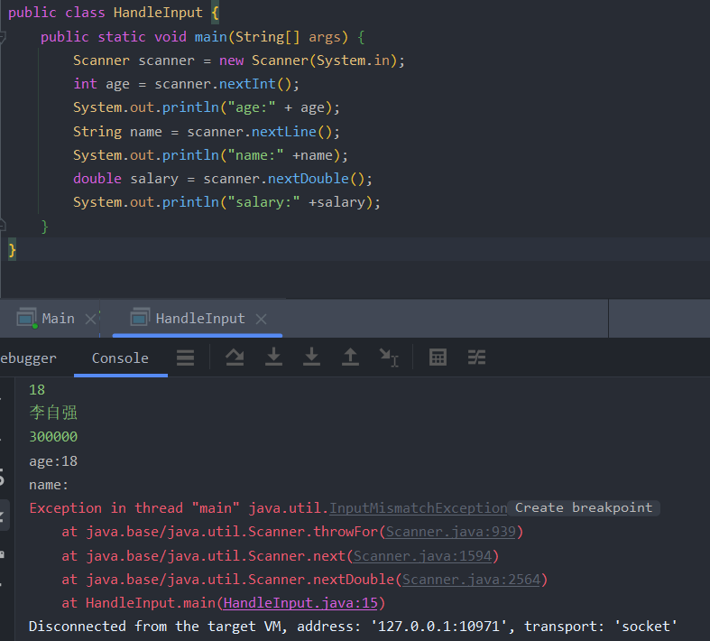
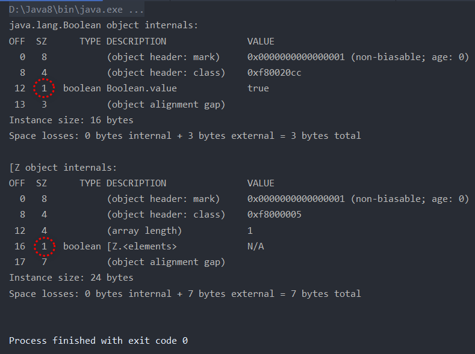

# JAVA中Scanner的使用及nextLine和nextInt等混用报错问题解决

> 参考出处：https://blog.csdn.net/qq_38367575/article/details/120420633

Scanner类用于扫描从控制台输入的数据，可以接收字符串和基本数据类型的数据。位于java.util.Scanner包中。

## Scanner常用方法

1. String  next(); 

   作用：接收控制台输入的一个字符串。

   注意：以空格和回车为结束符 

2. String  nextLine(); 

   作用：接收控制台输入的一个字符串。 

   注意：以回车为结束符

3. int  nextInt(); 

   作用：接收控制台输入的一个int类型的数据。

   注意：以空格和回车为结束符 

4. double  nextDouble(); 

   作用：接收控制台输入的一个double类型的数据。

   注意：以空格和回车为结束符  

5. boolean  nextBoolean(); 

   作用：接收控制台输入的一个boolean类型的数据。

   注意：以空格和回车为结束符 

示例：

```java
//步骤1、创建Scanner类的一个对象。 
Scanner scanner = new Scanner(System.in); 	 
//步骤2、通过scanner调用next等方法，接收控制台输入的数据。 
System.out.println(“姓名：”);
String name = scanner.next();
```

## 常见问题



原因分析：原因是nextDouble()、nextInt()等方法，能够读出空格或者回车前的字符串或者数字，并且下次读时不会切换到空格或者回车之后（也就是还在18之后继续读，不会切换到下一行）。而nextLine则会读取本行且下次自动切换到下一行开头读。

## 解决方法

在nextDouble()、nextInt()等方法后面都要加上一句不需要赋值的nextLine()，把读的位置切换到下一行

示例：

```Java
import java.util.Scanner;

public class Tess {
	public static void main(String[] args) {
		Scanner scanner = new Scanner(System.in);
		int age = scanner.nextInt();
		scanner.nextLine();//把读的位置切换到下一行
		String name = scanner.nextLine();
		double salary = scanner.nextDouble();
		scanner.nextLine();//把读的位置切换到下一行
		System.out.println("age:" + age);
		System.out.println("name:" + name);
		System.out.println("salary:" + salary);
	}
}
```

# IO流

## 字节流和字符流

> 根据数据流向的方向不同，分为输入流和输出流

IO流的输入\出源有控制台、文件、网络、数据库...

常用的IO流：分字节流（以字节，8bit为单位对数据进行读写操作）和字符流（以字符为单位，一个字符占2个字节）


输入字节流包含：文件（File）、对象（Object）、字节数组（ByteArray）、管道（Pipe）、过滤器（Filter）、缓冲字符串、顺序输入流（InputStream），都是InputStream（抽象类）的子类

输出字节流包含：文件（File）、对象（Object）、字节数组（ByteArray）、管道（Pipe）、过滤器（Filter）输出流（OutputStream），都是OutputStream（抽象类）的子类


输入字符流包含：字符数组（CharArray）、字符串（String）、其他输入流的缓冲区（Buffered）、管道（Piped）、过滤器（Filter）、将字节输入流转换为字符输入流（InputStream）Reader，都是Reader的子类（Reader是所有字符输入流的父类）

输出字符流包含：字符数组（CharArray）、字符串（String）、其他输出流的缓冲区（Buffered）、管道（Piped）、过滤器（Filter）、将字节输入流转换为字符输入流（InputStream）Writer，都是Writer的子类（Writer是所有字符输出流的父类）

## 节点流和处理流

节点流是低级流，直接与数据源相连，并且进行读写；处理流是高级流，不直接和数据源相连（采用装饰器模式对节点流进行封装），主要用于消除不同节点实现上的差异。

节点流包含：FileInputStream、FileOutputStream、FileReader、FileWriter

处理流包含：BufferInputStream（[FilterInputStream](https://docs.oracle.com/javase/7/docs/api/java/io/FilterInputStream.html)的实现类）、BufferOutputStream、BufferReader、BufferWriter

处理流相比节点流的优点：通过增加缓存提高了数据输入和输出的效率、封装了一系列高级方法来完成一次性大批量数据的输入和输出

## 内存映射文件技术

含义：操作系统利用虚拟内存将文件映射到内存中，然后，这个文件就可以被当作内存数据来访问

关键技术优势：

- 让操作系统负责文件的读写，应用程序只需要处理内存数据，就可以实现IO操作；
- 可以实现共享内存，内存映射文件可以被多个进程同时访问；内存映射文件技术涉及的内存在Java的堆空间之外；
- 大幅提升文件数据的输入输出速度

Java的NIO包支持内存映射技术，实现方式是通过**MapperdBytyBuffer**读写内存

# 数据类型

## 8种基本类型

在Java中共有8种基本类型（primitive type），其中包含4种整型、2种浮点型、1种字符类型（用于表示Unicode编码）和1种真值类型。

1. 4种整型

   byte：1字节；取值范围是从-128 (-2^7) 到 127 (2^7 - 1)

   short：2字节；取值范围是从 -32,768 (-2^15) 到 32,767 (2^15 - 1)

   int：4字节；取值范围是从 -2,147,483,648 (-2^31) 到 2,147,483,647 (2^31 - 1)

   long：8字节；取值范围是从-9,223,372,036,854,775,808 (-2^63) 到 9,223,372,036,854,775,807 (2^63 - 1)

   Java整型数值的表示方法：

   - 长整型（long）数值后面有一个后缀L或l

   - 十六进制数值有一个前缀0X或0x
   - 八进制有一个前缀0
   - 二进制有一个前缀0B或0b
   - 可以在整数类型的数字字面量上加下划线进行分组，以提高可读性
   
   > Java和C++的不同：
   >
   > Java中整型的范围是平台无关的，而C++（C同样也是）中，是平台相关的。
   
2. 2种浮点型

   float：4字节；取值范围是大约是正负3.4E+38（约7位有效数字）

   double：8字节；取值范围大约是正负1.7E+308（约15位有效数字）

   取值范围是由IEEE 754浮点数标准规定的，float类型的32位二进制数被划分为三个部分：1个符号位，8个指数位和23个尾数位。double类型的64位二进制数被划分为三个部分：1个符号位，11个指数位和52个尾数位。其中，指数位决定了浮点数的范围，尾数位决定了浮点数的精度。

   double这种表示浮点数的类型数值精度是float类型的两倍，所以称为双精度浮点数。

   Java整型数值的表示方法：

   - float类型的数值有一个后缀F或f
   - double类型的数值既可以没有后缀，也可以有一个后缀D或d，所以Java中没有后缀的浮点数类型默认是double

   >  警告： 
   >
   > 浮点数不适用于无法接受舍入误差的金童计算，如果需要精确的数值计算，不允许有舍入误差，应该使用BigDecimal类。

3. 1种字符类型

   char：2字节；取值范围是从0到65535（包括0和65535）

   char类型的作用主要有两个，表示单个字符，以及表示Unicode字符（目前，16位的char类型已经不足以描述所有Unicode字符了，部分Unicode字符需要两个char来表示）。

   > 备注：
   >
   > Unicode字符是一种用于表示文本字符的国际标准编码系统。它为几乎所有的字符（包括字母、数字、标点符号、符号、表情符号等）分配了唯一的代码点，以便在计算机系统中进行存储和处理。
   >
   > Unicode字符使用十六进制表示，前缀为"\u"，后跟四个十六进制数字。
   >
   > Unicode转义序列会在解释代码之前处理。

4. 1种真值类型

   boolean：[“大小”并不是精确定义的](https://docs.oracle.com/javase/tutorial/java/nutsandbolts/datatypes.html)，通常是1字节；取值范围是true或false
   
   > 注意：
   >
   > 在Java8HotSpot虚拟机下，单个boolean数值和数组中的boolean数值都是占1个字节。
   >
   > 使用JOL对象布局分析工具，编写测试程序如下：
   >
   > ```java
   > public class BooleanLength {
   >     public static void main(String[] args) {
   >         boolean b = true;
   >         boolean[] bArr = new boolean[]{true};
   >         System.out.println(ClassLayout.parseInstance(b).toPrintable());
   >         System.out.println(ClassLayout.parseInstance(bArr).toPrintable());
   >     }
   > }
   > ```
   >
   > 输出结果如下：
   >
   > 
   >
   > 可以看到无论是单个boolean对象还是数组中的boolean对象，其boolean数值都只占1个字节。

在Java中只有基本类型不是对象。

## 字符串

Java字符串（String类对象）是Unicode字符序列，每个字符char都对应一个Unicode码点。

**字符串不可变**

>  `String` objects are *immutable*, which means that once created, their values cannot be changed. 

Java中字符串是不可变的（immutable），并且也没有提供任何方法来修改字符串中的某个字符。

**字符串共享**

字符串常量池是一块位于Java堆内存中的特殊存储区域，用于存储字符串字面量（直接以双引号括起来的字符串）和显式通过String类的`intern()`方法调用加入常量池的字符串。当创建字符串时，如果字符串常量池中已经存在相同内容的字符串，则不会创建新的字符串对象，而是直接返回常量池中的字符串引用。

需要注意的是，通过`new`关键字创建的字符串对象不会被共享，而是在堆内存中创建新的对象。只有使用字符串字面量或显式调用`intern()`方法将字符串加入常量池时才会进行共享。此外，+或substring等操作得到的字符串也不共享。

**检测字符串是否相等**

String类覆盖了equals方法。

可以使用equals方法检测两个字符串是否相等，不能使用==运算符，因为==运算符只能确定两个字符串是否存储在同一个位置上，而Java中的相等的字符串可以存储在不共享的位置，不能仅通过位置判断是否相等。

**文本块**

Java15新增了文本块（text block）特性，提供了跨多行的字符串字面量。

文本块特别适合包含用其它语言编写的代码，如SQL或HTML。

文本块示例：

```java
String html = """
    <div>
    	HTML...
    </div>
""";
```

文本块需要转义的情况：

- 文本块以引号结尾

- 文本块中包含三个及以上的引号

- 文本块中有反斜杠（\）

- 文本块以空格结尾

  文本块会删除末尾的空格，如果需要保留末尾的空格，可以把空格替换为\s。

## 大数

Java的`java.math`包中提供了两个重要的数值处理类，BigInteger和BigDecimal，用于处理大整数和高精度浮点数的运算。BigInteger类能够表示任意精度的整数。BigDecimal类能够实现任意精度的浮点数运算。

## 数组

for each循环的对象必须是一份数组或者是一个实现了Iterable接口的类对象。

**Arrays类**

- **数组打印**

  如果要打印数组中的所有值，可以使用另一种方法，使用Arrays类的**toString**方法，该方法会返回一个包含数组元素的字符串，这些元素包围在中括号内，并使用逗号分隔。

  ```java
  System.out.println(Arrays.toString(a));
  ```

- **数组拷贝**

  如果要拷贝数组内的所有值，可以使用Arrays类的**copyOf**方法。

  ```java
  int[] copiedArray = Arrays.copyOf(a, length); //第二个参数length是新数组的长度
  ```

  如果要拷贝数组内指定范围内的所有值，可以使用Arrays类的**copyOfRange**方法。

- **数组排序**

  如果要对数值型的数组进行排序，可以使用Arrays类中的**sort**方法。如果是其它类型的数组，也可以使用该方法，前提是数组元素的类实现了Comparator接口的compareTo方法（x小于y时返回负数）。

  这个方法使用了优化的快速排序（QuickSort）算法

- **数组二分查找**

  如果要使用二分查找算法在有序数组a中或a中的指定范围内查找值v，可以使用Arrays的binarySearch方法，如果找到v，该方法会返回值的索引，否则返回一个负数值r，-r-1是v在保持a有序的前提下可以插入的位置。

- **数组填充**

  如果要将数组所有元素设置为指定值，可以使用Arrays类的fill方法。

- **数组元素比较**

  如果两个数组长度相同，并且相同索引对应的元素都相同，则返回true。

- **List集合转数组**

  将List集合转为数组可以使用toArray()方法。

- **基本类型的数组转List**

  ```java
  //基本类型也可以实现转换（依赖boxed的装箱操作）
  int[] myArray ={1,2,3};
  List myList =Arrays.stream(myArray2).boxed().collect(Collectors.toList());
  ```

**不规则数组**

Java中的数组可以是不规则的数组，即数组的每一行有不同的长度。

> Java和C++的不同：
>
> C++的Vector是按值复制的，赋值操作b=a将会构造一个与a长度相同的新向量，并将所有元素从a复制到b。而在Java中，这条赋值语句的操作结果是让a和b引用同一个数组列表。

# 运算符

## 位运算符

Java的运算符包括&（and）、|（or）、^（or）、~（not）。

对于布尔值，&和|运算符的返回结果也是布尔值，不过与`&&`和`||`不同的是，$和|运算符不是短路的，也就是说，计算结果之前两个操作数都需要计算

## 位移运算符

Java的位移运算符包括>>、<<、>>>，不存在<<<。

- \>>会用符号位填充高位
- \>>>会用0填充高位

## switch语句

Java14中引入switch，既可以作为语句，也可以做表达式。

**参数类型**

可以作为switch参数数据类型的有：int、bype、short、char、String、枚举、（int、bype、short、char）的包装类

不能作为switch参数的有：long、float、double、boolean、复杂的表达式、……

case的参数可以有多个。如`case "Summer"， "Winter" -> 0;`

**直通和非直通**

Java中switch语句的行为可以被描述为直通和非直通：

- 直通行为
  - case以冒号（:）结尾，是有直通行为的。

- 非直通行为
  - case以箭头（->）结尾，是无直通行为的。
  - switch表达式中有yield关键字，yield关键字会返回表达式的值并终止执行。
  - switch表达式中有break关键字，break关键字会终止执行，switch表达式中不能使用return、break或continue语句。

**switch的使用方法**

- ->

  - switch表达式

    - 直接返回值

      ```java
      enum Size {SMALL, MEDIUM, LARGE, EXTRA_LARGE};
      Size size = Size.LARGE;
      // switch表达式
      String result = switch (size) {
          case SMALL -> "S";
          case MEDIUM -> "M";
          case LARGE -> "L";
          case EXTRA_LARGE -> "XL";
      };
      ```

    - 使用yield返回值

      ```java
      enum Size {SMALL, MEDIUM, LARGE, EXTRA_LARGE};
      Size size = Size.LARGE;
      String result = switch (size) {
          case SMALL -> {
              yield "S";
          }
          case MEDIUM -> {
              yield "M";
          }
          case LARGE -> {
              yield "L";
          }
          case EXTRA_LARGE -> {
              yield "XL";
          }
      };
      ```

  - switch语句

    - 直接赋值

      ```java
      enum Size {SMALL, MEDIUM, LARGE, EXTRA_LARGE};
      Size size = Size.LARGE;
      String result;
      // switch语句
      switch (size) {
          case SMALL -> result = "S";
          case MEDIUM -> result = "M";
          case LARGE -> result = "L";
          case EXTRA_LARGE -> result = "XL";
      };
      ```

- :

  - switch表达式

    - 使用yield返回值

      ```java
      enum Size {SMALL, MEDIUM, LARGE, EXTRA_LARGE};
      Size size = Size.LARGE;
      String result = switch (size) {
           case SMALL:
               yield "S";
           case MEDIUM:
               yield "M";
           case LARGE:
               yield "L";
           case EXTRA_LARGE:
               yield "XL";
       };
      ```

      

  - switch语句

    - 赋值后使用break返回

      ```java
      enum Size {SMALL, MEDIUM, LARGE, EXTRA_LARGE};
      Size size = Size.LARGE;
      String result;
      switch (size) {
          case SMALL:
              result = "S";
              break;
          case MEDIUM:
              result = "M";
              break;
          case LARGE:
              result = "L";
              break;
          case EXTRA_LARGE:
              result = "XL";
              break;
      }
      ```

## 数值类型转换

数值类型转换中int转float，long转double可能产生精度损失。

**自动类型转换**

二元运算符在计算前会先将两个操作数转换为同一类型，如果有一个操作数是double/float/long（存在优先顺序），另一个操作数就会被转换（自动类型转换）为double/float/long。

**强制类型转换**

对于可能丢失信息的转换需要通过强制类型转换完成。

浮点数转换为整数时会截断小数位。

## 数学函数Math

Math.pow方法：进行幂运算，Java中没有完成幂运算的运算符

Math.round方法：舍入（round）浮点数来得到最接近的整数

Math.ramdom方法：返回一个0到1（包含0，不包含1）之间的随机浮点数，用n乘以这个浮点数，可以得到从0到n-1之间的一个随机数。例如：`int result = (int) (Math.random() * n);`

# 对象与类

## 面向对象编程的概念

**封装（encapsulation）**

从形式上看，封装就是将数据和行为组合在一个包中，并对对象的使用者隐藏具体的实现细节。

实现封装的关键在于，不能让其它类中的方法直接访问被封装的类的实例字段，程序只能通过对象的方法与对象的数据进行交互。这意味着一个类可以完全改变存储数据的方式，只要仍旧向外提供同样的方法，调用该方法的对象不需要关心这个类所发生的变化。

**继承（Inheritance）**

继承可以让实现Java类变得更容易，因为可以通过继承（extends、implements）其它类来构建新类。

**多态（Polymorphism）**

多态是指在父类或接口类型上使用不同的子类对象，以实现同一个方法的多种不同行为。一个父类变量既可以引用父类对象，也可以引用其任何一个子类的对象。

## 类之间的关系

| 关系                         | 含义                 | UML（Unified Modeling Language）连接符 | 关系强弱                     |
| ---------------------------- | -------------------- | -------------------------------------- | ---------------------------- |
| 实现（Implementation，is-a） | implements interface | 虚线+三角箭头                          |                              |
| 继承（Inheritance，is-a）    | inherits from        | 实线+三角箭头                          |                              |
| 依赖（Dependency，uses-a）   | depend on            | 虚线+三线箭头                          | 弱（如成员函数里的局部变量） |
| 关联（Association，uses-a）  | is associated with   | 实线+三线箭头                          | 强（如成员变量）             |
| 聚合（Aggregation，has-a）   | is an aggregate of   | 空心菱形箭头+实线                      | 弱                           |
| 组合（Composition，has-a）   | is composed of       | 实心菱形箭头+实线                      | 强                           |
|                              |                      |                                        |                              |

## 方法参数

**方法参数能否改变的规则**

- 方法不能改变基本数据类型的参数
- 方法可以改变对象参数的状态
- 方法不能改变对象参数的引用对象

**变长参数**

在 Java 5 中提供了变长参数，允许在调用方法时传入不定长度的参数。变长参数是 Java 的一个语法糖，本质上还是基于数组的实现。

定义变长参数的方法是，在最后一个形参后加上三点 **…**，就表示该形参可以接受多个参数值，需要注意的是：

- 可变参数只能作为函数的最后一个参数，但其前面可以有也可以没有任何其他参数
- 由于可变参数必须是最后一个参数，所以一个函数最多只能有一个可变参数
- Java的可变参数，会被编译器转型为一个数组

## 重载

重载（orverloading）指的是一个类的多个方法有相同的参数名，但是有不同的参数。

## 包装器

所有基本类型都有一个与之对应的类，这些类被称为包装器（wrapper），分别是：**Byte、Integer、Long、Float、Double、Boolean、Character**（前6个类派生于父类Number）。

> 由于每个值分别包装在一个对象中，所以ArrayList<Integer\>的效率远远低于int[]数组。

**自动装箱**

list.add(1);会自动转换为list.add(Integer.valueOf(1))，这种转换称为自动装箱（autoboxing）。

**自动拆箱**

当将Integer对象赋给一个int值时，会自动拆箱（unboxed）。例如，int n = list.get(i)会转换成int n = list.get(i).intValue()。


自动装箱和自动拆箱也适用于算术表达式。例如，对于Integer n = 1; n++;编译器会自动地对n拆箱，将拆箱后的结果增1，最后再将其装箱。

装箱和拆箱由编译器完成，而不是虚拟机。编译在再生成类的字节码时会插入必要的方法调用，虚拟机只是执行这些字节码。

## 抽象类

> Java和C++的不同：
>
> 在C++中，抽象方法称为纯虚函数（pure virtual function），要在末尾用=0标记，没有用于表示抽象类的特殊关键字。

## 枚举类

在比较枚举类的值时，不需要使用equals，可以之间使用==来比较。

枚举类可以有构造器、方法和字段。

有构造器、方法和字段的枚举类示例：

```java
public enum Size {
    SMALL("S"), MEDIUM("M"), LARGE("L"), EXTRA_LARGE("XL");

    private final String abbreviation;

    Size(String abbreviation) {
        this.abbreviation = abbreviation;
    }

    public String getAbbreviation() {
        return abbreviation;
    }
}
```

所有枚举类型都是抽象类Enum的子类。

## 内部类

内部类（inner class）是定义在类中类。

内部类的分类：


- 非静态的
  - Inner Classes：非静态内部类，又称成员内部类
  - Method Local Inner Classes：方法方法局部内部类
  - Annonymous Inner Classes：匿名内部类
- 静态的（类的前面多了一个关键字static）
  - Static Nested Classes：静态内部类

### [非静态内部类](https://www.runoob.com/w3cnote/java-inner-class-intro.html)

**访问成员的规则**

- 非静态内部类可以无条件访问外部类的所有成员属性和成员方法（包括private成员和静态成员）。当非静态内部类拥有和外部类同名的成员变量或者方法时，会发生隐藏现象，即默认情况下访问的是非静态内部类的成员。如果要访问外部类的同名成员，需要以下面的形式进行访问：

  ```java
  外部类.this.成员变量
  外部类.this.成员方法
  ```

- 在外部类中如果要访问非静态内部类的成员，必须先创建一个非静态内部类的对象，再通过指向这个对象的引用来访问。

**创建的方法**

非静态内部类是依附外部类而存在的，也就是说，如果要创建非静态内部类的对象，前提是必须存在一个外部类的对象。

```java
//第一种方式：
Outter outter = new Outter();
Outter.Inner inner = outter.new Inner();  //必须通过Outter对象来创建
```

**访问权限修饰**

内部类可以拥有 private 访问权限、protected 访问权限、public 访问权限及包访问权限。比如上面的例子，如果非静态内部类 Inner 用 private 修饰，则只能在外部类的内部访问，如果用 public 修饰，则任何地方都能访问；如果用 protected 修饰，则只能在同一个包下或者继承外部类的情况下访问；如果是默认访问权限，则只能在同一个包下访问。

### 静态内部类

**访问成员的规则**

- 静态内部类可以直接访问外部类的静态成员。如果要访问外部类的实例成员，需要通过外部类的实例去访问。
- 外部类以外的其他类需要通过完整的类名访问静态内部类中的静态成员。如果要访问静态内部类中的实例成员，则需要通过静态内部类的实例。

**创建的方法**

在创建静态内部类的实例时，不需要创建外部类的实例。

### [方法局部内部类](http://c.biancheng.net/view/1028.html)

方法局部内部类是定义在一个方法或者一个作用域里面的类。方法局部内部类只在当前方法中有效。

**实现规则**

1. 方法局部内部类中不能定义 static 成员。
2. 方法局部内部类与局部变量一样，不能使用访问控制修饰符（public、private 和 protected）和 static 修饰符修饰。
3. 方法局部内部类中还可以包含内部类，但是这些内部类也不能使用访问控制修饰符（public、private 和 protected）和 static 修饰符修饰。

**访问成员的规则**

- 方法局部内部类只可以访问**当前方法**中 final 类型的参数与变量。

  在方法局部内部类中可以访问**外部类**的所有成员。如果方法中的成员与外部类中的成员同名，则可以使用 <OuterClassName\>.this.<MemberName\> 的形式访问外部类中的成员。

### [匿名内部类](http://c.biancheng.net/view/1031.html)

匿名类是指没有类名的内部类，必须在创建时使用 new 语句来声明类。其语法形式如下：

```java
new <类或接口>() {
    // 类的主体
};
```

匿名内部类不能是静态的。

**实现方法**

匿名类有两种实现方式：

- 继承一个类，重写其方法。
- 实现一个接口（可以是多个），实现其方法。

**访问成员的规则**

- 如果匿名类位于一个方法中，则匿名类只能访问方法中 final 类型的局部变量。

  匿名内部类可以访问外部类的所有成员。

## Cloneable

`Cloneable` 是一个标记接口（marker interface），用于指示一个类可以被克隆（clone）。

要让一个类可以被克隆，需要满足两个条件：

1. 类实现 `Cloneable` 接口。
2. 重写 `clone()` 方法，实现对象的克隆逻辑。

# 继承

继承的基本思想是基于已有的类创建新的类。

> Java和C++的不同：
>
> Java中继承是使用关键字extends，而C++中是使用冒号（:）
>
> Java中所有的继承都是公共继承，没有C++中的私有继承和保护继承。

在覆盖一个方法的时候，子类的方法不能低于超类方法的可见性。

## final类和final方法

final能够阻止类的继承，以及方法的覆盖。

## protected访问修饰符

protected是Java的一个访问修饰符（access modifier）。

当一个类的成员被声明为 protected，意味着它只能被以下两种情况下的代码访问：

1. 在同一包内的其他类
2. 所有（在同一包或不同包中）的子类

需要注意的是，protected 修饰符并不会对类本身的可见性产生影响，也就是说，如果一个public类的某个成员被声明为 protected，不同包下的非子类仍然能够访问该类，只是不能访问该类的protected成员。

> 注意：
>
> 如果在Java中不指定类中某个方法的访问修饰符，则默认使用包级私有（package-private）修饰符，而不是protected修饰符。

## 覆盖

覆盖（override）指的是子类提供从父类中继承的方法的新的实现。

# Object类

## equals方法

Object类中的equals方法的默认实现是比较两个对象的引用地址（即内存地址）是否相同。所以如果需要比较两个对象中参数是否一致，就需要覆盖该equals方法。

Java规范要求equals方法具有如下特性：

1. 自反性：对于非null的引用x，x.equals(x)应返回true。
2. 对称性：对于非null的引用x、y，x.equals(y)返回true时，y.equals(x)也要返回true。
3. 传递性：对于非null的引用x、y、z，x.equals(y)返回true且y.equals(z)返回true，则x.equals(z)返回true。
4. 一致性：如果x，y引用的对象没有发送变化，则反复调用x.equals(y)应该返回相同的结果。
5. 对于非null的引用x，x.equals(null)应返回false。

## hashCode方法

Java中，散列码（hash code）是由对象导出的一个整型值（可以是负数）。

内容相同的字符串有相同的散列码，这是因为字符串的散列码是由内容导出的。

如果一个类覆盖了equals方法，则该类必须也覆盖hashCode方法。如果两个对象通过 equals 方法比较相等，那么它们的 hashCode 必须相等。比如如果equals方法比较的是参数id，那么hashCode方法就需要对id计算散列值，且不考虑其它的参数。

> 提示：
>
> 如果有数组类型的字段，那么可以使用静态的Arrays.hashCode方法计算一个散列码，该散列码有数组元素的散列码组成。

## getClass方法

Object类提供了getClass方法，返回值是对象的运行时类的Class对象。

调用getClass().getName()可以得到对象的类名。

## 反射

### 概述

反射（reflection）是在程序运行期间获取类的信息（如类名、类的方法、类的属性等信息）并进行操作（如创建对象、调用方法等操作）的技术。

### 反射机制的核心类

Java 反射机制的核心类包括“java.lang”包下的Class 类，以及“ java.lang.reflect”包下的Constructor类、Method类、Field类、Modifier类。这些类可以让我们在运行时动态地获取类的相关信息，并进行相应的操作。例如，我们可以使用Constructor类的newInstance()方法创建对象；使用Method 类中的 invoke() 方法来调用一个指定方法；使用 Field 类的 get() 和 set() 方法来读取或修改一个对象的属性值；使用Modifier类的isPublic()方法来判断类的修饰符是否是public。

#### Class类

虚拟机中每个类型只要唯一的Class对象，因此可以使用==运算符比较两个类对象是否相等。

Class类的部分方法示例：

- getName方法，由获取的Class类对象获取类的全限定名（fully qualified name）

  ```java
  Integer object = 1;
  Class classObject = object.getClass();//获取Class类对象
  String name = classObject.getName();
  ```

- forName方法，由类的全限定名获取Class类对象

  ```java
  String name = "java.lang.Integer";
  try {
  	classObject = Class.forName(name);
  } catch (ClassNotFoundException e) {
  	throw new RuntimeException(e);
  }
  ```

- 由类型获取Class类对象

  ```java
  Class classObject1 = Integer.class;
  Class classObject2 = int.class; //int不是类，但是int.Class是类对象
  ```

- getConstructor方法，由Class类对象获取构造器

  ```java
  Class classObject = TestGetLClass.class;
  try {
  	Object obj = classObject.getConstructor().newInstance();
  } catch (InstantiationException | IllegalAccessException | InvocationTargetException | NoSuchMethodException e) {
  	throw new RuntimeException(e);
  }
  ```

#### Constructor

Constructor类的部分方法：

| 方法签名                                  | 用途                       |
| ----------------------------------------- | -------------------------- |
| public T newInstance(Object ... initargs) | 根据传递的参数创建类的对象 |

#### Method

Method类的部分方法：

| 方法签名                                                     | 用途                                                         |
| ------------------------------------------------------------ | ------------------------------------------------------------ |
| public Object invoke(Object obj, Object... args)             | `invoke` 方法是 Java 反射 API 中 `Method` 类的一个重要方法，用于调用方法并执行其逻辑。通过 `invoke` 方法，可以在运行时动态地调用特定对象上的方法，并传递参数。 |
| public String getName()                                      | 获取方法的名称                                               |
| public <T extends Annotation\> T getAnnotation(Class<T\> annotationClass) | 获取指定类型的注解对象，如果存在的话                         |
| public Annotation[] getDeclaredAnnotations()                 | 获取所有注解对象的数组                                       |

#### Field

Field类的部分方法：

| 方法签名                                                     | 用途                               |
| ------------------------------------------------------------ | ---------------------------------- |
| public int getInt(Object obj)                                | 获取指定对象中包含指定参数的整型值 |
| public void setInt(Object obj, int i)                        | 置指定对象中表示的字段的整型值     |
| public <T extends Annotation\> T getAnnotation(Class<T\> annotationClass) | 获取指定类型在字段上的注解实例     |

#### Modifier

Modifier类的部分方法：

| 方法签名                                | 用途                             |
| --------------------------------------- | -------------------------------- |
| public static boolean isPublic(int mod) | 根据传递的参数判断是否包含public |

### [反射的应用](https://segmentfault.com/a/1190000010162647)

#### JDBC 的数据库的连接

在JDBC 的操作中，如果要想进行数据库的连接，则必须按照以上的几步完成

1. 通过Class.forName()加载数据库的驱动程序 （通过**反射**加载，前提是引入相关了Jar包）
2. 通过 DriverManager 类进行数据库的连接，连接的时候要输入数据库的连接地址、用户名、密码
3. 通过Connection 接口接收连接

```java
public class ConnectionJDBC {  
    /** 
     * @param args 
     */  
    //驱动程序就是之前在classpath中配置的JDBC的驱动程序的JAR 包中  
    public static final String DBDRIVER = "com.mysql.jdbc.Driver";  
    //连接地址是由各个数据库生产商单独提供的，所以需要单独记住  
    public static final String DBURL = "jdbc:mysql://localhost:3306/test";  
    //连接数据库的用户名  
    public static final String DBUSER = "root";  
    //连接数据库的密码  
    public static final String DBPASS = "";  
      
      
    public static void main(String[] args) throws Exception {  
        Connection con = null; //表示数据库的连接对象  
        Class.forName(DBDRIVER); //1、使用CLASS 类加载驱动程序 ,反射机制的体现 
        con = DriverManager.getConnection(DBURL,DBUSER,DBPASS); //2、连接数据库  
        System.out.println(con);  
        con.close(); // 3、关闭数据库  
    }
}
```

#### Spring 框架的IoC

在 Java的反射机制在做基础框架的时候非常有用，行内有一句这样的老话：反射机制是Java框架的基石。一般应用层面很少用，不过这种东西，现在很多开源框架基本都已经封装好了，自己基本用不着写。典型的除了hibernate之外，还有spring也用到很多反射机制。最经典的就是xml的配置模式。

Spring 通过 XML 配置模式装载 Bean 的过程：

1. 将程序内所有 XML 或 Properties 配置文件加载入内存中
2. Java类里面解析xml或properties里面的内容，得到对应实体类的字节码字符串以及相关的属性信息
3. 使用**反射**机制，根据这个字符串获得某个类的Class实例
4. 动态配置实例的属性

Spring这样做的好处是：

- 不用每一次都要在代码里面去new或者做其他的事情
- 以后要改的话直接改配置文件，代码维护起来就很方便了

## [代理](https://javaguide.cn/java/basis/proxy.html#_3-1-jdk-%E5%8A%A8%E6%80%81%E4%BB%A3%E7%90%86%E6%9C%BA%E5%88%B6)

### 概述

代理（proxy）是在运行时创建创建接口的代理类和代理对象的技术。

代理模式分为静态代理和动态代理两种。

静态代理和动态代理最主要的区别是：静态代理在**代码运行之前**，代理类的.class文件就已经存在，而动态代理则与静态代理相反，在代码运行之前不存在代理类的.class文件，**在代码运行时**才动态的生成代理类。

### 代理和反射的关系

反射和代理之间的关系是：通过反射可以创建动态代理对象。

Java中的**动态代理是一种利用反射机制在运行时动态地创建代理对象的技术**。通过动态代理，可以在运行时创建代理类和代理对象，并将方法的调用转发给代理对象的调用处理程序（如InvocationHandler的invoke方法）来处理，在方法调用前后执行一些额外的操作，例如记录日志、检查权限、实现缓存等。

### JDK动态代理机制

#### 核心类

Java代理机制的核心类包括`java.lang.reflect.Proxy`类和`java.lang.reflect.InvocationHandler`接口。`Proxy`类用于创建代理类和代理对象，而`InvocationHandler`接口定义了代理对象的调用处理程序。

创建代理对象的方法是调用Proxy类中的newProxyInstance(ClassLoader loader, Class<?>[] interfaces, InvocationHandler h)方法，该方法的三个参数分别是类加载器（用于加载代理对象）、一组被代理类实现的接口、实现类InvocationHandler接口的对象（需要自定义InvocationHandler接口的实现类来自定义处理逻辑）。

在代理对象调用方法时，实际上是调用了InvocationHandler的invoke方法。

#### 使用步骤

1. 定义一个接口及其实现类（被代理的类）；
2. 自定义 `InvocationHandler` 并重写`invoke`方法，在 `invoke` 方法中我们会调用原生方法（被代理类的方法）并自定义一些处理逻辑；
3. 通过 `Proxy.newProxyInstance(ClassLoader loader,Class<?>[] interfaces,InvocationHandler h)` 方法创建代理对象；

### CGLIB动态代理机制

**JDK 动态代理有一个最致命的问题是其只能代理实现了接口的类。**

**为了解决这个问题，我们可以用 CGLIB 动态代理机制来避免。**

[CGLIBopen in new window](https://github.com/cglib/cglib)(*Code Generation Library*)是一个基于[ASMopen in new window](http://www.baeldung.com/java-asm)的字节码生成库，它允许我们在运行时对字节码进行修改和动态生成。CGLIB 通过继承方式实现代理。很多知名的开源框架都使用到了[CGLIBopen in new window](https://github.com/cglib/cglib)， 例如 Spring 中的 AOP 模块中：如果目标对象实现了接口，则默认采用 JDK 动态代理，否则采用 CGLIB 动态代理。

#### 核心类

CGLIB代理机制的核心类包括`Enhancer`类和`MethodInterceptor`接口。`Enhancer`类用于创建代理类和代理对象，而`MethodInterceptor`接口定义了代理对象的调用处理程序。

当代理类调用方法的时候，实际调用的是 `MethodInterceptor` 中的 `intercept` 方法。需要自定义 `MethodInterceptor` 接口的实现类并实现 `intercept` 方法，`intercept`是用于拦截增强被代理类的方法。

#### 使用步骤

1. 添加CGLIB的依赖；
2. 定义一个类（被代理的类）；
3. 自定义 `MethodInterceptor` 并重写 `intercept` 方法，`intercept` 用于拦截增强被代理类的方法，和 JDK 动态代理中的 `invoke` 方法类似；
4. 通过 `Enhancer` 类的 `create()`创建代理类；

### 代理的应用

1. RPC框架：如Dubbo、gRPC等，通常使用动态代理来实现客户端的远程方法调用。客户端通过动态代理对象来调用远程服务的方法，而不需要直接关注底层的网络通信细节。代理对象将方法调用转发给远程服务，同时可以在方法调用前后添加一些额外的逻辑，比如实现负载均衡、服务治理、日志记录等。
2. AOP（面向切面编程）：如Spring的AOP特性，就是利用代理机制实现对方法的增强。通过在程序运行期间动态地将额外的代码（称为切面）织入到现有的代码中，实现对系统的横切关注点（cross-cutting concerns）的管理。

# 接口

## 定位和特性

接口（interface）用来描述类应该做什么（一组需求），而不指定应该怎么做（静态方法除外，从Java8开始允许在接口中增加静态方法包括方法的实现）。接口中除了可以声明方法，还可以定义静态常量。

接口中的所有方法都默认是public方法，因此在接口中声明方法时，可以不提供关键字public。不过在实现接口时必须把方法声明为public；所有静态常量的类型默认是public static final类型，可以不提供关键字public static final。

每个类只能有一个父类，但可以有多个接口。

> Java和C++的不同：
>
> Java只允许有一个父类，C++可以有多个父类。
>
> Java和C++都有抽象类的概念，但是C++中没有接口的概念。

## 默认方法

可以为接口中的方法提供一个默认实现，方法是在方法上添加default修饰符。

## Lambda表达式

Lambda表达式是一种用来创建代码块的简洁的方法。

**语法**

```java
(参数列表) -> 表达式
```

即使Lambda表达式没有参数，仍然要带有括号。

Lambda表达式的示例：

1. 无参数的Lambda表达式： () -> System.out.println("Hello, Lambda!");
2. 单个参数的Lambda表达式： (x) -> System.out.println("The value is: " + x);
3. 多个参数的Lambda表达式： (x, y) -> { int sum = x + y; System.out.println("The sum is: " + sum); };
4. Lambda表达式作为方法的参数： Arrays.asList(1, 2, 3, 4, 5).forEach(n -> System.out.println(n));

Lambda表达式中的变量必须是final或等效于final的（[final or effectively final](https://docs.oracle.com/javase/tutorial/java/javaOO/lambdaexpressions.html)）。

## 函数式接口

函数式接口是一种特殊的接口，接口内部除静态方法、默认方法、静态常量外只有一个抽象类。

只有函数式接口才能使用Lambda表达式。

在Java中，使用@FunctionalInterface注解来标记一个接口为函数式接口，这样编译器就可以检查这个接口是否符合函数式接口的要求（即只有一个抽象方法）。

## 方法引用

Java方法引用是一种Lambda表达式的简化写法，它可以直接引用已有Java方法来替代Lambda表达式。

使用方法是，通过::操作符将一个已有方法的引用赋值给一个函数式接口变量，从而创建一个方法引用。

 Java 中 4 种不同方法的引用：

1. **构造器引用：**它的语法是Class::new，或者更一般的Class< T >::new实例如下：

   ```java
   final Car car = Car.create( Car::new ); 
   final List< Car > cars = Arrays.asList( car );
   ```

2. **静态方法引用：**它的语法是Class::static_method，实例如下：

   ```java
   cars.forEach( Car::collide );
   ```

3. **特定类的任意对象的方法引用：**它的语法是Class::method实例如下：

   ```java
   cars.forEach( Car::repair );
   ```

4. **特定对象的方法引用：**它的语法是instance::method实例如下：

   ```java
   final Car police = Car.create( Car::new ); 
   cars.forEach( police::follow );
   ```

```java
@FunctionalInterface
public interface Supplier<T> {
    T get();
}
 
class Car {
    //Supplier是jdk1.8的接口，这里和lamda一起使用了
    public static Car create(final Supplier<Car> supplier) {
        return supplier.get();
    }
 
    public static void collide(final Car car) {
        System.out.println("Collided " + car.toString());
    }
 
    public void follow(final Car another) {
        System.out.println("Following the " + another.toString());
    }
 
    public void repair() {
        System.out.println("Repaired " + this.toString());
    }
}
```

## 闭包

闭包（Closure）指的是一个函数（或者方法），可以引用到自己作用域以外的变量。

Java中的Lambda表达式是闭包，Lambda表达式可以引用其作用域之外的变量，不过，Lambda表达式中引用的作用域外的变量不能被改变。

# [异常和错误](https://javaguide.cn/java/basis/java-basic-questions-03.html#%E5%BC%82%E5%B8%B8)

## 概述

Java中所有的异常（Exception）类型和错误（Error）类型都是 Throwable 类的子类，继承关系见下图。

- `Exception` ：程序可以处理的异常，可以通过 `catch` 来进行捕获。`Exception` 又可以分为 Checked Exception (受检查异常，必须处理) 和 Unchecked Exception (不受检查异常，可以不处理)。

  - Checked Exception：受检查异常 ，Java 代码在编译过程中，如果受检查异常没有被 `catch`或者`throws` 关键字处理的话，就没办法通过编译。

    除了`RuntimeException`及其子类以外，其他的`Exception`类及其子类都属于受检查异常 。常见的受检查异常有：IO 相关的异常、`ClassNotFoundException`、`SQLException`...。

  - Unchecked Exception：即不受检查异常 ，Java 代码在编译过程中 ，我们即使不处理不受检查异常也可以正常通过编译。

    `RuntimeException` 及其子类都统称为非受检查异常，常见的有`NullPointerException`(空指针错误)、`IllegalArgumentException`(参数错误比如方法入参类型错误)、`NumberFormatException`（字符串转换为数字格式错误，`IllegalArgumentException`的子类）、`ArrayIndexOutOfBoundsException`（数组越界错误）、`ClassCastException`（类型转换错误）、`ArithmeticException`（算术错误）、`SecurityException` （安全错误比如权限不够）、`UnsupportedOperationException`(不支持的操作错误比如重复创建同一用户)。

- `Error`：程序无法处理的错误 ，不能通过 `catch` 来进行捕获。如果发送，Java 虚拟机（JVM）会选择终止进程。


 [Throwable类常用方法](https://docs.oracle.com/javase/8/docs/api/java/lang/Throwable.html)：

| 方法名              | 作用                                                         |
| ------------------- | ------------------------------------------------------------ |
| printStackTrace     | 将Throwable的路径信息打印到标准错误流                        |
| toString            | 返回Throwable的类名和message                                 |
| getMessage          | 返回Throwable的message（message是调用Exception时传入的参数） |
| getLocalizedMessage | 返回Throwable的本地化message                                 |

## try-catch-finally 

finally块里代码是**在return前执行的**。当在 `try` 块或 `catch` 块中遇到 `return` 语句时，就会执行`finally` 语句块。

当 try 语句块和 finally 语句块中都有 return 语句时，try 语句块中的 return 语句会被忽略，因为在执行完finally 语句块后已经return，不会再回到try语句块。

在某些情况下，finally 中的代码不会被执行。比如如果finally之前虚拟机被终止运行，则finally中的代码就不会被执行。

## try-with-resource

在 Java 中，可以使用 try-with-resources （Java7引入）语句来自动关闭实现了 `AutoCloseable` 或 `Closeable` 接口（使用的前提条件）的资源。

关闭资源在try-with-resource中的执行顺序：在 `try-with-resources` 语句中，在 `try` 块的代码执行完毕后，会自动关闭在 `try` 声明中的资源。任何 catch 或 finally 块都会在声明的资源关闭后运行。

《Effective Java》中明确指出：

> 面对必须要关闭的资源，我们总是应该优先使用 `try-with-resources` 而不是`try-finally`。随之产生的代码更简短，更清晰，产生的异常对我们也更有用。`try-with-resources`语句让我们更容易编写必须要关闭的资源的代码，若采用`try-finally`则几乎做不到这点。

支持try-with-resource的类：

- **NIO 相关类**
  - **Channel 相关类**
    - `AbstractInterruptibleChannel`: NIO 抽象通道的基类，提供了可中断的通道操作。
    - `AbstractSelectableChannel`: NIO 抽象可选择通道的基类，提供了选择器注册和取消注册的功能。
    - `AbstractSelector`: NIO 抽象选择器的基类，提供了选择通道的功能。
    - `AsynchronousFileChannel`: 异步文件通道，提供了异步读写文件的能力。
    - `AsynchronousServerSocketChannel`: 异步服务器套接字通道，用于异步处理客户端连接请求。
    - `AsynchronousSocketChannel`: 异步套接字通道，用于异步进行套接字通信。


- **IO 类**

  - **字节流**
    - `FileInputStream`: 文件输入流，用于从文件中读取字节数据。
    - `FileOutputStream`: 文件输出流，用于向文件中写入字节数据。
    - `BufferedInputStream`: 带缓冲的输入流，提供了高效的读取功能。
    - `BufferedOutputStream`: 带缓冲的输出流，提供了高效的写入功能。
    - `ByteArrayInputStream`: 字节数组输入流，用于从字节数组中读取数据。
    - `ByteArrayOutputStream`: 字节数组输出流，用于向字节数组中写入数据。
    - `DataInputStream`: 数据输入流，用于读取基本数据类型。
    - `DataOutputStream`: 数据输出流，用于写入基本数据类型。
    - `ObjectInputStream`: 对象输入流，用于读取对象数据。
    - `ObjectOutputStream`: 对象输出流，用于写入对象数据。
    - `PipedInputStream`: 管道输入流，用于在多个线程之间进行字节数据的通信。
    - `PipedOutputStream`: 管道输出流，用于在多个线程之间进行字节数据的通信。
    - `SequenceInputStream`: 序列输入流，用于将多个输入流串联起来顺序读取数据。


  - **字符流**
    - `FileReader`: 文件字符输入流，用于从文件中读取字符数据。
    - `FileWriter`: 文件字符输出流，用于向文件中写入字符数据。
    - `BufferedReader`: 带缓冲的字符输入流，提供了逐行读取文本数据的功能。
    - `BufferedWriter`: 带缓冲的字符输出流，提供了逐行写入文本数据的功能。
    - `CharArrayReader`: 字符数组输入流，用于从字符数组中读取数据。
    - `CharArrayWriter`: 字符数组输出流，用于向字符数组中写入数据。
    - `InputStreamReader`: 字节流到字符流的桥接器，用于将字节流转换为字符流。
    - `OutputStreamWriter`: 字符流到字节流的桥接器，用于将字符流转换为字节流。
    - `StringReader`: 字符串输入流，

# 泛型

## 概述

Java泛型（Generics）是 JDK 5 中引入的一个新特性。

泛型一般有三种使用方式:**泛型类**、**泛型接口**、**泛型方法**。

> Java和C++的不同：
>
> Java中的泛型没有C++中的特殊template关键字。

## 泛型类型参数

在Java中，泛型类型参数常用的命名约定如下：

- `T`：表示泛型类型的参数。它是最常用的泛型类型参数名称，通常表示任意类型，例如`public class Box<T>`。
- `E`：表示集合中的元素类型的参数。它常用于表示集合类中的元素类型，例如`List<E>`。
- `K`：表示映射中的键类型的参数。它通常用于表示键-值对中的键类型，例如`Map<K, V>`。
- `V`：表示映射中的值类型的参数。它通常用于表示键-值对中的值类型，例如`Map<K, V>`。

`T`、`E`、`K`和`V`只是通用的命名约定，并没有强制规定使用这些字母。在实际使用中，可以根据上下文和需求来选择更有意义的类型参数名称。

## 通配符?

通配符（wildcard type）?代表某种未知类型。

通配符?的使用方法包括：

- ?
- ? extends Employee
- ? super People

其中，extends Employee表示，?代表的是Employee类型的父类；super People表示，?代表的是People类型的子类。

# [集合](https://javaguide.cn/java/collection/java-collection-questions-01.html#%E9%9B%86%E5%90%88%E6%A1%86%E6%9E%B6%E5%BA%95%E5%B1%82%E6%95%B0%E6%8D%AE%E7%BB%93%E6%9E%84%E6%80%BB%E7%BB%93)

## 概述

Java 集合， 也叫作容器，主要是由两大接口派生而来：一个是 `Collection`接口，主要用于存放单一元素；另一个是 `Map` 接口，主要用于存放键值对。对于`Collection` 接口，下面又有三个主要的子接口：`List`、`Set` 和 `Queue`。


注：图中只列举了主要的继承派生关系，并没有列举所有关系。比方省略了`AbstractList`, `NavigableSet`等抽象类以及其他的一些辅助类

## 集合数据结构分类

**Map**

- `Hashtable`：数组+链表组成的，数组是 `Hashtable` 的主体，链表则是主要为了解决哈希冲突而存在的。是线程安全的。
- `ConcurrentHashMap`：
- `HashMap`：JDK1.8 以后在解决哈希冲突时有了较大的变化，当链表长度大于阈值（默认为 8）（将链表转换成红黑树前会判断，如果当前数组的长度小于 64，那么会选择先进行数组扩容，而不是转换为红黑树）时，将链表转化为红黑树，以减少搜索时间。`HashMap` 默认的初始化大小为 16，之后每次扩充，容量变为原来的 2 倍。
- `LinkedHashMap`：`LinkedHashMap` 继承自 `HashMap`，所以它的底层仍然是基于拉链式散列结构即由数组和链表或红黑树组成。另外，`LinkedHashMap` 在上面结构的基础上，增加了一条双向链表，使得上面的结构可以保持键值对的插入顺序。同时通过对链表进行相应的操作，实现了访问顺序相关逻辑。详细可以查看：[《LinkedHashMap 源码详细分析（JDK1.8）》open in new window](https://www.imooc.com/article/22931)
- `TreeMap`：红黑树（自平衡的排序二叉树），实现了`NavigableMap`接口（对集合内元素的搜索）和`SortedMap` 接口（对集合中的元素根据键排序，默认是按 key 的升序排序，可以自定义排序的比较器）。**相比于`HashMap`来说 `TreeMap` 主要多了对集合中的元素根据键排序的能力以及对集合内元素的搜索的能力。**

**Set**

- `HashSet`(无序，唯一): 基于 `HashMap` 实现的，底层采用 `HashMap` 来保存元素。
- `LinkedHashSet`: `LinkedHashSet` 是 `HashSet` 的子类，并且其内部是通过 `LinkedHashMap` 来实现的。有点类似于我们之前说的 `LinkedHashMap` 其内部是基于 `HashMap` 实现一样，不过还是有一点点区别的
- `TreeSet`(有序，唯一): 红黑树(自平衡的排序二叉树)

**List**

- `Vector`：`Object[]` 数组
- `ArrayList`：`Object[]` 数组
- `LinkedList`：双向链表(JDK1.6 之前为循环链表，JDK1.7 取消了循环)

**Queue**

- `PriorityQueue`: `Object[]` 数组来实现二叉堆

- `ArrayQueue`: `Object[]` 数组 + 双指针

- `BlockingQueue`（阻塞队列），实现类：

  - `ArrayBlockingQueue`：使用数组实现的有界阻塞队列。在创建时需要指定容量大小，并支持公平和非公平两种方式的锁访问机制。

  - `LinkedBlockingQueue`：使用单向链表实现的可选有界阻塞队列。在创建时可以指定容量大小，如果不指定则默认为`Integer.MAX_VALUE`。和`ArrayBlockingQueue`类似， 它也支持公平和非公平的锁访问机制。

  - `PriorityBlockingQueue`：支持优先级排序的无界阻塞队列。元素必须实现`Comparable`接口或者在构造函数中传入`Comparator`对象，并且不能插入 null 元素。

  - `SynchronousQueue`：同步队列，是一种不存储元素的阻塞队列。每个插入操作都必须等待对应的删除操作，反之删除操作也必须等待插入操作。因此，`SynchronousQueue`通常用于线程之间的直接传递数据。

  - `DelayQueue`：延迟队列，其中的元素只有到了其指定的延迟时间，才能够从队列中出队。

  - ......

## 是否支持存储null

不支持存储null：

- ArrayDeque

- PriorityQueue

- Hashtable（不允许有 null 键和 null 值）

- TreeMap（不允许有 null 键，可以有null值）

  

支持存储null：

- ArrayList

- LinkedList

- HashMap（可以存储 null 的 key 和 value，但 null 作为键只能有一个，null 作为值可以有多个）

- HashSet

  

## Comparable和Comparator

`Comparable` 接口和 `Comparator` 接口都是 Java 中用于排序的接口。

| 接口名     | 抽象方法签名               | 包名      |
| ---------- | -------------------------- | --------- |
| Comparable | public int compareTo(T o); | java.lang |
| Comparator | int compare(T o1, T o2);   | java.util |

Comparable和Comparator一个基本的区别特征是，使用 Comparable只能定义一种比较。而使用Comparator可以根据需要为给定类型定义多种比较逻辑。

**Comparable**

Comparable顾名思义，表示实现了Comparable接口的类型的对象是可比较的。

类对Comparable接口的compareTo方法的实现，定义了同一个类的不同对象之间进行比较的策略。这被称为类的“自然排序”。

如果类实现了 Comparable 接口，那么在使用 Collections.sort() 或 Arrays.sort() 方法时，会自动根据 CompareTo 方法定义的自然顺序，对该对象的 List 或 Array 进行排序。

**Comparator**

Comparator接口和要排序的对象类型之间没有实现（implements）关系。

## Set的两大特性

### 无序性

无序性是指存储的数据在底层数组中并非按照数组索引的顺序添加 ，而是根据数据的哈希值决定的。无序性不等于随机性。

### 不可重复性

> HashSet检查重复的方法（引自《Head first java》第二版）：
>
> 当你把对象加入`HashSet`时，`HashSet` 会先计算对象的`hashcode`值来判断对象加入的位置，同时也会与其他加入的对象的 `hashcode` 值作比较，如果没有相符的 `hashcode`，`HashSet` 会假设对象没有重复出现。但是如果发现有相同 `hashcode` 值的对象，这时会调用`equals()`方法来检查 `hashcode` 相等的对象是否真的相同。如果两者相同，`HashSet` 就不会让加入操作成功。

# Java8新特性（部分）

1. **Lambda 表达式**：Lambda 表达式是一种简洁的语法形式，用于表示匿名函数。它可以用来简化代码，尤其是在使用函数式接口（只有一个抽象方法的接口）时。Lambda 表达式可以使代码更加紧凑和易读。
2. **函数式接口**：Java 8 引入了 `java.util.function` 包，提供了一组函数式接口，用于支持函数式编程。例如，`Predicate`、`Function`、`Consumer` 等接口可以在 Lambda 表达式中使用，使得函数式编程更加便捷。
3. **Stream API**：Stream API 提供了一种流式操作集合数据的方式。它可以用于对集合进行过滤、映射、排序、归约等操作，提供了函数式、流畅的操作方式，可以编写简洁、高效的代码。
4. **方法引用**：方法引用是一种更简洁的 Lambda 表达式的写法，它直接引用现有的方法作为 Lambda 表达式的实现。方法引用可以提高代码的可读性，并且可以重用现有的方法逻辑。
5. **默认方法（Default Methods）**：接口中可以定义默认方法，这些方法具有默认的实现，可以在接口中直接使用，而不需要实现类必须重写这些方法。这样的设计使得在接口的演进过程中可以向现有的接口添加新的方法，而不会破坏现有的实现。
6. **新的日期/时间 API**：Java 8 引入了新的日期/时间 API（`java.time` 包），提供了更加强大和易用的日期和时间处理功能。新的 API 解决了旧的 `Date` 和 `Calendar` 类的许多问题，并提供了更多的操作和格式化选项。

## Guava

Guava（Google Guava）是Google开发的一个开源Java库，提供了许多实用的工具类和函数，用于简化Java开发过程中的常见任务和操作。

Guava提供了多个模块，包括集合（Collections）、缓存（Caches）、并发（Concurrency）、字符串处理（Strings）、IO操作（IO）、函数式编程（Functional Programming）、原生类型支持（Primitives）、事件总线（EventBus）等。

# Reference

- 凯·S. 霍斯特曼. Java核心技术:原书第12版. 卷一, 开发基础. --北京: 机械工业出版社. 2022.5.
- https://docs.oracle.com/javase/tutorial/java/nutsandbolts/datatypes.html
- https://javaguide.cn/java/collection/java-collection-questions-01.html
- https://javaguide.cn/java/concurrent/java-concurrent-questions-02.html